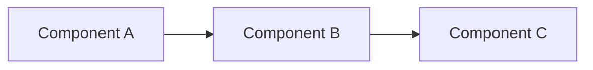

# Architecture Name

## 概要

このアーキテクチャを2から4文で説明する。初学者向けに「何をする考え方か」を書き、続けて実務者向けに「何を犠牲にして何を得るか」を書く。

## 解決したい課題

- どのような問題を解決するための考え方か
- どのような複雑さを扱うための設計か
- 放置するとどのような運用・変更・品質問題につながるか

## 背景・登場した文脈

この考え方がよく使われる背景を書く。特定の論文、書籍、クラウド運用、UI設計、分散システムなどの文脈があれば短く説明する。

## 基本構成

主要な構成要素と責務を書く。要素名だけではなく、実務で何を担当するかを具体的に書く。

| 要素 | 責務 |
| --- | --- |
| Example | Example |

## Mermaid図

図の直後に、図が何を表しているか、現実ではどこが変わりやすいかを説明する。

## 向いている場面

- Example

## 向いていない場面

- Example

## よくある適用例

- どのような業務、画面、データ処理、システム連携で使われやすいか
- 小さく導入するなら、どの範囲から始めると判断しやすいか
- 逆に、似ていても別のアーキテクチャを選ぶほうが自然な例は何か

## メリット

- Example

## デメリット

- Example

## よくある誤解

- Example

## 失敗しやすいポイント

- Example

## 類似アーキテクチャとの違い

| 比較対象 | 違い |
| --- | --- |
| Example | Example |

## 実務での判断ポイント

- 導入前に確認すべき条件
- チーム構成、運用体制、変更頻度、技術制約
- 過剰設計になりやすいポイント
- どう始め、どう撤退または縮小するか

## 導入チェックリスト

- [ ] 導入目的を1文で説明できる
- [ ] 向いていない場面に該当しないことを確認した
- [ ] 運用・監視・テストの責任者を決めた
- [ ] 類似アーキテクチャと比較して選んだ理由を説明できる

## 参考

### 原典・一次資料

- 未参照。一般的な知識をもとに作成。

### 補助資料

- 未参照。

### 関連パターン

- 未参照。
