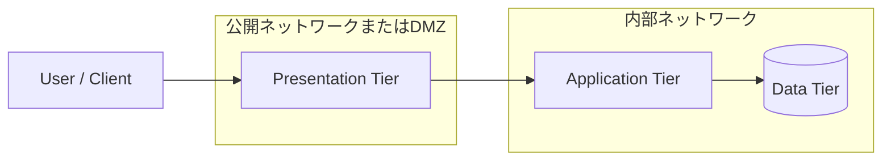

# Three-Tier Architecture

## 概要

Three-Tier Architectureは、システムをPresentation、Application、Dataの3層に分ける基本的な構成です。UIやAPI入口、業務処理、データ保存を分けることで、責務を理解しやすくし、層ごとの変更やスケールを考えやすくします。Webアプリケーションや業務システムの出発点として使われることが多いです。

## 解決したい課題

- 画面表示、業務処理、データアクセスが1つの場所に混ざる問題を避ける
- UI変更やDB変更が業務処理へ直接波及しにくい構造にする
- ネットワーク、権限、スケール、運用監視を層ごとに考えやすくする
- 初学者にも説明しやすい基本構成を作る

## 基本構成

| 要素 | 責務 |
| --- | --- |
| Presentation Tier | 画面表示、API入口、入力検証、レスポンス整形を担う |
| Application Tier | ユースケース、業務処理、トランザクション境界、外部連携の調整を担う |
| Data Tier | DB、ストレージ、永続化、検索、バックアップを担う |
| Network Boundary | 層間通信、公開範囲、ファイアウォール、認証境界を制御する |

## Mermaid図

この図では、利用者に近いPresentation層だけを公開側に置き、Application層とData層を内部に置く典型例を示しています。実際には、Presentation層がWebフロントエンドとAPI Gatewayに分かれたり、Data層が複数のDBやキャッシュに分かれたりします。

## 向いている場面

- 一般的なWebアプリケーションや業務システムを作る
- UI、業務処理、DBの責務をまず基本形で分けたい
- 層ごとにスケール、監視、セキュリティ境界を考えたい
- チーム内でアプリケーション構成を説明しやすくしたい

## 向いていない場面

- ドメイン境界やチーム境界ごとの独立デプロイが主目的である
- 非常に小さなツールで、層を分けるほどの変更可能性がない
- Application層が巨大な手続き処理置き場になっている
- Data層を複数機能が自由に共有し、所有権を分けられない

## メリット

- 構成が理解しやすく、説明しやすい
- 層ごとに責務、セキュリティ、スケール方針を分けられる
- UIやDBの変更をApplication層で吸収しやすい
- 多くのクラウド構成やフレームワークで考え方を対応づけやすい

## デメリット

- 層だけでは業務ドメインの境界を表現しにくい
- Application層に処理が集中し、巨大なServiceになりやすい
- 単純なCRUDでは層分けが手続き的な通過点だけになることがある
- 独立リリースや機能ごとの所有権を強く求める場合は不足しやすい

## 類似アーキテクチャとの違い

| 比較対象 | 違い |
| --- | --- |
| レイヤードアーキテクチャ | レイヤードはコード上の責務分離として使われることが多い。Three-Tierは実行環境やネットワーク配置も含めた3層構成として説明されることが多い |
| Client-Server Architecture | Client-Serverはクライアントとサーバーの2者関係を表す。Three-Tierはサーバー側をApplicationとDataにも分ける |
| マイクロサービスアーキテクチャ | マイクロサービスは業務能力ごとにサービスとデプロイ単位を分ける。Three-Tierは1つのアプリケーションを3層に分ける基本形 |
| クリーンアーキテクチャ | クリーンは依存方向を内側へ向け、業務ルールを技術詳細から守る。Three-Tierは層の配置と役割をわかりやすく分ける |

## 実務での判断ポイント

- 3層を物理的に分ける必要があるのか、論理的な分離で十分かを確認する
- Application層に業務判断が集まりすぎる場合は、Domain層やユースケース単位の分割を検討する
- Data層への直接アクセスをPresentation層から許さない
- キャッシュ、検索、メッセージングを追加するときは、どの層の責務かを明確にする
- DBスキーマ変更がApplication層やPresentation層へ漏れすぎていないか確認する

## 参考

- Microsoft, [N-tier architecture style](https://learn.microsoft.com/en-us/azure/architecture/guide/architecture-styles/n-tier)
- Martin Fowler, *Patterns of Enterprise Application Architecture*, Addison-Wesley, 2002
