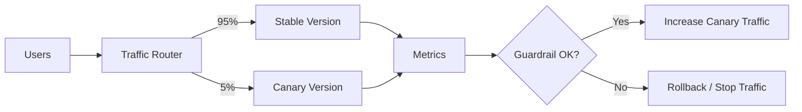

# Canary Release

## 概要

Canary Releaseは、新バージョンを一部ユーザーや一部トラフィックにだけ適用し、メトリクスを確認しながら段階的に対象を広げるリリース方式です。全ユーザーへ一気に公開するのではなく、失敗時の影響範囲を小さくして、実環境で安全に検証します。

## 解決したい課題

- リリース失敗時に全ユーザーへ影響する問題を避ける
- 本番相当ではなく本番トラフィックで新バージョンを検証する
- エラー率、レイテンシ、業務指標を見ながらリリース判断する
- 問題があれば早い段階で停止またはロールバックする

## 基本構成

| 要素 | 責務 |
| --- | --- |
| Stable Version | 大半のトラフィックを受ける現行の安定版 |
| Canary Version | 少量のトラフィックを受ける新バージョン |
| Traffic Router | ユーザー、割合、地域、テナントなどの条件で振り分ける |
| Metrics / Guardrail | 昇格、停止、ロールバックを判断する指標と閾値 |
| Rollback | 問題発生時にCanaryへの流量を止める手順 |

## Mermaid図

この図では、最初に少量のトラフィックだけをCanary Versionへ流し、メトリクスを見ながら段階的に割合を増やす流れを示しています。実務では、ユーザー単位で同じバージョンに固定するスティッキーなルーティングが必要になることがあります。

## 向いている場面

- 十分なトラフィックがあり、少量公開でも異常を検知できる
- エラー率、レイテンシ、売上、申込完了率などの判断指標がある
- 自動ロールバックやFeature Flagと組み合わせられる
- 影響範囲を限定しながら頻繁にリリースしたい

## 向いていない場面

- 少量トラフィックでは問題を検知できない
- ユーザーごとに異なるバージョンが見えると業務上困る
- DB変更が後方互換ではなく、新旧バージョンを並行稼働できない
- 監視やアラートが弱く、昇格や停止を判断できない

## メリット

- リリース失敗時の影響範囲を小さくできる
- 実環境のデータで安全性を確認できる
- 段階的な自動リリースと相性がよい
- ロールバック判断をメトリクスに基づいて行いやすい

## デメリット

- 監視、ルーティング、ロールバックの仕組みが必要
- DBマイグレーションや外部API変更との組み合わせが難しい
- 少量ユーザーだけに起きる問題を発見しにくい場合がある
- ユーザー体験やサポート対応が複雑になることがある

## 類似アーキテクチャとの違い

| 比較対象 | 違い |
| --- | --- |
| Blue-Green Deployment | Blue-Greenは2つの環境を切り替える。Canaryはトラフィック割合を段階的に変える |
| Rolling Update | Rolling Updateはインスタンスを順番に置き換える。Canaryは新旧の露出割合と判断指標を明確に持つ |
| A/B Testing | A/B Testingは施策効果の比較が主目的。Canaryはリリース安全性の確認が主目的 |
| Feature Flag | Feature Flagは機能単位の有効化制御。Canaryはバージョンやトラフィック単位の段階公開として使われる |

## 実務での判断ポイント

- 何%から始め、どの条件で増やし、どの条件で止めるかを事前に決める
- 技術指標だけでなく、業務指標や問い合わせ増加もGuardrailに含める
- DB変更はExpand/Contractなどで新旧バージョンの並行稼働を可能にする
- ユーザー単位、セッション単位、リクエスト単位のどれで振り分けるかを決める
- Canary対象ユーザーへの影響をサポートやCSと共有する

## 参考

- Martin Fowler, [CanaryRelease](https://martinfowler.com/bliki/CanaryRelease.html)
- Google SRE Workbook, [Canarying Releases](https://sre.google/workbook/canarying-releases/)
