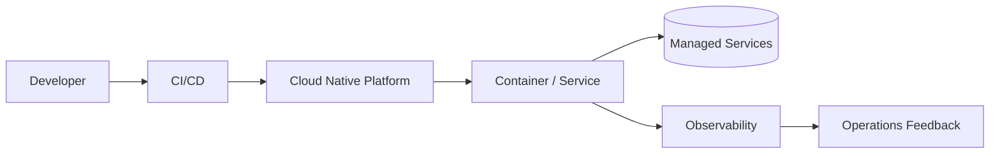

# Cloud Native Architecture

## 概要

コンテナ、動的オーケストレーション、マネージドサービス、疎結合、観測性、自動化を前提にクラウドで構築・運用する考え方です。

## 解決したい課題

- VMや手作業運用を前提にした構成では、リリース頻度やスケール変更に追いつきにくい
- 障害時に人手で復旧する運用では、可用性と復旧時間に限界が出る
- クラウドのマネージドサービスや自動化を活かせず、単なるリフトアンドシフトで終わる

## 背景・登場した文脈

CNCFの定義でも示されるように、クラウドネイティブは単にクラウド上で動かすことではなく、疎結合、回復性、管理性、観測性を前提に、変化へ強いシステムを作る考え方です。

## 基本構成

| 要素 | 責務 |
| --- | --- |
| Container / Service | コンテナ化された実行単位やサービス |
| Orchestration | 配置、スケール、回復を自動化する仕組み |
| Managed Service | クラウド事業者が運用を担うDB、キュー、認証など |
| Observability | ログ、メトリクス、トレースで状態を観測する仕組み |

## Mermaid図

この図では、CI/CDからクラウド基盤へデプロイし、マネージドサービスと観測性を組み合わせて運用改善へ戻す流れを示しています。単にクラウドで動かすのではなく、自動化と回復性を設計へ組み込む点が重要です。

## 向いている場面

- 継続的デリバリー、水平スケール、自動復旧を重視する
- コンテナ、Kubernetes、サーバーレス、マネージドDBなどを組み合わせて運用する
- ログ、メトリクス、トレースを前提に運用改善できる

## 向いていない場面

- クラウド移行だけが目的で、運用や開発プロセスを変える意思がない
- 小規模で自動化基盤の投資を回収できない
- クラウド固有サービスへの依存やコスト管理を受け入れられない

## メリット

- 自動化とマネージドサービスにより、変更と復旧を速くしやすい
- スケール、監視、デプロイの標準化を進めやすい
- 障害前提の設計により、回復性を高めやすい

## デメリット

- クラウド、コンテナ、ネットワーク、監視の横断知識が必要
- コスト、権限、構成管理が複雑になりやすい
- 設計を変えずに移行すると、クラウド費用だけが増える

## よくある誤解

- クラウド上で動かせばクラウドネイティブになるわけではない。自動化、観測性、回復性、疎結合を運用に組み込む必要がある。
- Kubernetesを使うこと自体が目的ではない。チームが扱える運用モデルか、マネージドサービスで代替できるかを比較する。
- マイクロサービス化と同義ではない。モジュラーモノリスでも、CI/CDや観測性を整えればクラウドネイティブな運用は可能。

## 失敗しやすいポイント

- IaC、権限、ネットワーク、監視を後回しにして、環境差分と手作業復旧が残る
- コスト配賦や利用量監視を設計せず、スケールのしやすさが予算超過につながる
- 基盤チームだけで進め、開発チームのデプロイ責任や障害対応手順が変わらない

## 類似アーキテクチャとの違い

| 比較対象 | 違い |
|---|---|
| Container-Based Architecture | コンテナベースはパッケージングと実行単位に焦点がある。クラウドネイティブは自動化、観測性、弾力性、マネージドサービス活用まで含む運用思想 |
| マイクロサービス | マイクロサービスはサービス分割の設計。クラウドネイティブはモノリス、モジュラーモノリス、マイクロサービスのいずれにも適用できる基盤・運用の考え方 |
| サーバーレスアーキテクチャ | サーバーレスは実行基盤の管理をさらにクラウドへ委ねる。クラウドネイティブはコンテナやKubernetesも含む、より広い設計・運用の範囲を指す |

## 実務での判断ポイント

- リリース頻度、復旧時間、スケール変動のどれを改善したいかを先に決める
- コンテナ、サーバーレス、マネージドDBの責任分界点を運用手順に落とす
- ログ、メトリクス、トレース、アラートを本番投入条件に含める
- クラウド固有サービスへの依存と移植性のどちらを優先するか合意する

## 導入チェックリスト

- [ ] 手作業デプロイや手作業復旧をどこまで減らすか決めた
- [ ] 本番障害時に見るメトリクス、ログ、トレースが定義されている
- [ ] 環境、権限、ネットワークをIaCまたは同等の手段で再現できる
- [ ] クラウド費用の監視、上限、責任者が決まっている

## 参考

- CNCF, [Cloud Native Definition](https://github.com/cncf/toc/blob/main/DEFINITION.md)
- CNCF, [Cloud Native Trail Map](https://github.com/cncf/trailmap)
