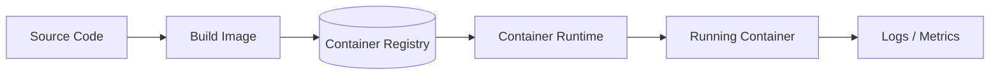

# Container-Based Architecture

## 概要

アプリケーションと依存関係をコンテナイメージとしてパッケージ化し、環境差異を抑えて実行する構成です。

## 解決したい課題

- 開発環境と本番環境の差異で不具合が起きる
- アプリケーションの配布物や起動方法がチームごとにばらつく
- 複数サービスの実行環境を標準化できず、運用が属人化する

## 背景・登場した文脈

コンテナは、アプリケーションと実行に必要な依存関係をイメージとして固め、環境差異を小さくするために普及しました。Kubernetesなどのオーケストレーション基盤と組み合わせることで、配置、スケール、復旧を標準化できます。

## 基本構成

| 要素 | 責務 |
| --- | --- |
| Container Image | アプリと依存関係を含む実行パッケージ |
| Container Runtime | コンテナを実行する基盤 |
| Registry | イメージを保存・配布する場所 |
| Orchestrator | Saga全体の手順を中央で制御する役割 |

## Mermaid図

この図は、Container-Based Architectureで中心になる責務と流れを簡略化したものです。実際の設計では、組織体制、運用能力、既存システムとの接続、非機能要件によって境界の切り方が変わります。

## 向いている場面

- 複数サービスを同じ実行基盤で運用したい
- CI/CDで同じイメージを環境間で昇格させたい
- 依存関係やランタイムの違いをアプリ単位で閉じたい

## 向いていない場面

- 単一VMやPaaSで十分に単純に運用できている
- 永続データ、ネットワーク、秘密情報の扱いを設計できていない
- コンテナ化を目的化し、監視やセキュリティを後回しにしている

## メリット

- 実行環境の再現性を高めやすい
- イメージ単位で配布、ロールバック、脆弱性管理を行いやすい
- オーケストレーション基盤と相性がよい

## デメリット

- イメージ更新、脆弱性スキャン、レジストリ管理が必要
- 永続化やネットワーク設計は別途必要
- コンテナ化だけでは設計上の密結合は解決しない

## よくある誤解

- コンテナ化すれば環境問題がすべて消えるわけではない。OS、CPU、永続化、ネットワーク、時刻設定の差は残る。
- 1コンテナ1プロセスは目安であり、監視や起動順序など運用都合も含めて判断する。
- 本番で使うにはイメージ管理、脆弱性対応、ログ出力、リソース制限まで設計が必要。

## 失敗しやすいポイント

- 巨大な万能イメージを作り、ビルド時間と脆弱性対応が重くなる
- 永続データや設定をイメージに閉じ込め、環境ごとの切替やバックアップが難しくなる
- CPU、メモリ、ヘルスチェックを設定せず、障害時に再起動ループや隣接影響が起きる

## 類似アーキテクチャとの違い

| 比較対象 | 違い |
|---|---|
| Cloud Native Architecture | Cloud Nativeはコンテナに加えて自動化、観測性、スケーリング、障害前提の運用まで含む。コンテナベースは主に実行環境の再現性と配布単位を扱う |
| サーバーレスアーキテクチャ | サーバーレスはランタイムやスケール制御をクラウドに強く委ねる。コンテナベースはイメージ、リソース、起動方式、運用責任をチームがより明示的に管理する |
| 3層アーキテクチャ | 3層はUI、業務ロジック、データの論理分割。コンテナベースはその各層をどのように梱包・配置・実行するかの実行方式 |

## 実務での判断ポイント

- 開発環境の再現性、デプロイ容易性、スケール単位のどれを主目的にするか決める
- ベースイメージ、タグ固定、SBOM、スキャンの運用を決める
- ステートレス化できない部分をボリューム、外部ストレージ、DBへ分離する
- ローカル、CI、本番で同じ起動手順を保てるか確認する

## 導入チェックリスト

- [ ] Dockerfileが最小権限、固定タグ、不要ファイル除外を満たしている
- [ ] イメージの脆弱性スキャンと更新手順がある
- [ ] 設定、秘密情報、永続データをイメージ外へ分離している
- [ ] リソース制限、ヘルスチェック、ログ出力が定義されている

## 参考

- Docker, [Overview](https://docs.docker.com/get-started/docker-overview/)
- Open Container Initiative, [Runtime Specification](https://github.com/opencontainers/runtime-spec)
