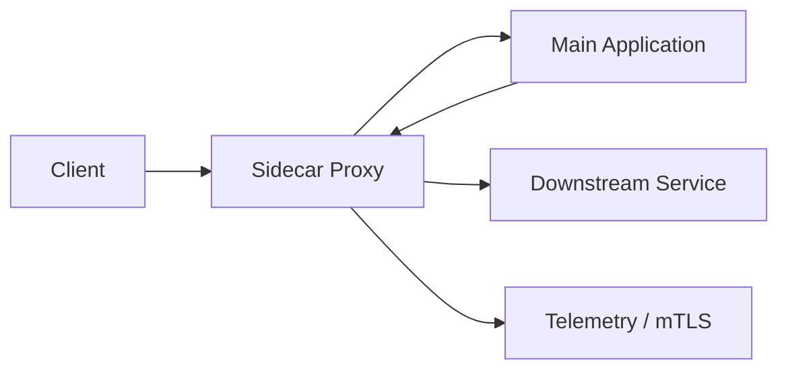

# Sidecar Pattern

## 概要

メインアプリケーションの横に補助プロセスや補助コンテナを配置し、共通機能を担わせるパターンです。

## 解決したい課題

- ログ収集、通信制御、証明書更新などを各アプリに実装すると重複する
- 言語やフレームワークが違うサービスへ共通機能を入れにくい
- アプリ本体を変更せずに通信や運用機能を追加したい

## 背景・登場した文脈

Sidecarは、メインアプリケーションの横に補助プロセスを置く配置パターンです。KubernetesのPodやService MeshのProxyでよく使われ、言語やフレームワークに依存しない横断機能を提供できます。

## 基本構成

| 要素 | 責務 |
| --- | --- |
| Main Application | 本来の業務処理を行うアプリケーション |
| Sidecar | 横に置かれる補助プロセスや補助コンテナ |
| Local Communication | localhostや共有ボリュームでの連携 |
| Platform | 配置、起動、ライフサイクルを管理する基盤 |

## Mermaid図

この図では、メインアプリケーションの隣にSidecarを置き、ログ転送やプロキシなどの補助機能を分離する構成を示しています。Sidecar障害が本体へ与える影響と、起動・停止順序を明確にする必要があります。

## 向いている場面

- Service MeshのProxyを導入する
- ログ転送、設定同期、証明書更新などの補助機能を横に置きたい
- アプリ本体と同じライフサイクルで補助機能を配置したい

## 向いていない場面

- 補助機能がメインアプリと強く一体化しており、横に出すと複雑になる
- リソース制約が厳しく、追加プロセスの負荷を許容できない
- Sidecar障害時の挙動を設計していない

## メリット

- アプリ本体を変更せず横断機能を追加しやすい
- 言語非依存で共通機能を提供できる
- メインアプリと同じ配置単位で運用できる

## デメリット

- プロセスやコンテナ数が増え、リソース消費が増える
- 通信経路が複雑になり、デバッグが難しくなる
- Sidecar自体が障害点になる

## よくある誤解

- 共通処理をSidecarへ出せば必ず単純になるわけではない。Pod内通信、起動順序、障害時の連動を理解する必要がある。
- アプリケーション改修なしで導入できる場合もあるが、タイムアウトやリトライの意味はアプリ側の設計に影響する。
- Service Meshの小型版ではない。単独の補助プロセスとして使う場合は制御プレーンや統一ポリシーを自前で考える。

## 失敗しやすいポイント

- Sidecar障害でメインアプリまで影響を受けるのに、監視対象から漏れる
- プロキシのリトライやタイムアウトがアプリの冪等性と合わず、二重処理を起こす
- 共通Sidecarのバージョン更新が各サービスのリリース制約になる

## 類似アーキテクチャとの違い

| 比較対象 | 違い |
|---|---|
| Service Mesh | Service Meshは多くのSidecarや基盤コンポーネントを統合してサービス間通信を制御する。Sidecar Patternは単一アプリケーションに補助機能を隣接配置する実装パターン |
| Adapter | Adapterはインターフェース差を吸収する設計パターン。Sidecarはログ転送、プロキシ、設定同期などを別プロセスとして分離し、デプロイ単位も分けられる |
| DaemonSet | DaemonSetはノード単位に補助プロセスを置くKubernetesの配置方式。SidecarはPodやアプリケーション単位で補助プロセスを置く |

## 実務での判断ポイント

- ログ転送、認証、プロキシなど、アプリから切り離したい責務を明確にする
- Sidecar停止時にメインアプリを止めるか、縮退運転するかを決める
- CPU、メモリ、ポート、ヘルスチェックをメインアプリと別に設計する
- 共通Sidecarの配布、互換性、ロールバック手順を用意する

## 導入チェックリスト

- [ ] Sidecarに切り出す責務とアプリに残す責務が分かれている
- [ ] 起動順序、停止順序、ヘルスチェックが定義されている
- [ ] Sidecarのログ、メトリクス、エラーが監視されている
- [ ] Sidecar更新時の互換性確認とロールバック手順がある

## 参考

- Microsoft, [Sidecar pattern](https://learn.microsoft.com/en-us/azure/architecture/patterns/sidecar)
- Kubernetes, [Pods](https://kubernetes.io/docs/concepts/workloads/pods/)
