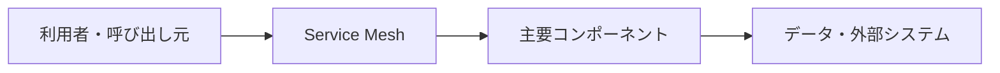

# Service Mesh

## 概要

サービス間通信の認証、暗号化、リトライ、タイムアウト、トラフィック制御、観測を基盤で扱う構成です。

## 解決したい課題

- 実行環境、リリース、運用、通信基盤の設計が曖昧だと、可用性や変更速度に影響します。
- 変更影響、運用負荷、理解しやすさのバランスを取る
- 適用範囲と責務境界を明確にする

## 基本構成

| 要素 | 責務 |
| --- | --- |
| Data Plane | 実際のサービス間通信を処理するProxy群 |
| Control Plane | Cellや通信方針を管理する制御層 |
| Service | 独立した業務機能や実行単位 |
| Policy | 認証、認可、レート制限などの方針 |

## Mermaid図

この図は全体像を簡略化したものです。実際には、非機能要件、組織体制、利用技術によって境界や責務が変わります。

## 向いている場面

- 運用自動化、スケール、リリース安全性を設計したい場面に向きます。
- 変更や障害の影響範囲を意識して設計したい
- チーム内で構成要素の責務を共通認識にしたい

## 向いていない場面

- 課題が小さく、導入コストのほうが大きい
- 境界や責務を運用で守る体制がない
- 名前だけ導入して実装方針やレビュー観点が変わらない

## メリット

- 責務の分離により変更箇所を見つけやすい
- 設計判断の観点をチームで共有しやすい
- 適用条件が合えば、保守性や拡張性を高めやすい

## デメリット

- 抽象化や構成要素が増え、初期コストがかかる
- 境界設計を誤ると、かえって複雑になる
- 小さなシステムでは過剰設計になりやすい

## 類似アーキテクチャとの違い

| 比較対象 | 違い |
| --- | --- |
| API Gateway Pattern | API Gateway Patternは関連する問題領域で使われる。Service Meshは「サービス間通信の認証、暗号化、リトライ、タイムアウト、トラフィック制御、観測を基盤で扱う構成です。」点を主に扱うため、導入目的と責務境界を分けて判断する |
| Sidecar Pattern | Sidecar Patternは関連する問題領域で使われる。Service Meshは「サービス間通信の認証、暗号化、リトライ、タイムアウト、トラフィック制御、観測を基盤で扱う構成です。」点を主に扱うため、導入目的と責務境界を分けて判断する |
| Cloud Native Architecture | Cloud Native Architectureは関連する問題領域で使われる。Service Meshは「サービス間通信の認証、暗号化、リトライ、タイムアウト、トラフィック制御、観測を基盤で扱う構成です。」点を主に扱うため、導入目的と責務境界を分けて判断する |

## 実務での判断ポイント

- 何を守りたいのか、何を変えやすくしたいのかを先に決める
- 導入後に責務境界をレビューできるルールを用意する
- 既存システムへは小さな範囲から適用し、効果を確認する

## 参考

- Istio, [What is a Service Mesh?](https://istio.io/latest/about/service-mesh/)
