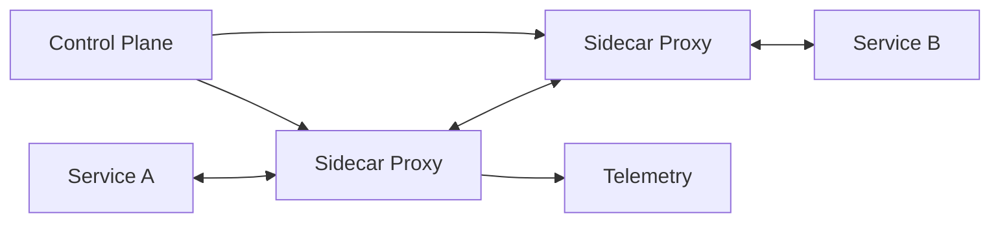

# Service Mesh

## 概要

サービス間通信の認証、暗号化、リトライ、タイムアウト、トラフィック制御、観測を基盤で扱う構成です。

## 解決したい課題

- サービスごとに通信制御、リトライ、mTLS、トレースを実装するとばらつく
- サービス間通信の経路や失敗が見えにくい
- カナリア、ミラーリング、障害注入などをアプリ改修なしで行いたい

## 背景・登場した文脈

Service Meshは、サービス間通信の横断機能をアプリケーションコードから切り離し、Proxy群とControl Planeで扱う構成です。マイクロサービスが増えた環境で、mTLS、トラフィック制御、リトライ、観測を統一するために使われます。

## 基本構成

| 要素 | 責務 |
| --- | --- |
| Data Plane | 実際のサービス間通信を処理するProxy群 |
| Control Plane | Cellや通信方針を管理する制御層 |
| Service | 独立した業務機能や実行単位 |
| Policy | 認証、認可、レート制限などの方針 |

## Mermaid図

この図は、Service Meshで中心になる責務と流れを簡略化したものです。実際の設計では、組織体制、運用能力、既存システムとの接続、非機能要件によって境界の切り方が変わります。

## 向いている場面

- サービス数が多く、通信ポリシーを統一したい
- mTLSや認可をサービス間通信に適用したい
- トラフィック制御や分散トレースを基盤で扱いたい

## 向いていない場面

- サービス数が少なく、Gatewayやライブラリで十分
- Control PlaneやProxyの運用負荷を持てない
- 導入目的が曖昧で、機能を使いこなせない

## メリット

- 通信の横断機能を統一できる
- アプリコードから通信制御を分離できる
- カナリアや観測性の強化に役立つ

## デメリット

- Proxyによる遅延とリソース消費がある
- Control Planeの運用とデバッグが難しい
- 障害時にアプリ、Proxy、Mesh基盤の切り分けが必要

## よくある誤解

- Service Meshはサービス分割の問題を解決しない。境界が曖昧なまま導入すると通信経路だけが複雑になる。
- mTLSやリトライを有効にすれば安全・高可用になるわけではない。証明書運用、冪等性、タイムアウト設計が必要。
- 小規模なシステムでは、Gatewayやライブラリで十分な場合がある。

## 失敗しやすいポイント

- メッシュの設定変更が本番通信へ広く影響するのに、レビューや検証環境がない
- リトライ、サーキットブレーカー、タイムアウトの多重設定で障害時に負荷を増幅する
- 制御プレーン障害やSidecarリソース消費を見積もらない

## 類似アーキテクチャとの違い

| 比較対象 | 違い |
|---|---|
| API Gateway | API Gatewayは外部から内部への入口を制御する。Service Meshは内部サービス間通信のmTLS、リトライ、タイムアウト、観測を制御する |
| Sidecar Pattern | Sidecarは補助コンテナを横に置く実装パターン。Service MeshはSidecarやプロキシ群を制御プレーンで管理し、組織横断の通信ポリシーを適用する |
| Cloud Native Architecture | Cloud Nativeはクラウド前提の設計・運用思想全体。Service Meshはその中でサービス間通信の運用複雑性を扱う特定の基盤 |

## 実務での判断ポイント

- 内部通信の認証、暗号化、観測、トラフィック制御のどれが主目的か決める
- アプリ側で持つ通信ロジックとメッシュへ委ねるロジックを分ける
- 段階導入する名前空間やサービスを限定し、効果と負荷を測る
- 証明書、ポリシー、メッシュ設定の変更管理を設計する

## 導入チェックリスト

- [ ] 導入目的がmTLS、観測性、トラフィック制御などに分解されている
- [ ] タイムアウト、リトライ、サーキットブレーカーの標準値がある
- [ ] 制御プレーンとSidecarの監視項目が定義されている
- [ ] メッシュ設定のレビュー、検証、ロールバック手順がある

## 参考

- Istio, [What is a Service Mesh?](https://istio.io/latest/about/service-mesh/)
- Linkerd, [What is a service mesh?](https://linkerd.io/what-is-a-service-mesh/)
