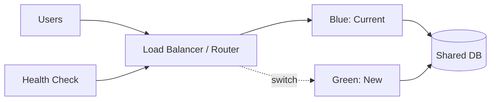

# Blue-Green Deployment

## 概要

本番相当の2つの環境を用意し、片方へ新バージョンをデプロイしてトラフィックを切り替えるリリース方式です。

## 解決したい課題

- リリース時の停止時間を短くしたい
- 新バージョンに問題があったとき、すぐ旧環境へ戻したい
- 本番相当の環境で新バージョンを検証したい

## 背景・登場した文脈

Blue-Green Deploymentは、現行環境と新環境を並べ、ルーティングを切り替えてリリースする方式です。新旧の環境を明確に分けることで、短時間の切替と切り戻しを狙います。

## 基本構成

| 要素 | 責務 |
| --- | --- |
| Blue Environment | 現行または旧バージョンの本番相当環境 |
| Green Environment | 新バージョンを配置する本番相当環境 |
| Router / Load Balancer | トラフィックの切替や分配を担う |
| Rollback | 問題時に旧状態へ戻す手順 |

## Mermaid図

この図は、Blue-Green Deploymentで中心になる責務と流れを簡略化したものです。実際の設計では、組織体制、運用能力、既存システムとの接続、非機能要件によって境界の切り方が変わります。

## 向いている場面

- 本番相当環境を2つ用意できる
- DB変更が後方互換で、新旧アプリが並行稼働できる
- 切り替えと切り戻しをロードバランサやDNSで制御できる

## 向いていない場面

- DBスキーマ変更が破壊的で新旧バージョンを並行できない
- 環境を2つ維持するコストが重すぎる
- セッションや状態を切替時に失いやすい

## メリット

- 切替と切り戻しが単純で速い
- 新環境を本番相当で事前検証できる
- リリース手順を標準化しやすい

## デメリット

- 環境コストが増える
- DBマイグレーションとの相性に注意が必要
- 切替後に旧環境へ流れたデータ差分の扱いが難しい場合がある

## よくある誤解

- Blue-Greenは無停止を保証しない。DB変更、キャッシュ、セッション、外部連携が切替に追随できる必要がある。
- 旧環境を残せば必ず戻せるわけではない。不可逆なデータ更新があると切り戻しできない。
- Canaryより常に安全とは限らない。全トラフィックを一気に切り替えるため、検知と戻しの速さが重要。

## 失敗しやすいポイント

- DBマイグレーションを後方互換にせず、旧環境へ戻せない
- 環境差分が残り、Greenで成功してもBlue相当の本番条件になっていない
- DNSやロードバランサの切替反映時間を見積もらず、混在状態を扱えない

## 類似アーキテクチャとの違い

| 比較対象 | 違い |
|---|---|
| Canary Release | Canaryは一部ユーザーや一部トラフィックに段階的に流す。Blue-Greenは本番相当の2環境を用意し、切替点で一気にトラフィックを移す |
| Rolling Update | Rolling Updateはインスタンスを順番に更新する。Blue-Greenは旧環境を温存したまま新環境を用意するため、切り戻しは速いが環境コストが大きい |
| Feature Flag | Feature Flagはコード内の機能有効化を制御する。Blue-Greenは環境とトラフィックの切替を制御するため、両者は組み合わせて使える |

## 実務での判断ポイント

- アプリ、DB、キャッシュ、ジョブ、外部連携を含めて切替単位を定義する
- 切替前のスモークテストと切替後の監視指標を決める
- 戻し可能なDB変更手順にするか、戻せない変更を別リリースに分ける
- 2環境分のコストを許容できる期間を決める

## 導入チェックリスト

- [ ] 新旧環境の構成差分を確認できる
- [ ] DB変更が後方互換または段階移行になっている
- [ ] 切替後に見るエラー率、レイテンシ、主要業務KPIが決まっている
- [ ] 切り戻し手順と判断期限が明文化されている

## 参考

- Martin Fowler, [BlueGreenDeployment](https://martinfowler.com/bliki/BlueGreenDeployment.html)
- AWS, [Blue/Green Deployments on AWS](https://docs.aws.amazon.com/whitepapers/latest/blue-green-deployments/welcome.html)
