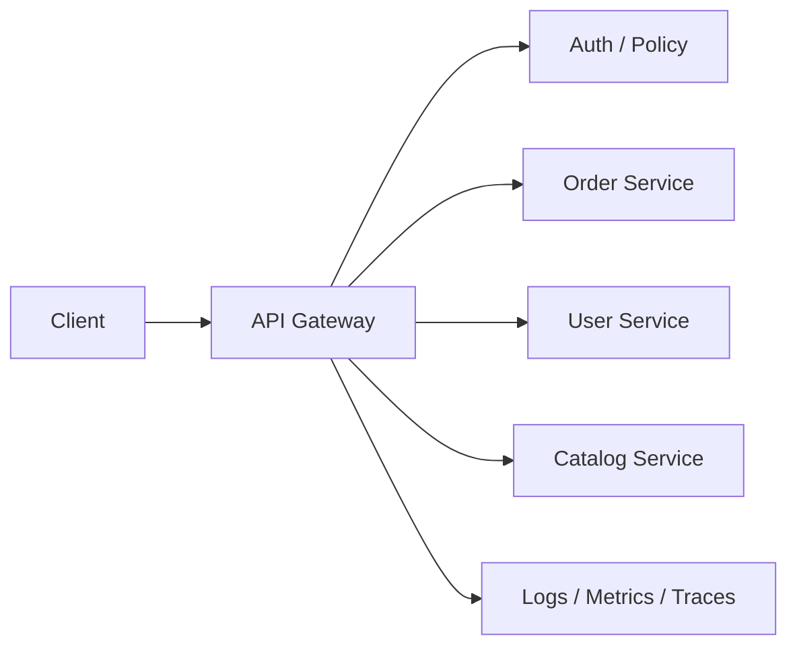

# API Gateway Pattern

## 概要

API Gateway Patternは、複数のバックエンドサービスへの入口をAPI Gatewayに集約し、認証、認可、ルーティング、レート制限、監視、レスポンス集約などを担わせるパターンです。クライアントが内部サービス構成を直接知らなくてよいようにし、入口で共通ポリシーを適用します。

## 解決したい課題

- クライアントが多数のサービスを直接呼び出す複雑さを減らす
- 認証、レート制限、ログ、監視などの入口共通処理を一元化する
- 内部サービス構成やURLを外部クライアントから隠蔽する
- サービスごとのAPI変更がクライアントへ直接波及しにくい境界を作る

## 基本構成

| 要素 | 責務 |
| --- | --- |
| Client | Web、モバイル、外部システムなどAPIを利用する側 |
| API Gateway | 認証、認可、ルーティング、集約、変換、制限を担う入口 |
| Backend Service | 個別の業務機能を提供するサービス |
| Policy | 認証方式、レート制限、タイムアウト、ログ、CORSなどの方針 |
| Observability | リクエスト単位のログ、メトリクス、トレースを収集する |

## Mermaid図

この図では、クライアントがAPI Gatewayだけを呼び、Gatewayが内部サービスへルーティングする構成を示しています。Gatewayは便利な集約点ですが、業務ロジックを置きすぎると変更のボトルネックになります。

## 向いている場面

- マイクロサービスや複数APIの外部入口を整理したい
- 認証、認可、レート制限、監視を共通化したい
- 外部公開APIと内部サービスAPIを分けたい
- クライアントから見たAPIを安定させたい

## 向いていない場面

- 単一サービスで入口集約の価値が小さい
- Gatewayに業務ロジックや複雑なオーケストレーションを集めようとしている
- Gatewayの高可用性、監視、障害時挙動を設計できない
- 低レイテンシが最重要で、追加ホップの影響が大きい

## メリット

- クライアントを内部サービス構成から切り離せる
- 入口共通機能を一元化できる
- API公開範囲やセキュリティポリシーを管理しやすい
- ログ、メトリクス、トレースの入口を統一しやすい

## デメリット

- Gatewayがボトルネックや単一障害点になりうる
- 業務ロジックを集めると巨大な中間層になる
- Gatewayチームの変更待ちが発生すると開発速度が落ちる
- バージョニング、タイムアウト、リトライ方針を誤ると障害を増幅する

## 類似アーキテクチャとの違い

| 比較対象 | 違い |
| --- | --- |
| Backend for Frontend | BFFは特定クライアント向けにAPIを最適化する。API Gatewayは共通入口として横断ポリシーやルーティングを担う |
| ESB | ESBは企業内システム連携、変換、オーケストレーションを広く扱う。API Gatewayは主にAPI入口と公開境界に焦点を当てる |
| Service Mesh | Service Meshはサービス間通信を制御する。API Gatewayは外部またはクライアントからの入口を制御する |
| Load Balancer | Load Balancerは主に負荷分散を担う。API Gatewayは認証、制限、変換、API管理まで扱うことが多い |

## 実務での判断ポイント

- Gatewayに置く処理を横断機能に絞り、業務判断はバックエンドサービスへ寄せる
- Gateway障害時に全APIが止まらないよう、高可用構成と監視を設計する
- タイムアウト、リトライ、Circuit Breakerをバックエンド特性に合わせて設計する
- APIバージョニングと後方互換性をGatewayだけで吸収しすぎない
- クライアント差が大きい場合はBFFを分けることも検討する

## 参考

- Chris Richardson, [API Gateway pattern](https://microservices.io/patterns/apigateway.html)
- Microsoft, [Gateway Routing pattern](https://learn.microsoft.com/en-us/azure/architecture/patterns/gateway-routing)
- Microsoft, [Gateway Aggregation pattern](https://learn.microsoft.com/en-us/azure/architecture/patterns/gateway-aggregation)
