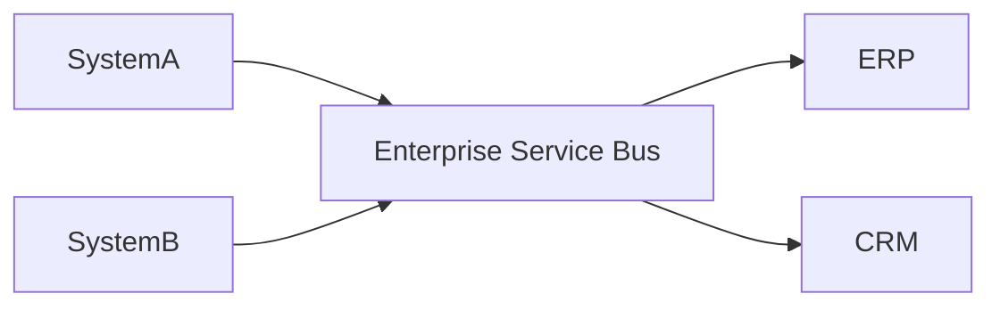

# ESB

## 概要

企業内システム連携をバス型の統合基盤で扱う構成です。

## 解決したい課題

- 既存システムごとにプロトコル、データ形式、認証方式が異なり、接続のたびに個別実装が増える
- ルーティング、変換、監視、再送などの連携共通処理が各システムに散らばる
- 企業内の重要連携で、契約変更や障害影響を統制する場所がない

## 背景・登場した文脈

ESBは、企業内の複数システムをサービスとして連携させるSOAの文脈で広く使われた統合基盤です。特に、レガシーシステム、パッケージ製品、外部接続が混在する環境で、変換やルーティングを中央で扱う目的で採用されます。一方で、業務ロジックまで集めると巨大なボトルネックになりやすいため、責務の線引きが重要です。

## 基本構成

| 要素 | 責務 |
| --- | --- |
| Service Bus | メッセージ配送、ルーティング、変換を担う統合基盤 |
| Adapter | 各システム固有の接続差異を吸収する部品 |
| Canonical Model | 連携で使う共通データ表現 |
| Policy / Monitoring | 連携ポリシー、監視、制御の仕組み |

## Mermaid図

この図は、ESBで中心になる責務と流れを簡略化したものです。実際の設計では、組織体制、運用能力、既存システムとの接続、非機能要件によって境界の切り方が変わります。

## 向いている場面

- 異なるプロトコルやデータ形式の既存システムを統合する
- 連携監視、再送、変換、ルーティングを標準化したい
- システム間契約や接続変更を組織的に管理したい

## 向いていない場面

- 新規サービス同士を軽量なAPIやイベントで直接つなげば十分
- ESBに業務判断や複雑なオーケストレーションを集中させようとしている
- ESB基盤の運用、監視、変更管理を担う体制がない

## メリット

- 接続方式や監視を標準化し、個別連携のばらつきを減らせる
- 既存システムを大きく改修せずに連携しやすい
- 連携経路を集約することで障害箇所や流量を追跡しやすい

## デメリット

- ESBが性能ボトルネックや単一障害点になりやすい
- 変換や例外処理が蓄積すると変更待ちが発生する
- 中央統制が強すぎると各チームの変更速度を落とす

## よくある誤解

- ESBを置けば疎結合になるわけではない。変換ロジックや業務ルールを集中させると、むしろ強い結合点になる。
- すべての連携をESB経由にする必要はない。同期API、イベント、ファイル連携を用途で選ぶ。
- SOAの代替ではない。サービス契約と所有者を決めなければ、ESBは配線基盤に留まる。

## 失敗しやすいポイント

- 例外的な変換やルーティングがESBに蓄積し、変更待ちのボトルネックになる
- メッセージ形式、バージョン、エラー処理の標準を決めず、接続ごとに個別実装が増える
- ESB障害時の影響範囲を把握せず、企業内連携の単一障害点になる

## 類似アーキテクチャとの違い

| 比較対象 | 違い |
|---|---|
| API Gateway | API Gatewayは主に外部・クライアントからのAPI入口を統制する。ESBは社内システム間のプロトコル変換、ルーティング、メッセージ変換を中心に扱う |
| SOA | SOAはサービス境界と契約を設計する考え方。ESBはSOAを実装・連携するための統合基盤になり得るが、ESB自体がサービス設計を保証するわけではない |
| Broker Architecture | Broker Architectureは通信の仲介役に焦点を当てる。ESBは仲介に加えて変換、オーケストレーション、監視、ガバナンスまで担いやすい |

## 実務での判断ポイント

- ESBに置く責務をルーティング、変換、監視に限定するか、オーケストレーションまで含めるか決める
- サービス契約、スキーマ、バージョニングの統制を設計する
- 同期・非同期・バッチ連携の使い分けを明文化する
- ESB自体の可用性、監視、変更管理を業務重要度に合わせる

## 導入チェックリスト

- [ ] ESBに業務ルールを集めすぎない方針がある
- [ ] メッセージスキーマとバージョニング規約がある
- [ ] 障害時の迂回、再送、補償の方針が決まっている
- [ ] 連携ごとの所有者と変更承認フローが明確である

## 参考

- Gregor Hohpe, Bobby Woolf, *Enterprise Integration Patterns*, Addison-Wesley, 2003
