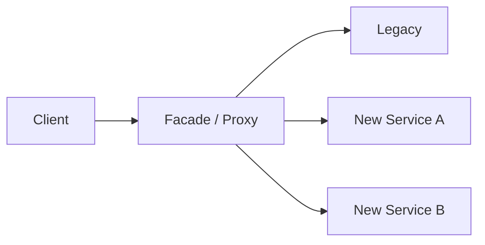

# Strangler Fig Pattern

## 概要

既存システムを機能単位で段階的に新システムへ置き換える移行パターンです。

## 解決したい課題

- 大規模な既存システムを一括刷新すると、切替リスクと停止時間が大きい
- 旧システムを運用しながら、新しい設計や技術へ段階的に移したい
- 移行中も利用者影響を抑え、機能単位で効果を確認したい

## 背景・登場した文脈

ストラングラーフィグパターンは、Martin Fowlerが紹介したレガシー置き換えの移行パターンです。既存システムの外側に新しい入口やルーティング層を置き、機能ごとに新実装へ流量を移していきます。重要なのは、新旧並走を前提にデータ、認証、監視、削除計画まで設計することです。

## 基本構成

| 要素 | 責務 |
| --- | --- |
| Legacy System | 既存機能を提供するシステム |
| Facade / Proxy | 新旧システムへの入口とルーティングを担う層 |
| New Service | 段階的に置き換えられる新しい機能単位 |
| Migration Slice | 移行対象として切り出す小さな機能単位 |

## Mermaid図

この図は、Strangler Fig Patternで中心になる責務と流れを簡略化したものです。実際の設計では、組織体制、運用能力、既存システムとの接続、非機能要件によって境界の切り方が変わります。

## 向いている場面

- 一括刷新のリスクを避け、機能単位で段階移行したい
- 旧システムを止めずに新システムへ利用者を移したい
- 移行対象の入口をルーティングで制御できる

## 向いていない場面

- 旧システムの機能境界や入口を分離できない
- 新旧データ同期や認証連携を設計する余力がない
- 並走期間の運用コストを許容できない

## メリット

- 小さな範囲で移行効果を検証しながら進められる
- 失敗時に対象機能だけ戻しやすい
- 移行を通じて境界やAPIを段階的に整備できる

## デメリット

- 新旧二重運用の期間は監視、障害対応、データ整合性が複雑になる
- 移行完了条件が曖昧だと旧システムが残り続ける
- ルーティング層や同期処理が暫定実装として固定化しやすい

## よくある誤解

- 段階移行は自動的に低リスクではない。旧新の二重運用、データ同期、切替条件を管理する必要がある。
- 最初から全体を切り出そうとすると効果が出にくい。入口を制御できる小さな機能から始める。
- 旧システムを残したまま新機能を足すだけでは移行にならない。削除計画まで含めて設計する。

## 失敗しやすいポイント

- 旧新の責務境界が曖昧で、同じ業務ルールが両方に重複する
- データ同期の整合性や遅延を決めず、問い合わせ結果が画面ごとに変わる
- 旧機能を消す期限や判断基準がなく、並走期間が固定化する

## 類似アーキテクチャとの違い

| 比較対象 | 違い |
|---|---|
| ビッグバン移行 | ビッグバン移行は一度に全面切替する。ストラングラーフィグは機能単位で切り出し、旧システムと新システムを一定期間並走させる |
| Branch by Abstraction | Branch by Abstractionはコード内部の抽象化で段階移行する。ストラングラーフィグはルーティングやAPI境界を使い、システム外側から置き換え範囲を広げる |
| マイクロサービス | マイクロサービスは最終的な分割形の一候補。ストラングラーフィグはそこへ移行する手段であり、必ずマイクロサービス化するとは限らない |

## 実務での判断ポイント

- 最初に置き換える機能を、リスク、依存、効果で選ぶ
- ルーティング、認証、監視、ログ相関を移行の入口で整える
- データ所有権を旧新どちらに置くか、移行フェーズごとに定義する
- 旧機能を停止・削除する完了条件を決める

## 導入チェックリスト

- [ ] 置き換え対象の機能境界とルーティング条件が明確である
- [ ] 旧新のデータ同期、整合性、遅延許容が定義されている
- [ ] 切替後の監視と切り戻し手順がある
- [ ] 旧機能を削除する期限または判断条件がある

## 参考

- Martin Fowler, [Strangler Fig Application](https://martinfowler.com/bliki/StranglerFigApplication.html)
