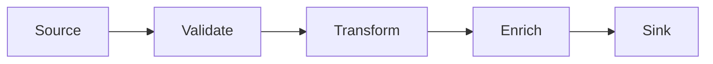

# Pipe and Filter

## 概要

処理をFilterに分け、Pipeでデータを順に流す構成です。

## 解決したい課題

- データ変換や検証など複数段階の処理が1つの大きな手続きに混ざる
- 処理の一部だけを再利用、差し替え、テストしにくい
- どの段階でエラーや遅延が起きているか追跡しにくい

## 背景・登場した文脈

Pipe and Filterは、UNIXパイプやデータ処理基盤でよく見られる構造です。処理をFilterとして分け、Pipeで入出力を接続します。段階的な変換、検証、集約に向きますが、各段階の契約と失敗時の再実行設計がないと、長い処理列がブラックボックスになります。

## 基本構成

| 要素 | 責務 |
| --- | --- |
| Filter | 入力データを処理・変換して出力する部品 |
| Pipe | Filter間でデータを渡す経路 |
| Source | データの発生元 |
| Sink | 処理結果を保存または配信する出力先 |

## Mermaid図

この図では、入力データが複数のFilterを順に通り、各段階で変換や検証を受ける流れを示しています。Filterごとの入出力契約と失敗時の再実行単位を決めることが、保守性を左右します。

## 向いている場面

- 入力データを複数段階で変換、検証、集約する
- 各処理を独立にテスト、差し替え、再利用したい
- 段階ごとの性能や失敗を観測したい

## 向いていない場面

- ユーザー操作に対する低遅延の同期応答が主目的
- 処理順序や分岐が複雑で、単純な直列処理に落としにくい
- Filter間のデータ契約を管理できない

## メリット

- 処理を小さな単位に分け、理解とテストをしやすくできる
- ボトルネックの段階を特定し、個別に改善しやすい
- Filterを組み替えて別パイプラインを作りやすい

## デメリット

- 入出力形式の互換性管理が必要になる
- 段階が増えるほど全体遅延と障害箇所が増える
- 途中失敗時の再実行、冪等性、重複処理を設計する必要がある

## よくある誤解

- Filterを細かく分ければ必ず再利用できるわけではない。入出力契約が曖昧だと組み合わせにくい。
- 順番に流す構造なので、低遅延の対話処理や複雑な分岐には向かない場合がある。
- パイプでつなぐだけでは監視できない。各段階の入力件数、失敗件数、遅延を見る必要がある。

## 失敗しやすいポイント

- Filter間のデータ形式が暗黙になり、1段の変更が後続全体を壊す
- 途中失敗時の再実行単位や冪等性を決めず、重複処理が起きる
- 全体遅延のボトルネックを特定できるメトリクスがない

## 類似アーキテクチャとの違い

| 比較対象 | 違い |
|---|---|
| Data Pipeline Architecture | Data Pipelineはデータ収集、保存、品質管理、スケジューリングまで含む基盤設計。Pipe and Filterは処理を小さなFilterへ分け、Pipeで接続する構造パターン |
| Chain of Responsibility | Chain of Responsibilityは要求を処理できるオブジェクトへ順に渡す設計パターン。Pipe and Filterはデータ変換・処理の段階を明示し、各段階の入出力を接続する |
| イベント駆動アーキテクチャ | イベント駆動はイベントの発生と購読で疎結合にする。Pipe and Filterは一定の順序を持つ処理列としてデータを流す点が中心 |

## 実務での判断ポイント

- 各Filterの入力、出力、エラー形式を契約として定義する
- 順序保証、並列化、再実行の必要性を処理ごとに決める
- 一時データの保存場所と保持期間を決める
- 段階ごとのメトリクスとトレースを用意する

## 導入チェックリスト

- [ ] 各Filterの入出力スキーマが文書化されている
- [ ] 失敗時の再実行単位と冪等性が定義されている
- [ ] 段階ごとの件数、遅延、失敗率を計測できる
- [ ] 処理順序と並列化可能な箇所が整理されている

## 参考

- Gregor Hohpe, Bobby Woolf, [Pipes and Filters](https://www.enterpriseintegrationpatterns.com/patterns/messaging/PipesAndFilters.html)
