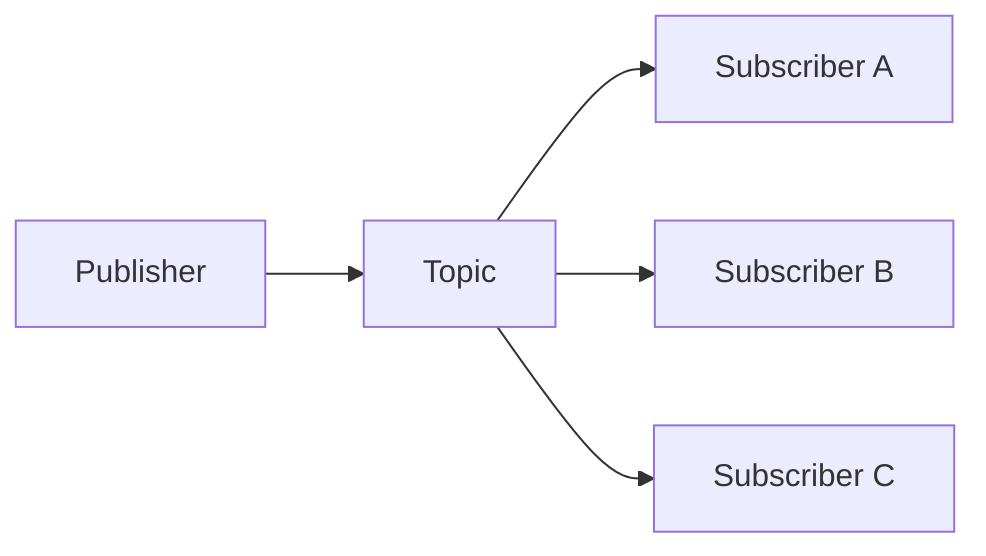

# Publish-Subscribe

## 概要

発行者と購読者を分離し、Topicを介してメッセージを配信するパターンです。

## 解決したい課題

- ある出来事を複数システムへ届けたいが、送信側が受信側を直接知りすぎている
- 購読者を追加するたびに発行側のコードや設定を変更している
- 通知、集計、連携処理を非同期に増やしたい

## 背景・登場した文脈

Publish-Subscribeは、発行者がTopicへイベントを発行し、購読者が関心のあるイベントを受け取る配信パターンです。イベント駆動アーキテクチャの実装手段としてよく使われます。発行者と購読者を分離できますが、イベント名、スキーマ、配信保証を設計しないと、暗黙の結合が残ります。

## 基本構成

| 要素 | 責務 |
| --- | --- |
| Publisher | メッセージやイベントを発行する側 |
| Topic | 関心ごとにメッセージを分類する配送先 |
| Subscriber | Topicを購読して受信する側 |
| Broker | 宛先解決、転送、仲介を担うコンポーネント |

## Mermaid図

この図では、PublisherがTopicへイベントを発行し、複数Subscriberが独立して受け取る流れを示しています。発行者と購読者を分けても、イベント名とスキーマの契約管理は残ります。

## 向いている場面

- 1つの業務イベントを複数の後続処理へ配信したい
- 購読者を後から追加できる拡張性が必要
- 発行側の処理時間を購読側の処理から切り離したい

## 向いていない場面

- 処理完了を同期的に確認しなければならない
- 強い順序保証や即時整合性が必須
- イベントスキーマの変更管理や購読者監視を運用できない

## メリット

- 発行者と購読者の直接依存を減らせる
- 新しい購読者を追加しても発行側の変更を抑えやすい
- 通知、連携、監査など複数用途へイベントを展開しやすい

## デメリット

- 非同期遅延、一時的不整合、重複配信を扱う必要がある
- イベント契約が崩れると購読側が広く壊れる
- 障害調査では発行から購読までの追跡が必要になる

## よくある誤解

- 発行者と購読者を分けても、イベントスキーマで結合は残る。スキーマ互換性の管理が必要。
- 購読者が増えても発行者の責務がゼロになるわけではない。イベントの意味、粒度、発行タイミングを設計する。
- 非同期化すれば性能問題が消えるわけではない。遅延、順序、重複、再配信を扱う必要がある。

## 失敗しやすいポイント

- イベント名や payload が業務意図を表さず、購読側が推測で実装する
- 重複配信や順序入れ替わりを想定せず、集計や通知が二重になる
- 購読者の失敗や遅延を発行側から観測できず、障害発見が遅れる

## 類似アーキテクチャとの違い

| 比較対象 | 違い |
|---|---|
| Message Queue | Message Queueは通常、Queueから処理側が取り出す一対一または競合消費を中心に考える。Publish-SubscribeはTopicを介して複数購読者へ同じイベントを配信できる |
| イベント駆動アーキテクチャ | イベント駆動はイベントでシステムを疎結合にする全体設計。Publish-Subscribeはその実現に使われる配信パターンの1つ |
| Broker Architecture | Broker Architectureは仲介者を置く広い構成。Publish-SubscribeはBrokerを使う場合でも、発行者と購読者の多対多配信モデルに焦点がある |

## 実務での判断ポイント

- イベントを事実として表すか、処理依頼として表すかを分ける
- Topic設計、スキーマ互換性、保持期間を決める
- 少なくとも一回配信、順序保証、DLQの扱いを明確にする
- 購読者ごとの遅延、失敗、再処理を監視する

## 導入チェックリスト

- [ ] イベント名、意味、payload、互換性ルールが定義されている
- [ ] 重複、順序入れ替わり、再配信への対応がある
- [ ] DLQまたは失敗イベントの扱いが決まっている
- [ ] 発行者と購読者の所有者、SLO、監視項目が明確である

## 参考

- Gregor Hohpe, Bobby Woolf, [Publish-Subscribe Channel](https://www.enterpriseintegrationpatterns.com/patterns/messaging/PublishSubscribeChannel.html)
