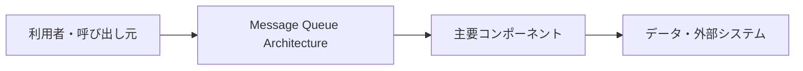

# Message Queue Architecture

## 概要

送信側と処理側の間にキューを置き、メッセージを非同期に受け渡す構成です。

## 解決したい課題

- 複数システムの接続方式がばらつくと、変更や障害の影響が読みにくくなります。
- 変更影響、運用負荷、理解しやすさのバランスを取る
- 適用範囲と責務境界を明確にする

## 基本構成

| 要素 | 責務 |
| --- | --- |
| Producer | メッセージを投入する側 |
| Queue | メッセージを一時保持する待ち行列 |
| Consumer | メッセージを取り出して処理する側 |
| Dead Letter Queue | 処理不能メッセージを隔離するキュー |

## Mermaid図

この図は全体像を簡略化したものです。実際には、非機能要件、組織体制、利用技術によって境界や責務が変わります。

## 向いている場面

- システム間連携、非同期処理、移行、入口集約を整理したい場面に向きます。
- 変更や障害の影響範囲を意識して設計したい
- チーム内で構成要素の責務を共通認識にしたい

## 向いていない場面

- 課題が小さく、導入コストのほうが大きい
- 境界や責務を運用で守る体制がない
- 名前だけ導入して実装方針やレビュー観点が変わらない

## メリット

- 責務の分離により変更箇所を見つけやすい
- 設計判断の観点をチームで共有しやすい
- 適用条件が合えば、保守性や拡張性を高めやすい

## デメリット

- 抽象化や構成要素が増え、初期コストがかかる
- 境界設計を誤ると、かえって複雑になる
- 小さなシステムでは過剰設計になりやすい

## 類似アーキテクチャとの違い

| 比較対象 | 違い |
| --- | --- |
| Publish-Subscribe | Publish-Subscribeは関連する問題領域で使われる。Message Queue Architectureは「送信側と処理側の間にキューを置き、メッセージを非同期に受け渡す構成です。」点を主に扱うため、導入目的と責務境界を分けて判断する |
| イベント駆動アーキテクチャ | イベント駆動アーキテクチャは関連する問題領域で使われる。Message Queue Architectureは「送信側と処理側の間にキューを置き、メッセージを非同期に受け渡す構成です。」点を主に扱うため、導入目的と責務境界を分けて判断する |
| Sagaパターン | Sagaパターンは関連する問題領域で使われる。Message Queue Architectureは「送信側と処理側の間にキューを置き、メッセージを非同期に受け渡す構成です。」点を主に扱うため、導入目的と責務境界を分けて判断する |

## 実務での判断ポイント

- 何を守りたいのか、何を変えやすくしたいのかを先に決める
- 導入後に責務境界をレビューできるルールを用意する
- 既存システムへは小さな範囲から適用し、効果を確認する

## 参考

- Microsoft, [Queue-Based Load Leveling pattern](https://learn.microsoft.com/en-us/azure/architecture/patterns/queue-based-load-leveling)
