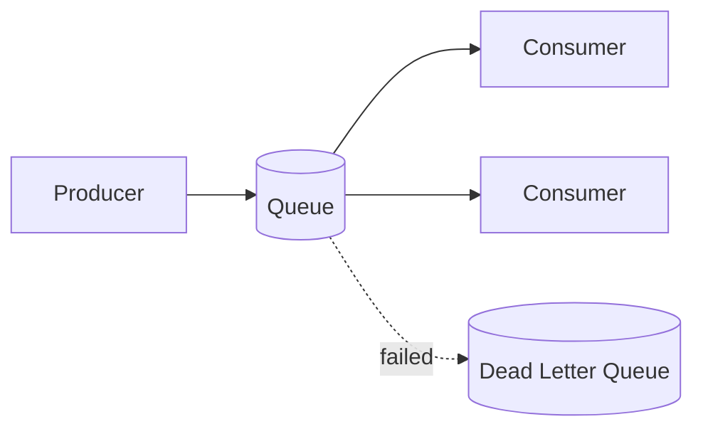

# Message Queue Architecture

## 概要

Queueを介して送信側と処理側を非同期に分離する構成です。

## 解決したい課題

- 重い処理を同期リクエスト内で実行し、応答時間が長くなる
- 処理側の一時障害が送信側に直接影響する
- ピーク時の処理量を平準化し、ワーカー数で調整したい

## 背景・登場した文脈

Message Queue Architectureは、送信側がQueueへメッセージを積み、処理側が非同期に取り出して処理する構成です。ジョブ処理、通知、外部API連携、注文処理などで広く使われます。Queueを挟むことで負荷平準化と障害隔離がしやすくなりますが、再試行、重複、順序、滞留を設計する必要があります。

## 基本構成

| 要素 | 責務 |
| --- | --- |
| Producer | メッセージを投入する側 |
| Queue | メッセージを一時保持する待ち行列 |
| Consumer | メッセージを取り出して処理する側 |
| Dead Letter Queue | 処理不能メッセージを隔離するキュー |

## Mermaid図

この図では、ProducerがQueueへメッセージを積み、Consumerが非同期に処理し、失敗メッセージをDLQへ隔離する流れを示しています。キュー長と滞留時間を監視しないと、利用者影響の発見が遅れます。

## 向いている場面

- 処理を非同期化して応答時間や負荷を安定させたい
- 一時的な処理側障害から送信側を切り離したい
- ワーカー数で処理能力を調整したい

## 向いていない場面

- 処理結果を即座に返す必要がある
- 重複処理や順序入れ替わりを許容できないのに対策できない
- キュー滞留を監視・運用する体制がない

## メリット

- ピーク負荷をQueueで吸収しやすい
- 処理側を水平スケールしやすい
- 失敗メッセージの再試行や隔離を設計しやすい

## デメリット

- エンドツーエンドの遅延は見えにくくなる
- 冪等性、DLQ、再処理手順が必要になる
- キューが詰まると利用者影響が遅れて顕在化する

## よくある誤解

- Queueを挟むと送信側は速く見えるが、処理完了が遅れるだけの場合がある。エンドツーエンドの遅延を見る必要がある。
- 非同期化しても失敗は消えない。再試行、DLQ、重複処理、順序制御を設計する。
- Queueは分散トランザクションの代替ではない。整合性モデルと補償処理を別途考える。

## 失敗しやすいポイント

- メッセージが積み上がってもユーザー影響に気づけない
- ワーカーを増やしても外部APIやDBがボトルネックになり、障害を拡大する
- メッセージ形式の変更で古いワーカーが処理できなくなる

## 類似アーキテクチャとの違い

| 比較対象 | 違い |
|---|---|
| Publish-Subscribe | Publish-Subscribeは1つのイベントを複数購読者へ配る。Message Queueは処理要求をQueueに積み、ワーカーが順に処理する負荷平準化や非同期化に向く |
| イベント駆動アーキテクチャ | イベント駆動はイベントを中心にシステムを設計する考え方。Message Queueはその一部としても使えるが、コマンドやジョブの非同期処理にも使われる |
| Sagaパターン | Sagaは分散トランザクションを補償処理で扱う設計。Message QueueはSagaのステップ間通信を支える手段になり得るが、補償設計そのものではない |

## 実務での判断ポイント

- 応答時間短縮、負荷平準化、障害隔離のどれを目的にQueueを使うか決める
- 可視性タイムアウト、再試行回数、DLQ、冪等性キーを設計する
- 順序保証が必要な処理と並列化できる処理を分ける
- キュー長、滞留時間、失敗率をアラート条件にする

## 導入チェックリスト

- [ ] メッセージのスキーマ、バージョン、互換性ルールがある
- [ ] 再試行、DLQ、手動再処理の手順がある
- [ ] ワーカー処理が冪等または重複検知できる
- [ ] キュー長と滞留時間の監視が設定されている

## 参考

- Microsoft, [Queue-Based Load Leveling pattern](https://learn.microsoft.com/en-us/azure/architecture/patterns/queue-based-load-leveling)
