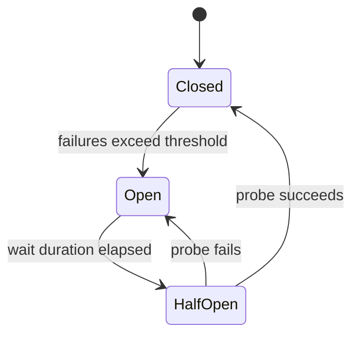

# Circuit Breaker Pattern

## 概要

Circuit Breaker Patternは、連携先の失敗が続いたときに呼び出しを一時的に遮断し、連鎖障害やリソース枯渇を防ぐ信頼性パターンです。電気回路のブレーカーのように、危険な状態では呼び出しを止め、一定時間後に少量の試行で回復を確認します。

## 解決したい課題

- 障害中の外部APIや下流サービスへ呼び出し続け、自システムのスレッドや接続も枯渇する
- タイムアウト待ちが積み上がり、正常な処理まで遅くなる
- 無制限のリトライで下流サービスの回復を妨げる
- 障害時にユーザーへ返す代替応答や縮退動作がない

## 背景・登場した文脈

分散システムでは、ネットワーク越しの呼び出しは失敗する前提で設計する必要があります。Circuit Breakerは、失敗を早く検知して呼び出しを止めることで、連鎖障害を防ぐ代表的なパターンです。

## 基本構成

| 要素 | 責務 |
| --- | --- |
| Closed | 通常通り呼び出す状態 |
| Open | 失敗が閾値を超え、呼び出しを遮断する状態 |
| Half-Open | 回復確認のため、一部の呼び出しだけ試す状態 |
| Failure Threshold | Openへ遷移する失敗率や失敗回数の条件 |
| Fallback | Open中に返す代替応答や縮退動作 |

## Mermaid図

この図では、通常状態のClosed、遮断状態のOpen、回復確認状態のHalf-Openを示しています。実装では、失敗率、連続失敗数、タイムアウト、待機時間、試行数などを調整します。

## 向いている場面

- 外部APIや下流サービスを同期呼び出ししている
- 下流障害時にタイムアウト待ちが増え、上流まで遅くなる
- Fallbackやキャッシュ応答などの縮退動作を提供できる
- RetryやTimeoutだけでは障害時の呼び出し圧を抑えられない

## 向いていない場面

- 失敗しても即時に再実行すべき短いローカル処理
- 遮断すると業務上さらに危険になる処理
- 閾値や状態遷移を監視できない
- Fallbackを用意できず、Open時のユーザー体験が設計されていない

## メリット

- 下流障害時の連鎖障害を抑えられる
- タイムアウト待ちによるリソース枯渇を減らせる
- 下流サービスに回復時間を与えられる
- Fallbackと組み合わせて、ユーザー体験を制御しやすい

## デメリット

- 閾値設定が難しく、誤検知や検知遅れが起こりうる
- Open中は正常化していても呼び出しを止める時間がある
- Fallbackが古い情報や限定機能になる場合がある
- メトリクスなしでは効果を判断できない

## よくある誤解

- Retryを増やせばよいわけではない。障害中のRetryは下流をさらに悪化させることがある。
- Timeoutの代わりではない。Timeout、Retry、Circuit Breakerは組み合わせて使う。
- すべての呼び出しに同じ閾値を使うべきではない。下流の重要度や特性で分ける。

## 失敗しやすいポイント

- Timeoutが長すぎて、Circuit Breakerが開く前にリソースが枯渇する
- Retryと組み合わせた結果、リクエスト量が爆発する
- Open時のFallbackがなく、単にエラーを返すだけになる
- メトリクスがなく、Openが頻発していることに気づかない

## 類似アーキテクチャとの違い

| 比較対象 | 違い |
| --- | --- |
| Retry | Retryは失敗した処理を再試行する。Circuit Breakerは失敗が続く呼び出しを止める |
| Timeout | Timeoutは待ち時間の上限を決める。Circuit Breakerは失敗履歴に基づいて状態を切り替える |
| Bulkhead Pattern | Bulkheadはリソースを隔離する。Circuit Breakerは特定の呼び出し先への通信を遮断する |
| Rate Limiting | Rate Limitingは流量制限。Circuit Breakerは失敗状態に基づく遮断 |

## 実務での判断ポイント

- まずTimeoutを適切に設定し、そのうえでCircuit Breakerを設計する
- 失敗率、連続失敗数、遅延、HTTPステータスなど、Open条件を明確にする
- Fallbackの内容を業務部門や利用者影響込みで決める
- Open、Half-Open、Closedの状態をメトリクスで監視する
- Retryは指数バックオフやジッターと組み合わせ、呼び出し増幅を防ぐ

## 導入チェックリスト

- [ ] 対象の外部依存や下流サービスを特定した
- [ ] TimeoutとRetryの方針を決めた
- [ ] Open条件とHalf-Openの試行条件を決めた
- [ ] Fallbackを設計した
- [ ] 状態遷移と失敗率を監視している

## 参考

- Martin Fowler, [CircuitBreaker](https://martinfowler.com/bliki/CircuitBreaker.html)
- Microsoft, [Circuit Breaker pattern](https://learn.microsoft.com/en-us/azure/architecture/patterns/circuit-breaker)
- Michael T. Nygard, *Release It!*, 2nd Edition, Pragmatic Bookshelf, 2018
