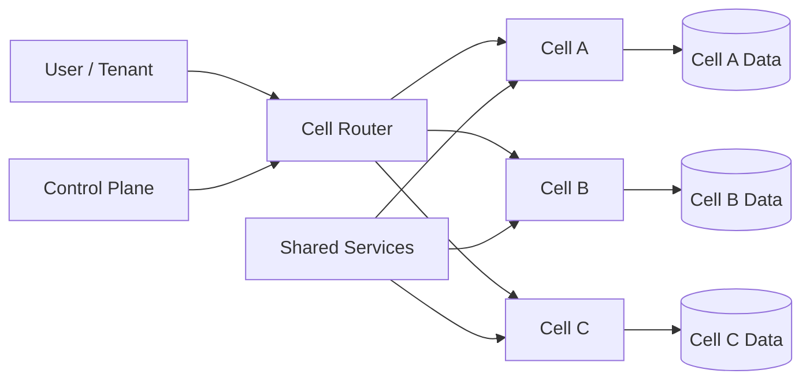

# Cell-Based Architecture

## 概要

Cell-Based Architectureは、システムを複数の独立したCellに分け、障害や高負荷の影響をCell内に閉じ込める構成です。大規模SaaSやマルチテナント環境で、全ユーザー同時障害を避けるために、アプリケーション、データ、運用単位を一定の利用者群ごとに分割します。

## 解決したい課題

- 単一の巨大環境で障害が起きると、全ユーザーに影響する
- 一部テナントや一部地域の高負荷が全体へ波及する
- 障害範囲が広すぎて復旧や調査が難しい
- 大規模化に伴い、データや処理のスケール単位が曖昧になる

## 背景・登場した文脈

クラウドや大規模SaaSでは、全ユーザーを1つの巨大な環境で処理すると障害の影響範囲が大きくなります。Cell-Based Architectureは、ワークロードをCellへ分け、障害を局所化するための信頼性設計として使われます。

## 基本構成

| 要素 | 責務 |
| --- | --- |
| Cell | 一定範囲のユーザー、テナント、地域を処理する独立単位 |
| Cell Router | 利用者やテナントを担当Cellへ振り分ける |
| Control Plane | Cellの作成、割当、設定、移動を管理する |
| Data Partition | Cellごとに分離されたデータ領域 |
| Shared Service | 認証や課金など、Cell外に残る共通機能 |

## Mermaid図

この図では、ユーザーやテナントをCell Routerが担当Cellへ振り分けます。Shared Serviceが大きくなりすぎると、そこが全体障害の原因になるため、共有範囲を最小化します。

## 向いている場面

- 大規模なマルチテナントSaaS
- 障害影響を一部ユーザーや一部テナントに限定したい
- 地域、規制、顧客規模ごとに分離したい
- Cell単位でリリース、移行、負荷分散を行いたい

## 向いていない場面

- 小規模システムでCell分割の運用コストが価値を上回る
- データや処理をCell内に閉じられない
- 共有サービスが多く、結局すべてのCellが同じ障害点に依存している
- テナント移動や再配置の手順を用意できない

## メリット

- 障害や高負荷の影響範囲を小さくできる
- Cell単位でスケール、リリース、復旧を行いやすい
- 大規模システムでも運用対象を小さな単位に分解できる
- 特定顧客や地域向けの分離要件に対応しやすい

## デメリット

- Cell RouterとControl Planeの設計が難しい
- Cell間移動、再配置、データ移行が複雑
- Shared Serviceが残ると全体障害点になりやすい
- Cellごとの監視、容量計画、運用手順が必要

## よくある誤解

- マイクロサービスにすればCell-Basedになるわけではない。Cellはユーザーやテナント単位の障害隔離が主目的。
- DBをシャーディングするだけでは不十分。アプリ、データ、運用、ルーティングを含めて隔離する。
- すべてをCell内に複製すればよいわけではない。共有すべき機能と分離すべき機能の判断が必要。

## 失敗しやすいポイント

- 認証、設定、課金などのShared Serviceが巨大な単一障害点になる
- Cell割当ルールが複雑で、障害時にどのユーザーが影響を受けたか追えない
- Cell間移動の手順がなく、容量偏りを解消できない
- 監視が全体平均だけで、特定Cellの異常を見逃す

## 類似アーキテクチャとの違い

| 比較対象 | 違い |
| --- | --- |
| Bulkhead Pattern | Bulkheadはリソース隔離の一般パターン。Cell-Basedはユーザーやテナント単位でアプリとデータを含めて隔離する構成 |
| マイクロサービスアーキテクチャ | マイクロサービスは機能境界で分割する。Cell-Basedは同じ機能群を複数Cellへ分け、障害範囲を限定する |
| シャーディング | シャーディングは主にデータ分割。Cell-Basedはアプリケーション、データ、運用単位まで含める |

## 実務での判断ポイント

- Cellの単位をユーザー、テナント、地域、契約規模のどれで切るか決める
- Cell RouterとControl Planeを高可用にする
- Shared Serviceを棚卸しし、全体障害点を減らす
- CellごとのSLO、容量、エラー率を監視する
- Cell間移動や再配置の手順を事前に用意する

## 導入チェックリスト

- [ ] Cellの分割単位を決めた
- [ ] Cell Routerの障害時挙動を設計した
- [ ] Shared Serviceの依存を棚卸しした
- [ ] Cell単位の監視とアラートを用意した
- [ ] Cell間移動の手順を検証した

## 参考

- AWS, [Reducing the Scope of Impact with Cell-Based Architecture](https://docs.aws.amazon.com/wellarchitected/latest/reducing-scope-of-impact-with-cell-based-architecture/welcome.html)
- AWS Builders' Library, [Workload isolation using shuffle-sharding](https://aws.amazon.com/builders-library/workload-isolation-using-shuffle-sharding/)
