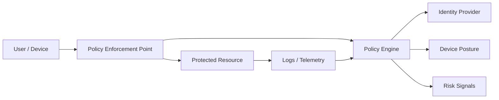

# Zero Trust Architecture

## 概要

Zero Trust Architectureは、ネットワークの内側にいることを理由に暗黙に信頼せず、ユーザー、端末、アプリケーション、通信を継続的に検証するセキュリティ設計です。境界防御を捨てるという意味ではなく、境界だけに頼らず、ID、端末状態、権限、リスクを組み合わせてアクセスを判断します。

## 解決したい課題

- 社内ネットワークに入れた利用者や端末を過度に信頼してしまう
- VPN接続後に広い範囲のシステムへ到達できてしまう
- クラウド、SaaS、リモートワークにより、従来の境界防御だけでは守りにくい
- 侵害されたアカウントや端末からの横展開を抑えたい

## 背景・登場した文脈

NIST SP 800-207では、Zero Trustを「暗黙の信頼を最小化し、アクセス要求ごとに評価する」考え方として整理しています。近年はリモートワーク、SaaS利用、クラウド移行、端末多様化により、社内ネットワークと社外ネットワークを単純に分ける前提が崩れたことが背景にあります。

## 基本構成

| 要素 | 責務 |
| --- | --- |
| Identity | ユーザー、サービスアカウント、端末、ワークロードを識別する |
| Policy Engine | ID、端末状態、場所、リスク、権限からアクセス可否を判断する |
| Policy Enforcement Point | 判断結果を実際の通信や操作に適用する |
| Resource | 保護対象のアプリケーション、API、データ、管理機能 |
| Continuous Monitoring | ログ、端末状態、振る舞い、脅威情報を継続的に評価する |

## Mermaid図

この図では、利用者が直接リソースへ到達するのではなく、Policy Enforcement Pointで判断が適用されます。判断はログイン時だけでなく、端末状態やリスク変化に応じて見直されます。

## 向いている場面

- リモートワーク、SaaS、クラウド利用が多い
- 重要データや管理機能へのアクセスを細かく制御したい
- 端末管理、ID管理、ログ監視をすでに整備し始めている
- 侵害後の横展開を抑えたい

## 向いていない場面

- ID管理や端末管理が未整備で、誰が何にアクセスしているか把握できない
- 「Zero Trust製品を入れれば完了」と考えている
- 業務影響を見ずに一気に厳格化し、例外運用だらけになる
- 重要資産の分類がなく、どこから守るべきか決められない

## メリット

- ネットワーク境界に依存しないアクセス制御を作りやすい
- 最小権限と継続的な検証を徹底しやすい
- 侵害された端末やアカウントからの横展開を抑えやすい
- ログとポリシーを結びつけることで、監査や調査がしやすくなる

## デメリット

- ID、端末、ログ、ネットワーク、アプリの横断的な整備が必要
- 導入範囲が広く、組織的な合意形成が重い
- ポリシーが複雑になると、利用者体験や運用負荷が悪化する
- レガシーアプリや古い認証方式との統合が難しい

## よくある誤解

- VPNを廃止することがZero Trustではない。VPNを使う場合でも、接続後の権限を継続的に制御することが重要。
- 社内ネットワークを信頼しないというだけでは不十分。ID、端末状態、リスク、監視が必要。
- 単一製品で完成するものではなく、段階的なアーキテクチャ改善である。

## 失敗しやすいポイント

- 資産分類なしに全社展開し、重要度の低い領域で疲弊する
- 例外ポリシーが増え、実質的に誰でも広くアクセスできる状態へ戻る
- 認証強化だけで止まり、認可、端末状態、ログ分析まで進まない
- 運用チームだけで進め、業務部門の利用実態と合わなくなる

## 類似アーキテクチャとの違い

| 比較対象 | 違い |
| --- | --- |
| Defense in Depth | 多層防御は防御層を重ねる考え方。Zero Trustはアクセス要求ごとに信頼を検証する考え方 |
| VPN | VPNはネットワーク接続を提供する手段。Zero Trustは接続後も最小権限と継続評価を行う |
| マイクロセグメンテーション | マイクロセグメンテーションはネットワーク到達範囲を細かく分ける手段。Zero Trust実現の一部になり得る |

## 実務での判断ポイント

- まず重要資産、管理機能、個人情報を扱うシステムから始める
- ID基盤、MFA、端末管理、ログ収集を土台として整える
- 権限はロールだけでなく、端末状態やリスクシグナルも含めて判断する
- 例外ポリシーに期限と責任者を持たせる
- 導入効果を、横展開可能範囲、過剰権限数、検知時間などで測る

## 導入チェックリスト

- [ ] 重要資産と保護対象を分類した
- [ ] IDと端末の管理状態を把握した
- [ ] アクセスログを継続的に収集できる
- [ ] 例外ポリシーの期限と承認者を決めた
- [ ] 利用者影響を段階導入で検証した

## 参考

- NIST, [SP 800-207 Zero Trust Architecture](https://csrc.nist.gov/publications/detail/sp/800-207/final)
- CISA, [Zero Trust Maturity Model](https://www.cisa.gov/resources-tools/resources/zero-trust-maturity-model)
