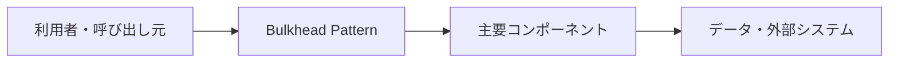

# Bulkhead Pattern

## 概要

リソースや処理を分割し、一部の障害や高負荷が全体へ波及しないようにする信頼性パターンです。

## 解決したい課題

- 侵害や障害を完全には避けられない前提で、影響範囲を抑える設計が必要です。
- 変更影響、運用負荷、理解しやすさのバランスを取る
- 適用範囲と責務境界を明確にする

## 基本構成

| 要素 | 責務 |
| --- | --- |
| Partition | 隔離されたリソース領域 |
| Limit | 同時実行数や接続数などの制限 |
| Fallback | 失敗時に返す代替応答や縮退動作 |
| Monitoring | 領域ごとの状態を監視する仕組み |

## Mermaid図

この図は全体像を簡略化したものです。実際には、非機能要件、組織体制、利用技術によって境界や責務が変わります。

## 向いている場面

- 重要資産の保護、障害隔離、連鎖障害の抑制を重視する場面に向きます。
- 変更や障害の影響範囲を意識して設計したい
- チーム内で構成要素の責務を共通認識にしたい

## 向いていない場面

- 課題が小さく、導入コストのほうが大きい
- 境界や責務を運用で守る体制がない
- 名前だけ導入して実装方針やレビュー観点が変わらない

## メリット

- 責務の分離により変更箇所を見つけやすい
- 設計判断の観点をチームで共有しやすい
- 適用条件が合えば、保守性や拡張性を高めやすい

## デメリット

- 抽象化や構成要素が増え、初期コストがかかる
- 境界設計を誤ると、かえって複雑になる
- 小さなシステムでは過剰設計になりやすい

## 類似アーキテクチャとの違い

| 比較対象 | 違い |
| --- | --- |
| Circuit Breaker Pattern | Circuit Breaker Patternは関連する問題領域で使われる。Bulkhead Patternは「リソースや処理を分割し、一部の障害や高負荷が全体へ波及しないようにする信頼性パターンです。」点を主に扱うため、導入目的と責務境界を分けて判断する |
| Cell-Based Architecture | Cell-Based Architectureは関連する問題領域で使われる。Bulkhead Patternは「リソースや処理を分割し、一部の障害や高負荷が全体へ波及しないようにする信頼性パターンです。」点を主に扱うため、導入目的と責務境界を分けて判断する |
| Rate Limiting | Rate Limitingは関連する問題領域で使われる。Bulkhead Patternは「リソースや処理を分割し、一部の障害や高負荷が全体へ波及しないようにする信頼性パターンです。」点を主に扱うため、導入目的と責務境界を分けて判断する |

## 実務での判断ポイント

- 何を守りたいのか、何を変えやすくしたいのかを先に決める
- 導入後に責務境界をレビューできるルールを用意する
- 既存システムへは小さな範囲から適用し、効果を確認する

## 参考

- Microsoft, [Bulkhead pattern](https://learn.microsoft.com/en-us/azure/architecture/patterns/bulkhead)
