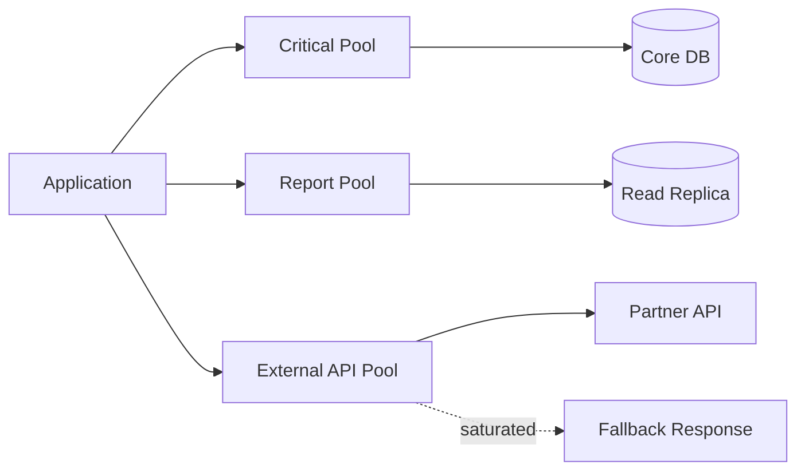

# Bulkhead Pattern

## 概要

Bulkhead Patternは、船の隔壁のようにリソースや処理を分割し、一部の障害や高負荷が全体へ波及しないようにする信頼性パターンです。スレッドプール、接続プール、キュー、テナント、外部API呼び出しなどを分け、重要機能のリソースを守ります。

## 解決したい課題

- 一部機能の高負荷でアプリケーション全体のスレッドや接続が枯渇する
- 不安定な外部API呼び出しが、重要な処理まで巻き込む
- 重いバッチやレポート処理がオンライン処理に影響する
- 特定テナントの負荷が他テナントへ波及する

## 背景・登場した文脈

Michael Nygardの *Release It!* などで、障害を隔離する信頼性パターンとして広く知られています。分散システムだけでなく、単一アプリケーション内でも、リソースプールやキューを分けることで効果があります。

## 基本構成

| 要素 | 責務 |
| --- | --- |
| Partition | 隔離されたリソース領域。例: スレッドプール、接続プール、キュー |
| Limit | 同時実行数、接続数、キュー長などの上限 |
| Priority | 重要機能に優先的に割り当てるリソース方針 |
| Fallback | 隔離領域が失敗したときの縮退動作 |
| Monitoring | 領域ごとの使用率、失敗率、待ち時間を監視する |

## Mermaid図

この図では、重要処理、レポート処理、外部API呼び出しを別のリソース領域へ分けています。外部APIが詰まっても、重要処理のリソースを使い切らないようにするのが狙いです。

## 向いている場面

- 外部APIや下流サービスの品質が一定でない
- 重要処理と重い処理を同じリソースで実行している
- マルチテナントで一部顧客の負荷を隔離したい
- スレッド、接続、キュー、CPUなどの枯渇が障害原因になっている

## 向いていない場面

- リソース分割により利用効率が大きく下がる
- 負荷や障害の偏りがなく、隔離する価値が小さい
- 制限値を測定、調整する監視がない
- 隔離単位を細かくしすぎて運用できない

## メリット

- 障害や高負荷の波及を抑えられる
- 重要機能のリソースを守りやすい
- 外部依存ごとにタイムアウト、リトライ、制限を分けやすい
- 隔離単位ごとにSLOやアラートを設計しやすい

## デメリット

- リソース利用効率が下がる場合がある
- 制限値のチューニングが必要
- 隔離境界を誤ると、守りたい処理を守れない
- Fallbackやユーザー通知を設計しないと、単に失敗が増える

## よくある誤解

- Circuit Breakerと同じではない。Circuit Breakerは呼び出し遮断、Bulkheadはリソース隔離。
- マイクロサービス専用ではない。単一アプリ内のスレッドプール分離でも使える。
- リソースを分ければ終わりではない。上限、監視、Fallbackまで必要。

## 失敗しやすいポイント

- すべての処理が同じDB接続プールを使い、結局そこで詰まる
- 低優先度処理のキューが無制限に伸び、メモリを圧迫する
- Fallbackがなく、隔離した領域の失敗がユーザーに雑に見える
- 隔離単位ごとのメトリクスがなく、効果を判断できない

## 類似アーキテクチャとの違い

| 比較対象 | 違い |
| --- | --- |
| Circuit Breaker Pattern | Circuit Breakerは失敗が続く呼び出しを遮断する。Bulkheadはリソースを分けて波及を抑える |
| Cell-Based Architecture | Cell-Basedはユーザーやテナント単位でアプリとデータを含めて隔離する。Bulkheadはより小さなリソース隔離にも使える |
| Rate Limiting | Rate Limitingは流量を制限する。Bulkheadは処理領域やリソース領域を分ける |

## 実務での判断ポイント

- まず枯渇しやすいリソースを特定する。例: DB接続、スレッド、キュー、外部API枠
- 重要処理と低優先度処理を同じプールに置かない
- 隔離単位ごとに上限、タイムアウト、キュー長、アラートを決める
- Circuit Breaker、Timeout、Retryと組み合わせる
- Fallback時の画面表示、APIレスポンス、再試行方針を設計する

## 導入チェックリスト

- [ ] 守りたい重要処理を定義した
- [ ] 枯渇しやすいリソースを特定した
- [ ] 隔離単位ごとの上限を決めた
- [ ] Fallbackを設計した
- [ ] 隔離単位ごとのメトリクスを監視している

## 参考

- Michael T. Nygard, *Release It!*, 2nd Edition, Pragmatic Bookshelf, 2018
- Microsoft, [Bulkhead pattern](https://learn.microsoft.com/en-us/azure/architecture/patterns/bulkhead)
