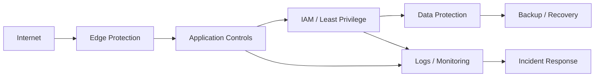

# Defense in Depth

## 概要

Defense in Depth、多層防御は、単一の防御策に依存せず、複数の防御層を重ねて攻撃や障害の影響を抑える考え方です。予防だけでなく、検知、封じ込め、復旧まで含めて設計することで、どこか1つの対策が破られても全体被害を小さくします。

## 解決したい課題

- ファイアウォールや認証など、1つの対策が破られると全体が危険になる
- 侵害を検知できず、被害範囲が広がる
- バックアップや復旧手順がなく、障害後に戻せない
- セキュリティ対策が製品導入だけで終わり、運用に結びつかない

## 背景・登場した文脈

多層防御は軍事や物理防御にも由来する考え方で、情報システムではネットワーク、アプリケーション、ID、データ、監視、復旧を重ねて防御する文脈で使われます。現代では「侵害されない」前提ではなく、「一部は破られる」前提で検知と封じ込めを組み合わせます。

## 基本構成

| 要素 | 責務 |
| --- | --- |
| Prevent | MFA、入力検証、パッチ適用、WAFなどで攻撃を防ぐ |
| Detect | ログ、監視、IDS、EDR、SIEMで異常を検知する |
| Contain | セグメント分離、最小権限、Rate Limitで影響範囲を抑える |
| Recover | バックアップ、復旧手順、インシデント対応で正常状態へ戻す |
| Learn | 事後レビューで再発防止策を更新する |

## Mermaid図

この図は、入口、アプリ、ID、データ、監視、復旧を防御層として重ねる例です。層は多ければよいわけではなく、各層が別の失敗を補うことが重要です。

## 向いている場面

- 個人情報、決済情報、機密情報など重要資産を扱う
- 規制や監査要件がある
- 侵害や障害が起きたときの封じ込めと復旧を重視する
- 単一対策に依存している状態を改善したい

## 向いていない場面

- 製品やチェックリストを重ねるだけで、運用責任がない
- 防御層の目的が重複し、利用者体験や開発速度だけが悪化する
- 検知後の対応手順がなく、アラートが放置される
- 資産重要度に関係なく全領域へ同じ強度の対策を入れる

## メリット

- 単一障害点や単一防御策への依存を減らせる
- 侵害時の検知、封じ込め、復旧まで設計しやすい
- 資産重要度に応じて防御層を強められる
- セキュリティレビューの観点を整理しやすい

## デメリット

- 防御層が増えるほど運用、設定、監視が複雑になる
- 誤設定や例外運用が増えると逆にリスクになる
- コストと利用者体験への影響が出やすい
- 各層の責務が曖昧だと、誰も検知や復旧を担当しない

## よくある誤解

- 防御製品を多く入れることが多層防御ではない。各層が異なるリスクを下げる必要がある。
- 予防策だけでは不十分。検知、封じ込め、復旧まで含める。
- すべてのシステムに同じ防御強度を適用する必要はない。資産重要度で濃淡をつける。

## 失敗しやすいポイント

- WAF、EDR、SIEMを入れても、誰もアラートを見ない
- バックアップはあるが、復旧テストをしていない
- 例外申請が恒久化し、最小権限が崩れる
- 開発チームと運用チームの責務境界が曖昧で、脆弱性対応が遅れる

## 類似アーキテクチャとの違い

| 比較対象 | 違い |
| --- | --- |
| Zero Trust Architecture | Zero Trustはアクセスごとの継続検証を重視する。多層防御は予防、検知、封じ込め、復旧を重ねる広い考え方 |
| Bulkhead Pattern | Bulkheadは障害や負荷の隔離に焦点を当てる。多層防御はセキュリティを含む複数層の防御 |
| 境界防御 | 境界防御は入口を守る。多層防御は内部侵害や復旧も前提にする |

## 実務での判断ポイント

- 資産重要度ごとに必要な防御層を決める
- 予防、検知、封じ込め、復旧のどこが弱いかを棚卸しする
- アラート対応の責任者、SLA、エスカレーション先を決める
- バックアップは取得だけでなく復旧テストまで確認する
- 防御層が開発速度や利用者体験に与える影響を測る

## 導入チェックリスト

- [ ] 保護すべき資産を分類した
- [ ] 予防、検知、封じ込め、復旧の責任者を決めた
- [ ] アラート対応手順を定義した
- [ ] 復旧テストを実施した
- [ ] 例外運用の期限と棚卸し方法を決めた

## 参考

- OWASP, [Principles of security](https://devguide.owasp.org/en/02-foundations/03-security-principles/)
- NIST, [Cybersecurity Framework](https://www.nist.gov/cyberframework)
