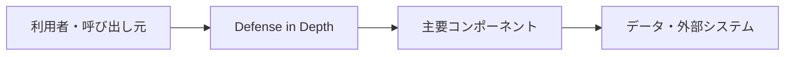

# Defense in Depth

## 概要

単一の防御策に依存せず、複数の防御層を重ねて攻撃や障害の影響を抑える考え方です。

## 解決したい課題

- 侵害や障害を完全には避けられない前提で、影響範囲を抑える設計が必要です。
- 変更影響、運用負荷、理解しやすさのバランスを取る
- 適用範囲と責務境界を明確にする

## 基本構成

| 要素 | 責務 |
| --- | --- |
| Prevent | 攻撃や障害を事前に防ぐ防御層 |
| Detect | 異常や侵害を検知する防御層 |
| Contain | 影響範囲を封じ込める防御層 |
| Recover | バックアップや復旧手順で戻す防御層 |

## Mermaid図

この図は全体像を簡略化したものです。実際には、非機能要件、組織体制、利用技術によって境界や責務が変わります。

## 向いている場面

- 重要資産の保護、障害隔離、連鎖障害の抑制を重視する場面に向きます。
- 変更や障害の影響範囲を意識して設計したい
- チーム内で構成要素の責務を共通認識にしたい

## 向いていない場面

- 課題が小さく、導入コストのほうが大きい
- 境界や責務を運用で守る体制がない
- 名前だけ導入して実装方針やレビュー観点が変わらない

## メリット

- 責務の分離により変更箇所を見つけやすい
- 設計判断の観点をチームで共有しやすい
- 適用条件が合えば、保守性や拡張性を高めやすい

## デメリット

- 抽象化や構成要素が増え、初期コストがかかる
- 境界設計を誤ると、かえって複雑になる
- 小さなシステムでは過剰設計になりやすい

## 類似アーキテクチャとの違い

| 比較対象 | 違い |
| --- | --- |
| Zero Trust Architecture | Zero Trust Architectureは関連する問題領域で使われる。Defense in Depthは「単一の防御策に依存せず、複数の防御層を重ねて攻撃や障害の影響を抑える考え方です。」点を主に扱うため、導入目的と責務境界を分けて判断する |
| Bulkhead Pattern | Bulkhead Patternは関連する問題領域で使われる。Defense in Depthは「単一の防御策に依存せず、複数の防御層を重ねて攻撃や障害の影響を抑える考え方です。」点を主に扱うため、導入目的と責務境界を分けて判断する |
| 境界防御 | 境界防御は関連する問題領域で使われる。Defense in Depthは「単一の防御策に依存せず、複数の防御層を重ねて攻撃や障害の影響を抑える考え方です。」点を主に扱うため、導入目的と責務境界を分けて判断する |

## 実務での判断ポイント

- 何を守りたいのか、何を変えやすくしたいのかを先に決める
- 導入後に責務境界をレビューできるルールを用意する
- 既存システムへは小さな範囲から適用し、効果を確認する

## 参考

- OWASP, [Defense in Depth](https://owasp.org/www-community/Defense_in_depth)
