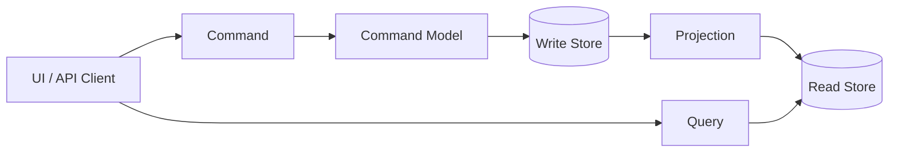

# CQRS

## 概要

CQRS、Command Query Responsibility Segregationは、更新を扱うCommand側と参照を扱うQuery側の責務を分ける設計です。更新モデルは業務ルールや整合性を守ることに集中し、参照モデルは画面表示、検索、集計など読み取りに適した形へ最適化します。

## 解決したい課題

- 更新処理と参照処理で必要なデータ形状や性能要件が大きく違う
- 参照画面の都合で、更新モデルやドメインモデルが歪む問題を避ける
- 複雑な業務更新をCommandとして明示し、意図を追いやすくする
- 検索、一覧、集計、ダッシュボードを読み取り専用モデルで高速化する

## 基本構成

| 要素 | 責務 |
| --- | --- |
| Command | 状態変更の意図を表す。例: 注文を確定する、在庫を引き当てる |
| Command Model | 業務ルール、不変条件、トランザクション境界を扱う更新側モデル |
| Query | 状態を変更せず、必要な情報を取得する要求 |
| Query Model | 画面や検索に合わせて最適化した参照側モデル |
| Projection | 更新結果やイベントからQuery Modelを作る処理 |
| Read Store | 参照に最適化したDB、検索エンジン、キャッシュなど |

## Mermaid図

この図では、更新はCommand Modelを通り、参照はRead Storeを見る流れに分けています。Write StoreとRead Storeを物理的に分けることもありますが、必須ではありません。重要なのは、更新と参照で責務とモデルを分けることです。

## 向いている場面

- 更新側は業務ルールが複雑で、参照側は検索や一覧表示が多い
- 参照性能を上げるために、画面専用のRead Modelを作りたい
- 書き込み負荷と読み取り負荷の特性が大きく違う
- Event Sourcingやイベント駆動と組み合わせてProjectionを作りたい
- 管理画面、監査画面、集計画面など読み取り要件が多様

## 向いていない場面

- 単純なCRUDで、読み書きのモデル差がほとんどない
- 参照モデルの同期遅延を利用者や業務が許容できない
- Projectionの再構築や障害復旧を運用できない
- チームがCommandとQueryの境界を守れず、両方が混ざる
- 全機能に一律適用して、単純な処理まで複雑にしてしまう

## メリット

- 更新モデルを業務ルールと整合性に集中させられる
- 参照モデルを画面や検索に合わせて自由に最適化しやすい
- 読み取り負荷のスケールやキャッシュ戦略を分けやすい
- Command名により、状態変更の意図がコードに出やすい

## デメリット

- モデル、保存先、同期処理が増えて複雑になる
- Write ModelとRead Modelの同期遅延を扱う必要がある
- Projectionの失敗、再処理、再構築の運用が必要
- 更新直後に参照結果へ反映されないことがある

## Event Sourcingとの関係

CQRSとEvent Sourcingはよく一緒に使われますが、同じものではありません。

| 組み合わせ | 説明 |
| --- | --- |
| CQRSのみ | 更新モデルと参照モデルを分ける。状態保存は通常のDB更新でもよい |
| Event Sourcingのみ | 状態の保存方法としてイベント列を使う。参照モデル分離は必須ではない |
| CQRS + Event Sourcing | イベントを保存し、そのイベントから複数のRead ModelをProjectionで作る |

## 類似アーキテクチャとの違い

| 比較対象 | 違い |
| --- | --- |
| CRUD | CRUDは同じモデルで作成、参照、更新、削除を扱うことが多い。CQRSは更新と参照のモデルを明示的に分ける |
| Event Sourcing | Event Sourcingは状態をイベント列として保存する方式。CQRSは読み書き責務の分離であり、保存方式は問わない |
| レイヤードアーキテクチャ | レイヤードはPresentation/Application/Domainなどの層分離。CQRSは操作種別による分離 |
| Data Pipeline Architecture | Data Pipelineはデータ処理の流れ全体を設計する。CQRSのProjectionはRead Model作成の小さなパイプラインと見なせる |

## 実務での判断ポイント

- 「読み書きを分けたい理由」が性能、モデル差、複雑な更新のどれなのかを明確にする
- 最初から全体へ導入せず、読み取り要件が強い領域に絞る
- Read Modelの再構築手順を用意する
- 更新直後の画面表示で、Read Modelの遅延をどう扱うか決める
- Commandは単なるCRUD名ではなく、業務上の意図を表す名前にする

## 参考

- Martin Fowler, [CQRS](https://martinfowler.com/bliki/CQRS.html)
- Microsoft, [CQRS pattern](https://learn.microsoft.com/en-us/azure/architecture/patterns/cqrs)
- Greg Young, [CQRS Documents](https://cqrs.files.wordpress.com/2010/11/cqrs_documents.pdf)
