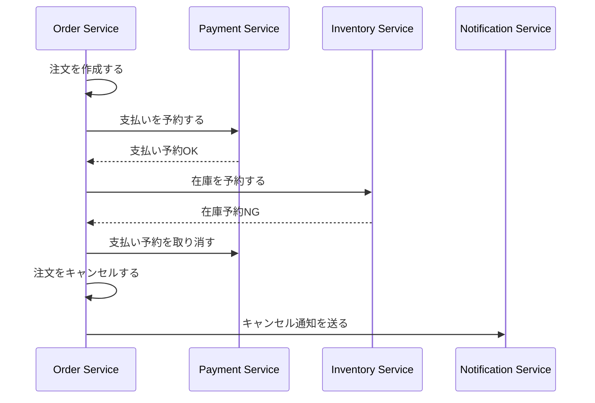

# Sagaパターン

## 概要

Sagaパターンは、複数サービスにまたがる業務処理を、各サービス内のローカルトランザクションと補償処理の連なりとして扱う設計です。2相コミットのように全体を強くロックするのではなく、失敗時に意味を打ち消す処理を用意し、最終的整合性で業務プロセスを進めます。

## 解決したい課題

- 複数サービスにまたがる更新を、単一DBトランザクションのようには扱えない
- 分散トランザクション基盤や2相コミットを避けたい
- 長時間の業務プロセスで途中失敗、タイムアウト、再試行を扱いたい
- サービスごとのデータ所有権を保ちながら、業務全体の整合性を管理したい

## 基本構成

| 要素 | 責務 |
| --- | --- |
| Local Transaction | 各サービス内で完結する状態変更を行う |
| Compensation | 失敗時に、完了済み処理の業務的な意味を取り消す |
| Orchestrator | Saga全体の手順、状態、タイムアウト、再試行を中央で管理する |
| Choreography | 各サービスがイベントに反応し、自律的に次の処理を進める |
| Saga State | 進行中、完了、失敗、補償中などの状態を記録する |

## Mermaid図

この図はOrchestration型の例です。Order Serviceまたは専用Orchestratorが手順を管理し、在庫予約に失敗した場合は、すでに完了した支払い予約を補償します。

## 向いている場面

- マイクロサービス間で業務プロセスをまたぐ更新がある
- 各サービスが自分のDBを所有している
- 最終的整合性を業務上許容できる
- 補償処理を業務的に定義できる
- 長時間処理、外部API、非同期処理を含む

## 向いていない場面

- 強いACID整合性が必須で、途中状態を許容できない
- 補償できない副作用が多い
- 各ステップの状態、再試行、タイムアウトを追跡する仕組みがない
- 失敗時の業務判断を定義できない
- 単一DB内の通常トランザクションで十分に解ける

## メリット

- サービスごとのデータ所有権を保ちやすい
- 分散トランザクション基盤に依存しにくい
- 長い業務プロセスを明示的に設計できる
- 失敗時の補償や再試行を業務ルールとして扱いやすい

## デメリット

- 補償処理の設計が難しい
- 最終的整合性になるため、一時的な不整合を利用者や運用が理解する必要がある
- Choreography型では全体の流れが見えにくくなりやすい
- Orchestration型ではOrchestratorに責務が集中しやすい
- 重複実行、順序ずれ、タイムアウトへの対策が必要

## 類似アーキテクチャとの違い

| 比較対象 | 違い |
| --- | --- |
| 2相コミット | 2相コミットは参加者を強く調整して原子性を狙う。Sagaはローカルトランザクションと補償処理で最終的整合性を扱う |
| イベント駆動アーキテクチャ | イベント駆動は連携方式。SagaのChoreography型はイベント駆動で実装されることが多い |
| ワークフローエンジン | ワークフローエンジンは手順実行の基盤。Sagaは分散更新と補償を扱う設計パターン |
| CQRS | CQRSは更新と参照の責務分離。Sagaは複数更新の業務プロセス管理 |

## 実務での判断ポイント

- 補償処理が「技術的な巻き戻し」ではなく、業務的に正しい取り消しになっているか確認する
- Sagaの状態を永続化し、途中失敗から再開または補償できるようにする
- 各ステップを冪等にし、重複メッセージや再試行に耐えられるようにする
- Orchestration型とChoreography型のどちらで全体フローを可視化しやすいか検討する
- 利用者に見える途中状態、キャンセル状態、保留状態の表示を設計する

## 参考

- Hector Garcia-Molina, Kenneth Salem, [Sagas](https://www.cs.cornell.edu/andru/cs711/2002fa/reading/sagas.pdf), 1987
- Chris Richardson, [Saga pattern](https://microservices.io/patterns/data/saga.html)
