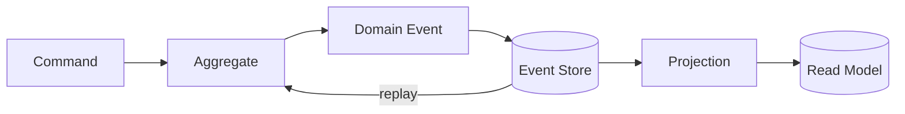

# Event Sourcing

## 概要

Event Sourcingは、現在状態そのものではなく、状態を変化させたイベント列を保存し、そのイベントを再生して現在状態を復元する設計です。状態変更の履歴が第一級のデータになるため、監査、過去状態の再現、Projectionの再構築に強い一方、イベント設計と運用の難度は高くなります。

## 解決したい課題

- 「いつ、なぜ、どのように状態が変わったか」を正確に残したい
- 現在状態だけではなく、過去時点の状態や変更履歴を再現したい
- イベントから複数の参照モデルや集計モデルを作りたい
- 監査証跡を補助ログではなく、システムの中心データとして扱いたい

## 基本構成

| 要素 | 責務 |
| --- | --- |
| Command | 状態変更の意図を表す入力 |
| Aggregate | Commandを検証し、発生するイベントを決める一貫性境界 |
| Event | 過去に発生した業務上の事実。例: OrderPlaced、PaymentReserved |
| Event Store | イベントを追記専用で保存するストア |
| Snapshot | イベント再生を高速化するための途中状態 |
| Projection | イベント列から参照用の状態や集計を作る処理 |

## Mermaid図

この図では、Commandから直接DBの現在状態を書き換えるのではなく、業務上のEventを保存し、そのEventからAggregateやRead Modelを復元します。Event Storeは通常、過去イベントを書き換えず追記していく前提で設計します。

## 向いている場面

- 監査、履歴、説明責任が強く求められる
- 業務状態の遷移が重要で、後から分析や再現をしたい
- 複数のRead Modelや集計を後から追加したい
- 過去イベントを再生してProjectionを再構築したい
- ドメインイベントが業務上自然な概念として定義できる

## 向いていない場面

- 現在状態だけ保存できれば十分
- 単純なCRUDやマスタ管理が中心
- イベントの意味を長期的に維持できない
- イベントスキーマの進化、再生、Snapshot運用を管理できない
- 個人情報や削除要件との整合を設計できない

## メリット

- 完全な状態変更履歴を残しやすい
- 過去状態の再現や監査に強い
- Eventから複数のProjectionを作れる
- 状態変更の意図と結果を業務イベントとして表現しやすい

## デメリット

- イベント設計を誤ると後から修正しにくい
- イベント再生、Snapshot、Projection再構築の運用が必要
- 現在状態を見るだけの処理でも設計が重くなりやすい
- イベントスキーマ変更や個人情報削除の扱いが難しい

## イベント設計の注意

- イベントは `OrderPlaced` のように過去形の業務事実として命名する
- 技術ログや差分データではなく、業務的に意味のある出来事を表す
- 後からConsumerやProjectionが増える前提で、イベントの互換性を保つ
- 過去イベントは原則として書き換えないため、訂正は訂正イベントとして表現する

## 類似アーキテクチャとの違い

| 比較対象 | 違い |
| --- | --- |
| CQRS | CQRSは読み書きの責務分離。Event Sourcingはイベント列を保存の源泉にする方式。併用されることが多いが独立した概念 |
| イベント駆動アーキテクチャ | イベント駆動はサービス連携や処理起動にイベントを使う。Event Sourcingではイベントが状態の保存形式になる |
| 監査ログ | 監査ログは現在状態の補助記録であることが多い。Event Sourcingではイベント列が正本であり、現在状態は派生物 |
| Sagaパターン | Sagaは複数サービスにまたがる業務プロセス管理。Event Sourcingは単一Aggregateやサービス内の状態保存にも使える |

## 実務での判断ポイント

- 監査や再現性の価値が、実装・運用の複雑さを上回るか確認する
- イベントスキーマのバージョニング方針を先に決める
- Projectionを壊しても再構築できるようにする
- Snapshotを使う場合、どの頻度で作るか、古いSnapshotをどう扱うか決める
- 個人情報削除、暗号化、保持期間などの法務・セキュリティ要件を確認する

## 参考

- Martin Fowler, [Event Sourcing](https://martinfowler.com/eaaDev/EventSourcing.html)
- Greg Young, [CQRS Documents](https://cqrs.files.wordpress.com/2010/11/cqrs_documents.pdf)
- Martin Kleppmann, *Designing Data-Intensive Applications*, O'Reilly, 2017
