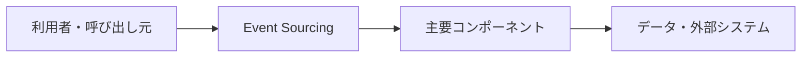

# Event Sourcing

## 概要

現在状態ではなく、状態を変化させたイベント列を保存し、そこから状態を復元する設計です。

## 解決したい課題

- データの更新、参照、履歴、処理遅延をどう扱うかが主要な論点です。
- 変更影響、運用負荷、理解しやすさのバランスを取る
- 適用範囲と責務境界を明確にする

## 基本構成

| 要素 | 責務 |
| --- | --- |
| Event | 過去に発生した業務上の事実 |
| Event Store | イベントを追記保存する永続ストア |
| Aggregate | 一貫性境界として状態変更を扱う単位 |
| Projection | 更新結果やイベントから参照用データを作る処理 |

## Mermaid図

この図は全体像を簡略化したものです。実際には、非機能要件、組織体制、利用技術によって境界や責務が変わります。

## 向いている場面

- データ量、整合性、再処理、監査性が設計判断に影響する場面に向きます。
- 変更や障害の影響範囲を意識して設計したい
- チーム内で構成要素の責務を共通認識にしたい

## 向いていない場面

- 課題が小さく、導入コストのほうが大きい
- 境界や責務を運用で守る体制がない
- 名前だけ導入して実装方針やレビュー観点が変わらない

## メリット

- 責務の分離により変更箇所を見つけやすい
- 設計判断の観点をチームで共有しやすい
- 適用条件が合えば、保守性や拡張性を高めやすい

## デメリット

- 抽象化や構成要素が増え、初期コストがかかる
- 境界設計を誤ると、かえって複雑になる
- 小さなシステムでは過剰設計になりやすい

## 類似アーキテクチャとの違い

| 比較対象 | 違い |
| --- | --- |
| CQRS | CQRSは関連する問題領域で使われる。Event Sourcingは「現在状態ではなく、状態を変化させたイベント列を保存し、そこから状態を復元する設計です。」点を主に扱うため、導入目的と責務境界を分けて判断する |
| イベント駆動アーキテクチャ | イベント駆動アーキテクチャは関連する問題領域で使われる。Event Sourcingは「現在状態ではなく、状態を変化させたイベント列を保存し、そこから状態を復元する設計です。」点を主に扱うため、導入目的と責務境界を分けて判断する |
| 監査ログ | 監査ログは関連する問題領域で使われる。Event Sourcingは「現在状態ではなく、状態を変化させたイベント列を保存し、そこから状態を復元する設計です。」点を主に扱うため、導入目的と責務境界を分けて判断する |

## 実務での判断ポイント

- 何を守りたいのか、何を変えやすくしたいのかを先に決める
- 導入後に責務境界をレビューできるルールを用意する
- 既存システムへは小さな範囲から適用し、効果を確認する

## 参考

- Martin Fowler, [Event Sourcing](https://martinfowler.com/eaaDev/EventSourcing.html)
