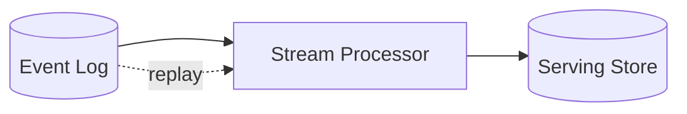

# Kappa Architecture

## 概要

ストリーム処理を中心にデータ処理を統一する構成です。

## 解決したい課題

- バッチ層とストリーム層の二重実装を避けたい
- イベントログを再生して、仕様変更や障害後に再処理したい
- データ処理経路を一本化して保守コストを下げたい

## 背景・登場した文脈

Kappa Architectureは、Lambda Architectureの二重実装を避けるため、ストリーム処理を中心に構成する考え方です。入力ログを保持し、必要に応じてログを再生して再処理します。構成は単純に見えますが、イベント時間、遅延データ、状態管理、再処理時の副作用を設計できることが前提です。

## 基本構成

| 要素 | 責務 |
| --- | --- |
| Immutable Log | 追記のみで保持するイベントやデータのログ |
| Stream Processor | ログやイベントを継続的に処理するコンポーネント |
| Serving Store | 問い合わせに使う処理済み結果の保存先 |
| Replay | 過去ログを再処理する仕組み |

## Mermaid図

この図は、Kappa Architectureで中心になる責務と流れを簡略化したものです。実際の設計では、組織体制、運用能力、既存システムとの接続、非機能要件によって境界の切り方が変わります。

## 向いている場面

- 入力データを再生可能なログとして保持できる
- ストリーム処理基盤を安定運用できる
- 低遅延処理と再処理を同じロジックに寄せたい

## 向いていない場面

- 過去ログを十分に保持できない
- 処理結果に外部副作用が多く、再処理が難しい
- 厳密な全量再計算をバッチで行う方が説明しやすい

## メリット

- 処理ロジックを一本化し、Lambdaの二重保守を減らしやすい
- ログ再生により再処理や仕様変更に対応しやすい
- リアルタイム性を前提にしたデータ提供をしやすい

## デメリット

- ストリーム処理基盤の運用難度が高い
- 遅延、重複、順序入れ替わりへの対応が必要
- 再処理時の外部副作用を避ける設計が必要

## よくある誤解

- ストリーム処理だけにすれば簡単になるとは限らない。再処理、順序、遅延データ、スキーマ変更の設計が必要。
- Kappaはバッチを禁止する思想ではない。中心をログ再生可能なストリーム処理に寄せる選択肢。
- リアルタイム性だけが目的ではない。処理経路を一本化してロジック重複を減らすことも重要。

## 失敗しやすいポイント

- 過去ログの保持期間が短く、障害や仕様変更時に再計算できない
- 遅延イベントや順序入れ替わりへの対応がなく、集計結果が揺れる
- ストリーム処理基盤の運用スキルが不足し、障害時に復旧できない

## 類似アーキテクチャとの違い

| 比較対象 | 違い |
|---|---|
| Lambda Architecture | Lambdaはバッチ層とスピード層を併用する。Kappaはストリーム処理を主軸にし、再処理もログの再生で扱うことを目指す |
| Event Sourcing | Event Sourcingは業務状態の変更履歴をイベントとして保存する設計。Kappaはデータ処理基盤の構成であり、入力ログを再処理可能にする点に焦点がある |
| Data Pipeline Architecture | Data Pipelineはバッチ、ストリーム、ETL/ELTなどを広く含む。Kappaはストリーム中心に構成を単純化する選択肢 |

## 実務での判断ポイント

- すべての入力を再生可能なログとして保持できるか確認する
- イベント時間、処理時間、ウォーターマーク、遅延許容を定義する
- 再処理時に外部副作用を起こさない設計にする
- Lambdaより単純化できる範囲と、失う正確性保証を比較する

## 導入チェックリスト

- [ ] 入力ログの保持期間と再生手順が定義されている
- [ ] 遅延イベント、重複、順序入れ替わりへの対応がある
- [ ] ストリーム処理の状態管理とチェックポイントを監視している
- [ ] 再処理時の外部通知や書き込みが冪等化されている

## 参考

- Jay Kreps, [Questioning the Lambda Architecture](https://www.oreilly.com/radar/questioning-the-lambda-architecture/)
