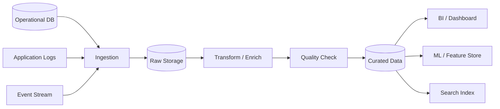

# Data Pipeline Architecture

## 概要

Data Pipeline Architectureは、データの収集、変換、検証、保存、配信を段階的な処理として設計する構成です。業務システムのトランザクション処理そのものではなく、分析、機械学習、監視、レポート、検索基盤などに向けてデータを流通させるために使われます。

## 解決したい課題

- 複数のデータソースから継続的にデータを集めたい
- 生データ、整形済みデータ、集計済みデータを段階的に管理したい
- データ品質、再処理、依存関係、処理失敗を運用できるようにしたい
- 分析、BI、ML、検索など用途ごとにデータを届けたい

## 基本構成

| 要素 | 責務 |
| --- | --- |
| Source | 業務DB、ログ、イベント、外部API、ファイルなどのデータ発生元 |
| Ingestion | バッチ、ストリーム、CDCなどでデータを取り込む |
| Raw Storage | 変換前のデータを保持し、再処理できるようにする |
| Transform | 整形、結合、検証、匿名化、集計などを行う |
| Quality Check | スキーマ、欠損、重複、件数、範囲などを検証する |
| Sink | DWH、Lakehouse、検索基盤、BI、ML Feature Storeなどの出力先 |

## Mermaid図

この図では、複数ソースから取り込んだデータをRaw Storageに保存し、変換と品質チェックを経て用途別の出力先へ届ける流れを示しています。重要なのは、処理が失敗したときにどこから再実行できるかを設計しておくことです。

## 向いている場面

- データ分析、BI、機械学習、監視基盤を作る
- 複数システムのデータを統合して利用したい
- バッチ処理やストリーム処理の依存関係を管理したい
- データ品質、再処理、データ系譜を追跡したい
- 業務DBに直接重い分析クエリを投げたくない

## 向いていない場面

- 単純なアプリ内集計で十分
- データ所有者、品質基準、利用目的が曖昧
- 失敗時の再実行や重複排除を設計できない
- リアルタイム性や整合性の要求が不明確
- パイプラインを作ること自体が目的化している

## メリット

- データ処理の流れと責務を可視化しやすい
- Rawデータを残すことで再処理しやすい
- 段階ごとに品質チェックや監視を入れやすい
- 分析やMLなど複数用途へデータを届けやすい

## デメリット

- パイプライン数が増えると依存関係が複雑になる
- スキーマ変更、遅延データ、重複データへの対応が必要
- 処理失敗時の再実行や部分復旧が難しい場合がある
- データ品質の責任者が曖昧だと、信頼できないデータが増える

## バッチとストリームの違い

| 方式 | 特徴 | 向いている場面 |
| --- | --- | --- |
| バッチ処理 | 一定間隔でまとめて処理する | 日次集計、請求、レポート、再計算 |
| ストリーム処理 | データ到着に近いタイミングで処理する | リアルタイム監視、不正検知、即時通知 |
| ハイブリッド | バッチとストリームを用途で使い分ける | 正確性と低遅延の両方が必要な分析基盤 |

## 類似アーキテクチャとの違い

| 比較対象 | 違い |
| --- | --- |
| Lambda Architecture | Lambdaはバッチ層とスピード層を併用する具体的なデータ処理構成。Data Pipelineはより広いデータ処理の流れ全般を扱う |
| Kappa Architecture | Kappaはストリーム処理中心に統一する構成。Data Pipelineはバッチ、ストリーム、ハイブリッドのいずれも含む |
| Data Mesh | Data Meshはドメインごとのデータ所有権や組織設計を含む。Data Pipelineはデータを処理して届ける技術的な流れに焦点を当てる |
| Lakehouse Architecture | Lakehouseは保存・分析基盤の構成。Data Pipelineはその基盤へデータを入れ、変換し、配信する流れを設計する |

## 実務での判断ポイント

- データの所有者、利用者、SLA、品質基準を先に決める
- Rawデータを残すか、どの粒度で再処理できるかを設計する
- スキーマ変更時の互換性と移行手順を決める
- パイプラインの遅延、失敗率、処理件数、データ品質を監視する
- 個人情報や機密情報をどの段階でマスク、匿名化、削除するか決める

## 参考

- Martin Kleppmann, *Designing Data-Intensive Applications*, O'Reilly, 2017
- Tyler Akidau et al., [The Dataflow Model](https://www.vldb.org/pvldb/vol8/p1792-Akidau.pdf), VLDB, 2015
- Google Cloud, [What Data Pipeline Architecture should I use?](https://cloud.google.com/blog/topics/developers-practitioners/what-data-pipeline-architecture-should-i-use)
