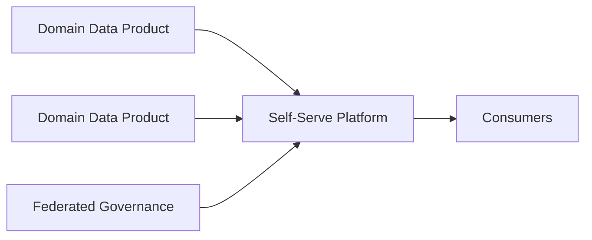

# Data Mesh

## 概要

ドメインごとにデータをプロダクトとして所有・提供する考え方です。

## 解決したい課題

- 中央データチームに依頼が集中し、データ提供が遅くなる
- データの意味や品質を一番知っているドメインチームが、公開後の責任を持てていない
- 横断利用したいデータの所有者、SLO、スキーマ、利用条件が分からない

## 背景・登場した文脈

Data Meshは、Zhamak Dehghaniが提唱した分散型データアーキテクチャの考え方です。ドメインチームがデータをプロダクトとして所有し、中央基盤はセルフサービス能力と横断ガバナンスを提供します。技術構成だけでなく、組織、責任、評価指標を変える取り組みです。

## 基本構成

| 要素 | 責務 |
| --- | --- |
| Domain Ownership | ドメインチームがデータの意味と品質を所有すること |
| Data as a Product | 利用者に価値を届けるプロダクトとしてデータを扱うこと |
| Self-Serve Platform | データ公開や監視を標準化する共通基盤 |
| Federated Governance | 中央標準とドメイン自律を両立する統治方式 |

## Mermaid図

この図は、Data Meshで中心になる責務と流れを簡略化したものです。実際の設計では、組織体制、運用能力、既存システムとの接続、非機能要件によって境界の切り方が変わります。

## 向いている場面

- 複数ドメインがデータを生成し、中央チームだけでは品質や速度を保てない
- データ利用者に対して所有者、SLO、契約を明確にしたい
- セルフサービス基盤と共通ガバナンスを用意できる

## 向いていない場面

- 組織が小さく、中央チームで十分に対応できる
- ドメインチームがデータ品質や公開責任を持てない
- メタデータ、権限、標準化の基盤がないまま分散しようとしている

## メリット

- ドメイン知識をデータ品質と仕様に反映しやすい
- 中央チームのボトルネックを減らしやすい
- データを利用者向けのプロダクトとして扱いやすくなる

## デメリット

- 組織設計、評価制度、責任分担まで変える必要がある
- 標準化が弱いとドメインごとのばらつきが増える
- セルフサービス基盤とガバナンスの整備に投資が必要

## よくある誤解

- Data Meshはデータ基盤ツールの名前ではない。ドメイン所有、データプロダクト、フェデレーテッドガバナンスを含む運営モデル。
- 中央データチームをなくすことではない。セルフサービス基盤や標準化を支える役割はむしろ重要になる。
- ドメインに丸投げすると品質は上がらない。SLO、メタデータ、契約、レビューの仕組みが必要。

## 失敗しやすいポイント

- データプロダクトの所有者、利用者、品質指標が曖昧なままカタログだけ作る
- ドメインごとに形式や権限管理がばらつき、横断利用が難しくなる
- 基盤が未整備で、各ドメインが個別にパイプラインや権限管理を作り始める

## 類似アーキテクチャとの違い

| 比較対象 | 違い |
|---|---|
| Data Lake | Data Lakeはデータを集約して保存する場所や基盤に焦点がある。Data Meshはドメインがデータプロダクトを所有し、発見性や品質責任を持つ組織設計を含む |
| Lakehouse Architecture | LakehouseはデータレイクとDWHの技術的統合を狙う基盤構成。Data Meshは技術よりも所有権、フェデレーテッドガバナンス、セルフサービス基盤を重視する |
| Data Pipeline Architecture | Data Pipelineはデータの移動と変換処理を設計する。Data Meshはそのパイプラインの責任を中央チームだけでなくドメインチームへ分散する |

## 実務での判断ポイント

- データプロダクトの定義、所有者、SLO、利用契約を先に決める
- 中央基盤チームが提供する標準、ツール、ガードレールを明確にする
- ドメインの成熟度に応じて段階導入する
- 組織構造、予算、評価指標がデータ所有責任と合っているか確認する

## 導入チェックリスト

- [ ] 各データプロダクトに所有者、利用者、SLOがある
- [ ] メタデータ、スキーマ、アクセス権の標準がある
- [ ] ドメインチームが自走できるセルフサービス基盤がある
- [ ] 横断ガバナンスの意思決定者と例外処理が決まっている

## 参考

- Zhamak Dehghani, [Data Mesh Principles and Logical Architecture](https://martinfowler.com/articles/data-mesh-principles.html)
