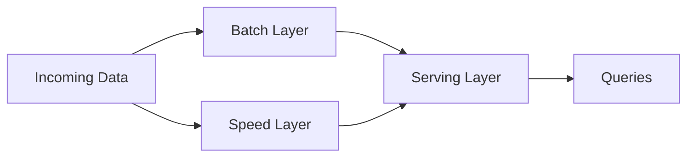

# Lambda Architecture

## 概要

バッチ層とスピード層を併用し、正確性と低遅延を両立するデータ処理構成です。

## 解決したい課題

- 大量データを正確に再計算したいが、利用者には低遅延の速報値も必要
- バッチ処理だけでは結果提供が遅く、ストリーム処理だけでは再計算や補正が不安
- 生データから再処理できる構成を保ちたい

## 背景・登場した文脈

Lambda Architectureは、Nathan Marzが提唱した大規模データ処理の構成です。バッチ層で正確な全体結果を作り、スピード層で新しいデータを低遅延に反映し、Serving層で結果を提供します。正確性と低遅延を両立しやすい一方、二重実装の保守が大きな課題になります。

## 基本構成

| 要素 | 責務 |
| --- | --- |
| Batch Layer | 全データから正確な結果を定期生成する層 |
| Speed Layer | 新着データを低遅延で処理する層 |
| Serving Layer | 問い合わせ向けに結果を提供する層 |
| Master Dataset | 再計算の元になる信頼できるデータ集合 |

## Mermaid図

この図は、Lambda Architectureで中心になる責務と流れを簡略化したものです。実際の設計では、組織体制、運用能力、既存システムとの接続、非機能要件によって境界の切り方が変わります。

## 向いている場面

- 大量データの再計算可能性と低遅延な参照を両立したい
- イベントログや生データを長期間保持できる
- バッチとストリームの二系統運用を担える

## 向いていない場面

- データ量や遅延要件が小さく、単純なバッチやKappaで足りる
- 同じロジックを二重に保守する余力がない
- 結果差分や補正を利用者に説明できない

## メリット

- バッチ層で正確な再計算結果を提供できる
- スピード層で新しいデータを早く反映できる
- 生データを保持するため、仕様変更時に再処理しやすい

## デメリット

- バッチ層とスピード層の二重実装が重い
- 結果の差分、補正、Serving層の統合が複雑になる
- 運用対象のコンポーネントが多く、障害調査が難しい

## よくある誤解

- Lambdaは高機能だが、バッチ層とスピード層の二重実装を持つ。データ量や遅延要件が小さい場合は過剰になりやすい。
- バッチ層が正しければ十分ではない。スピード層との結果差分を検知し、利用者に説明できる必要がある。
- ツールを組み合わせるだけでは成立しない。再計算、履歴保持、Serving層の整合性が設計の中心になる。

## 失敗しやすいポイント

- バッチとストリームでロジックが乖離し、同じ指標でも結果が違う
- 再処理に必要な生データやイベントログの保持期間が足りない
- Serving層の切替や補正手順がなく、古い結果と新しい結果が混在する

## 類似アーキテクチャとの違い

| 比較対象 | 違い |
|---|---|
| Kappa Architecture | Kappaはストリーム処理へ寄せて構成を単純化する。Lambdaはバッチ層で正確な再計算を行い、スピード層で低遅延結果を補う二重構成を取る |
| Data Pipeline Architecture | Data Pipelineはデータ処理全般の設計を指す。Lambdaは大量データの正確性と低遅延を両立するための具体的な二層処理パターン |
| Lakehouse Architecture | Lakehouseは保存・分析基盤の統合に焦点がある。Lambdaはデータをどのように処理し、どの経路で結果を提供するかに焦点がある |

## 実務での判断ポイント

- 正確性、低遅延、再計算可能性のどれをどの水準で求めるか決める
- バッチ処理とストリーム処理でロジックを共有できる範囲を検討する
- 生データ、処理済みデータ、Servingデータの保持期間を決める
- Kappaや単純なバッチ処理で足りない理由を明確にする

## 導入チェックリスト

- [ ] バッチ層とスピード層の結果差分を検知できる
- [ ] 再処理に必要なログ、データ、スキーマ履歴を保持している
- [ ] Serving層の更新、補正、ロールバック手順がある
- [ ] 二重実装の保守コストをチームが受け入れられる

## 参考

- Nathan Marz, James Warren, *Big Data*, Manning, 2015
