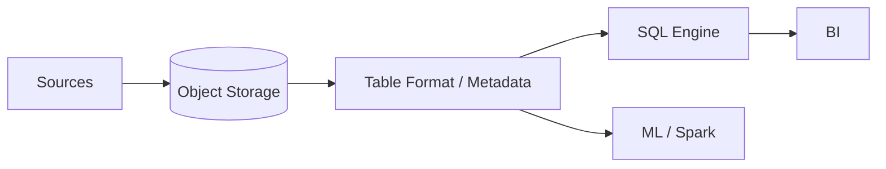

# Lakehouse Architecture

## 概要

Data LakeとData Warehouseの特徴を統合しようとするデータ基盤構成です。

## 解決したい課題

- Data Lakeは柔軟だが品質やクエリ性能が不安定で、DWHは管理しやすいが柔軟性やコストに課題がある
- BI、機械学習、探索分析で同じデータを重複管理している
- 生データから整形済みデータまでの品質段階を一貫して管理したい

## 背景・登場した文脈

Lakehouse Architectureは、Data Lakeの柔軟性とData Warehouseの管理性を同じ基盤で両立しようとする構成です。Delta Lake、Apache Iceberg、Apache Hudiなどのテーブル形式により、トランザクション、スキーマ進化、カタログ管理をデータレイク上で扱いやすくします。

## 基本構成

| 要素 | 責務 |
| --- | --- |
| Object Storage | 大量データを低コストに保存する基盤 |
| Table Format | ACID、スキーマ、メタデータを扱うテーブル形式 |
| Compute Engine | SQL、Spark、MLなどの処理エンジン |
| Catalog | データセット、権限、メタデータを管理する仕組み |

## Mermaid図

この図では、Rawデータから加工済みデータ、分析・機械学習利用へ進む品質段階を示しています。Lakehouseの価値は、保存の柔軟性だけでなく、テーブル管理、権限、品質昇格ルールを揃える点にあります。

## 向いている場面

- BIと機械学習で同じデータ基盤を使いたい
- 生データ、加工済みデータ、集計データを段階管理したい
- トランザクションやスキーマ管理をData Lakeに加えたい

## 向いていない場面

- 小規模なBIだけで、DWHの方が単純に運用できる
- データ品質、権限、カタログを運用する体制がない
- 低遅延のOLTP用途をLakehouseで代替しようとしている

## メリット

- 生データと分析用データを同じ基盤で扱いやすい
- DWHへの重複コピーを減らせる場合がある
- スキーマ進化やACIDトランザクションによりData Lakeを管理しやすくなる

## デメリット

- テーブル形式、カタログ、権限管理の運用知識が必要
- ワークロードによっては専用DWHほど性能が出ない場合がある
- 品質層やデータ契約を設計しないとData Lakeの混沌が残る

## よくある誤解

- Lakehouseを導入すればData LakeとDWHの課題が自動で解消するわけではない。データ品質、権限、性能設計は残る。
- 全データを1か所に置けばよいという話ではない。用途別のゾーン、スキーマ、ライフサイクル管理が必要。
- BIにも機械学習にも使えるが、ワークロードごとのSLOやコスト特性は異なる。

## 失敗しやすいポイント

- Bronze、Silver、Goldなどの層の意味が曖昧で、同じ品質のデータが混在する
- テーブル形式やカタログの運用を決めず、互換性と権限管理が崩れる
- 小さなBI用途までLakehouseへ寄せ、運用負荷が増える

## 類似アーキテクチャとの違い

| 比較対象 | 違い |
|---|---|
| Data Lake | Data Lakeは多様なデータを低コストに保存することを重視する。Lakehouseはその上にトランザクション、スキーマ管理、分析性能を加え、DWH用途にも近づける |
| Data Warehouse | Data Warehouseは整形済みデータと安定したBI性能を重視する。Lakehouseは生データや機械学習用途も同じ基盤で扱いやすくすることを狙う |
| Data Mesh | Data Meshはドメイン所有とガバナンスの考え方。Lakehouseはデータ保存・分析基盤の技術アーキテクチャであり、Data Meshの基盤として使われることもある |

## 実務での判断ポイント

- DWHで困っていることとData Lakeで困っていることを分けて整理する
- トランザクション、スキーマ進化、カタログ、アクセス制御の要件を確認する
- BI、機械学習、探索分析それぞれの性能とコストを測る
- データ品質の昇格条件と責任者を決める

## 導入チェックリスト

- [ ] データ層ごとの品質基準と利用用途が定義されている
- [ ] テーブル形式、カタログ、権限管理の標準がある
- [ ] 主要クエリとMLワークロードの性能・コストを検証した
- [ ] データ削除、保持、監査のルールがある

## 参考

- Michael Armbrust et al., [Lakehouse](http://cidrdb.org/cidr2021/papers/cidr2021_paper17.pdf), CIDR 2021
