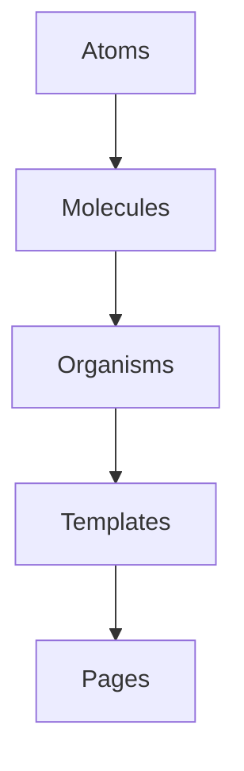

# Atomic Design

## 概要

UIをatoms、molecules、organisms、templates、pagesのような粒度で整理するデザインシステムの考え方です。

## 解決したい課題

- UI部品の粒度や再利用方針がばらつく
- デザインと実装で部品名や構造が一致しない
- 画面ごとに似たUIが重複実装される

## 背景・登場した文脈

Atomic Designは、UIを小さな部品から段階的に組み立てるデザインシステムの考え方です。実装アーキテクチャというより、UI部品の粒度とデザイン・実装の共通言語を作るために使われます。

## 基本構成

| 要素 | 責務 |
| --- | --- |
| Atoms | ボタンや入力などの最小UI部品 |
| Molecules | 複数Atomsを組み合わせた小さなUI部品 |
| Organisms | 画面上のまとまったUI領域 |
| Templates / Pages | レイアウトと実データを含む画面 |

## Mermaid図

この図は、Atomic Designで中心になる責務と流れを簡略化したものです。実際の設計では、組織体制、運用能力、既存システムとの接続、非機能要件によって境界の切り方が変わります。

## 向いている場面

- デザインシステムを整備したい
- 部品カタログやStorybookを運用する
- デザイナーと開発者の言葉を揃えたい

## 向いていない場面

- 状態管理や業務境界の整理を期待している
- 分類そのものが目的化している
- 小規模で部品体系が不要

## メリット

- UI部品の再利用と整理に役立つ
- デザインレビューの共通言語になる
- 部品カタログと相性がよい

## デメリット

- 分類が主目的化しやすい
- 状態管理や機能境界は別途必要
- 実装粒度とAtomic分類が一致しないことがある

## よくある誤解

- Atomic Designはフォルダ名をatomsやmoleculesに分けるだけではない。部品の粒度と責務を共有するための言語。
- すべてのUIを5階層に厳密分類する必要はない。分類に迷う時間が実装価値を超えるなら簡略化する。
- Design Systemそのものではない。トークン、アクセシビリティ、利用ルールは別途整備が必要。

## 失敗しやすいポイント

- 分類名にこだわりすぎて、実際の利用文脈やアクセシビリティが後回しになる
- 小さすぎるコンポーネントが増え、propsが複雑化する
- デザイン側と実装側で同じ部品名を使っていない

## 類似アーキテクチャとの違い

| 比較対象 | 違い |
|---|---|
| Component-Based UI | Component-Based UIは実装単位として部品化する考え方。Atomic DesignはUI部品を粒度で分類し、デザインレビューやカタログ化の共通言語を作る |
| Design System | Design Systemは原則、トークン、アクセシビリティ、運用ルールまで含む。Atomic Designはその中でコンポーネント階層を整理する分類法として使われる |
| Feature-Sliced Design | Feature-Sliced Designは業務機能や画面単位でフロントエンドコードを分割する。Atomic Designは見た目の部品粒度を整理するため、分割軸が異なる |

## 実務での判断ポイント

- コンポーネント分類を設計レビューやStorybook運用に使う目的で導入する
- atoms、molecules、organismsの境界を例付きで決める
- デザイントークン、バリアント、アクセシビリティ要件とつなげる
- 分類より利用頻度、変更頻度、再利用価値を優先する

## 導入チェックリスト

- [ ] 分類ルールが例付きで説明されている
- [ ] コンポーネントカタログやデザインデータと対応している
- [ ] アクセシビリティ、状態、バリアントが部品に含まれている
- [ ] 分類に迷う部品の判断ルールがある

## 参考

- Brad Frost, [Atomic Design](https://atomicdesign.bradfrost.com/)
- Brad Frost, *Atomic Design*, 2016
