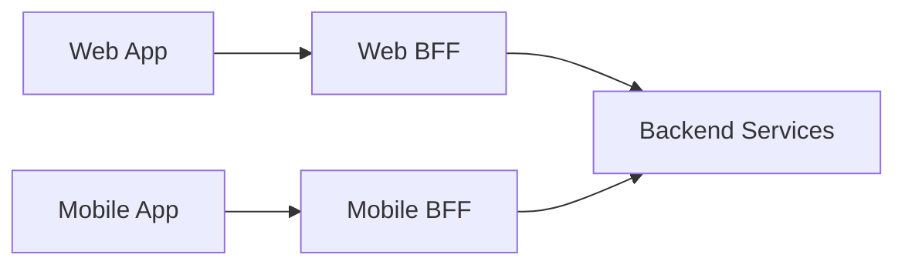

# Backend for Frontend

## 概要

Web、モバイル、管理画面などフロントエンドの種類ごとに専用のバックエンドAPI層を設けるパターンです。

## 解決したい課題

- 汎用APIが各クライアントにとって使いにくい
- 画面表示に複数API呼び出しが必要で遅い
- Webとモバイルで必要なデータや認証フローが違う

## 背景・登場した文脈

Backend for Frontendは、Web、モバイル、管理画面などクライアント種別ごとに専用のバックエンド層を設けるパターンです。汎用APIではなく、クライアント体験に合わせたAPIを提供するために使います。

## 基本構成

| 要素 | 責務 |
| --- | --- |
| Frontend | Web、モバイル、管理画面などの利用者側 |
| BFF | 特定Frontend向けにAPI集約や変換を担う層 |
| Backend Services | 共通の業務サービスやデータAPI |
| Contract | 呼び出しやメッセージの形式と意味の契約 |

## Mermaid図

この図は、Backend for Frontendで中心になる責務と流れを簡略化したものです。実際の設計では、組織体制、運用能力、既存システムとの接続、非機能要件によって境界の切り方が変わります。

## 向いている場面

- クライアントごとの要件差が大きい
- API集約で通信回数を減らしたい
- フロントエンドチームがAPI体験を所有したい

## 向いていない場面

- 単一クライアントで汎用APIで十分
- BFFに業務ロジックを集めてしまう
- BFFごとの重複を管理できない

## メリット

- クライアントに最適なAPIを提供できる
- バックエンドサービスの複雑さを隠せる
- フロントエンドの変更速度を上げやすい

## デメリット

- BFFが増えると運用対象が増える
- ロジック重複が起きやすい
- 責務境界を誤ると中間層が肥大化する

## よくある誤解

- BFFは単なるAPIプロキシではない。クライアント固有の集約、認可、データ整形、エラー表現を担う。
- BFFを増やせばフロントエンドが必ず独立するわけではない。Backend APIとの契約と所有者が重要。
- 全クライアントにBFFが必要とは限らない。API GatewayやGraphQLで足りる場合もある。

## 失敗しやすいポイント

- BFFに業務ロジックを重複実装し、Backendと整合しなくなる
- クライアントごとに認可やエラー処理がばらつく
- BFFが下流APIの遅さを隠せず、タイムアウトとキャッシュ設計が後手になる

## 類似アーキテクチャとの違い

| 比較対象 | 違い |
|---|---|
| API Gateway | API Gatewayは認証、ルーティング、レート制限など入口の横断機能を担う。BFFは画面やクライアント種別に合わせた集約、整形、会話粒度の調整を担う |
| GraphQL | GraphQLはクライアントが必要なフィールドを問い合わせるAPI方式。BFFはサーバー側でクライアント専用APIを設計し、認証、外部API呼び出し、キャッシュ方針まで含めて運用する |
| Micro Frontends | Micro Frontendsはフロントエンドの開発・デプロイ単位を分ける。BFFはその背後のAPI境界を分け、各UIが必要なデータ取得を安定させる |

## 実務での判断ポイント

- Web、モバイル、管理画面などで必要なAPI粒度が本当に違うか確認する
- BFFに置く責務を集約、整形、認可補助、キャッシュに限定する
- 下流APIの契約、タイムアウト、リトライ、部分失敗の扱いを決める
- BFFの所有チームとリリース頻度をフロントエンドに合わせる

## 導入チェックリスト

- [ ] BFFに置く責務とBackendに残す業務ロジックが分かれている
- [ ] クライアントごとのAPI契約とエラー形式が定義されている
- [ ] 下流API呼び出しのタイムアウト、キャッシュ、部分失敗が設計されている
- [ ] BFFの監視、認可、ログ相関が整っている

## 参考

- Sam Newman, [Pattern: Backends For Frontends](https://samnewman.io/patterns/architectural/bff/)
- Microsoft, [Backends for Frontends pattern](https://learn.microsoft.com/en-us/azure/architecture/patterns/backends-for-frontends)
