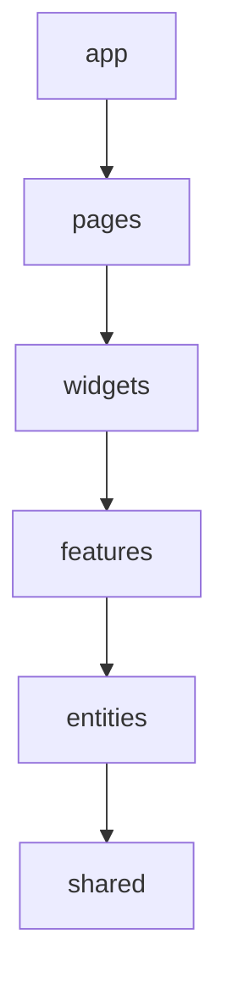

# Feature-Sliced Design

## 概要

フロントエンドコードをapp、pages、widgets、features、entities、sharedなどの層とスライスで整理する設計手法です。

## 解決したい課題

- componentsやutilsが何でも置き場になる
- 機能単位の変更範囲が読めない
- sharedに業務依存が入り込み再利用性が崩れる

## 背景・登場した文脈

Feature-Sliced Designは、フロントエンドコードを機能、業務概念、共有基盤の層として整理する設計手法です。componentsやutilsが無秩序に肥大化する問題を避け、依存方向を制御します。

## 基本構成

| 要素 | 責務 |
| --- | --- |
| Layer | 依存方向を持つ上位分類 |
| Slice | 機能やユースケースごとの変更単位 |
| Segment | ui、model、apiなどの技術的区分 |
| Public API | Feature-Sliced Designの中で明確な責務を持つ構成要素 |

## Mermaid図

この図は、Feature-Sliced Designで中心になる責務と流れを簡略化したものです。実際の設計では、組織体制、運用能力、既存システムとの接続、非機能要件によって境界の切り方が変わります。

## 向いている場面

- 中規模以上のフロントエンド
- 複数人で機能追加を続ける
- 依存ルールをlintやレビューで守れる

## 向いていない場面

- 小規模で構造化コストが価値を上回る
- フレームワーク規約と強く衝突する
- レイヤー名だけ導入して依存ルールを守らない

## メリット

- コード配置の判断がしやすい
- 機能単位の変更範囲を見つけやすい
- sharedの肥大化を抑えやすい

## デメリット

- 学習コストがある
- 既存コード移行には段階設計が必要
- 厳密にやりすぎると小さな変更が重くなる

## よくある誤解

- FSDはフォルダ構成を真似るだけでは効果が出ない。層間依存と公開APIの制約を守ることが中心。
- すべてのプロジェクトでapp、pages、widgets、features、entities、sharedを同じ密度で使う必要はない。
- Atomic Designの代替ではない。UI粒度ではなく業務機能と依存方向を整理する。

## 失敗しやすいポイント

- sharedに便利関数やUIを無制限に置き、依存の逃げ道になる
- 公開APIを経由せず内部ファイルを直接importし、スライス境界が崩れる
- 小規模な画面に過剰な層を作り、変更時に移動コストだけが増える

## 類似アーキテクチャとの違い

| 比較対象 | 違い |
|---|---|
| Atomic Design | Atomic DesignはUI部品の粒度で整理する。Feature-Sliced Designは業務機能、エンティティ、共有部品などコードの依存方向と配置を整理する |
| Vertical Slice Architecture | Vertical Sliceはユースケース単位でバックエンドを含む構造にも適用される。Feature-Sliced Designはフロントエンド向けに層とスライスのルールを具体化している |
| Modular Architecture | Modular Architectureは一般的なモジュール境界の考え方。Feature-Sliced Designはフロントエンドにおける層、公開API、importルールまで踏み込む |

## 実務での判断ポイント

- チーム規模と機能数が、層とスライスの運用コストに見合うか確認する
- importルール、公開API、禁止依存をlintやレビューで守る
- entitiesとfeaturesの境界を業務語彙で説明できるようにする
- 既存コードへは画面や機能単位で段階導入する

## 導入チェックリスト

- [ ] 層ごとの責務とimport方向が定義されている
- [ ] 各スライスに公開APIがあり、内部直接importを避けている
- [ ] sharedの肥大化をレビューする基準がある
- [ ] 既存コードからの移行単位と完了条件がある

## 参考

- Feature-Sliced Design, [Documentation](https://feature-sliced.design/docs)
- Feature-Sliced Design, [Reference: Layers](https://feature-sliced.design/docs/reference/layers)
