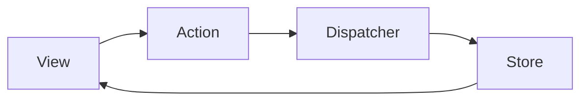

# Flux

## 概要

Action、Dispatcher、Store、Viewによる単方向データフローでUI状態を管理するアーキテクチャです。

## 解決したい課題

- 複数Viewが同じ状態を変更し、原因を追いにくい
- 双方向データフローで状態更新が循環する
- 共有状態の変更履歴や意図が見えにくい

## 背景・登場した文脈

Fluxは、FacebookがReactアプリケーションの状態変更を単方向データフローで整理するために提案した考え方です。状態変更の入口をActionへ集め、Storeを通してViewへ反映することで、双方向更新の混乱を減らします。

## 基本構成

| 要素 | 責務 |
| --- | --- |
| Action | ユーザー操作や外部イベントを表す |
| Dispatcher | ActionをStoreへ配送する |
| Store | アプリケーション状態を保持する |
| View | 表示とユーザー入力の受け口 |

## Mermaid図

この図は、Fluxで中心になる責務と流れを簡略化したものです。実際の設計では、組織体制、運用能力、既存システムとの接続、非機能要件によって境界の切り方が変わります。

## 向いている場面

- 共有状態が複数Viewにまたがる
- 状態変更の流れを一方向に揃えたい
- Actionとしてユーザー操作や外部イベントを記録したい

## 向いていない場面

- 局所状態だけで十分
- ActionやStoreの設計が過剰になる
- 非同期処理や副作用の置き場を決めていない

## メリット

- 状態変更の流れを追いやすい
- View間の共有状態を整理しやすい
- ログ化やデバッグがしやすい

## デメリット

- 記述量が増える
- Storeが巨大化しやすい
- 単純な画面には重い

## よくある誤解

- Fluxは状態管理ライブラリ名ではなく、単方向データフローの考え方。実装ごとにStoreやDispatcherの形は異なる。
- 単方向にすれば状態設計が不要になるわけではない。状態の正規化、所有者、派生値の扱いを決める必要がある。
- 小さな画面に導入すると、ActionやStoreの定義が過剰になることがある。

## 失敗しやすいポイント

- Actionが曖昧で、何が起きたのかではなく画面都合の命令になってしまう
- StoreにUI一時状態と業務状態が混在し、更新影響が読みにくくなる
- 非同期処理の結果、エラー、キャンセルの扱いが統一されない

## 類似アーキテクチャとの違い

| 比較対象 | 違い |
|---|---|
| Redux Architecture | ReduxはFluxの影響を受けつつ、単一Storeと純粋Reducerで状態更新を定式化する。FluxはDispatcherや複数Storeを含む、より広い単方向データフローの考え方 |
| MVC | MVCは入力、表示、モデルの責務分離を中心にする。FluxはActionからStoreへ状態更新経路を固定し、ViewはStoreの状態を反映する |
| MVVM | MVVMはViewModelが画面向け状態を持つ。Fluxはアプリケーション状態をStoreへ集め、Actionによる変更履歴を追いやすくする |

## 実務での判断ポイント

- 状態の所有者と更新経路を単方向にする価値がある複雑さか見極める
- Actionをユーザー操作、外部イベント、処理結果として命名する
- 永続的な業務状態と画面ローカル状態を分ける
- 開発者ツールやログで状態遷移を追えるようにする

## 導入チェックリスト

- [ ] 状態更新経路がActionからStoreへ一方向になっている
- [ ] Action名が業務上またはUI上の出来事を表している
- [ ] 非同期処理の成功、失敗、キャンセルが設計されている
- [ ] Storeに不要な派生状態や画面一時状態を集めすぎていない

## 参考

- Meta, [In-Depth Overview - Flux](https://facebookarchive.github.io/flux/docs/in-depth-overview/)
- Redux, [Prior Art](https://redux.js.org/understanding/history-and-design/prior-art)
