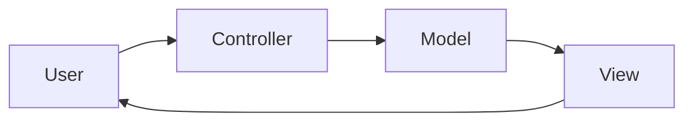

# MVC

## 概要

Model、View、Controllerに分け、入力処理、表示、状態や業務データを分離する基本的なUIアーキテクチャです。

## 解決したい課題

- 表示、入力処理、データ操作が1つの場所に混ざる
- UI変更が業務ロジックへ波及する
- 複数画面で同じデータや操作を扱いにくい

## 背景・登場した文脈

MVCはGUIアプリケーションの責務分離として広まり、Webフレームワークでも広く使われる基本パターンです。ただし、フレームワークによってControllerやModelの意味が異なるため、名前より責務で理解することが重要です。

## 基本構成

| 要素 | 責務 |
| --- | --- |
| Model | 状態、業務データ、ルールを表す |
| View | 表示とユーザー入力の受け口 |
| Controller | 入力を受け取りModelやViewを操作する |

## Mermaid図

この図では、Controllerが入力を受け、Modelを更新し、Viewが利用者へ表示する基本的な責務分担を示しています。実際のMVCはフレームワークごとに解釈が異なるため、名前ではなく責務で確認します。

## 向いている場面

- WebやGUIの基本構造を整理したい
- フレームワークがMVCを前提にしている
- 画面と入力処理を分けたい

## 向いていない場面

- 複雑な共有状態管理が主課題
- Controllerが巨大化して業務ロジックを抱えている
- 宣言的UIや単方向データフローの方が合う

## メリット

- 役割が理解しやすい
- 多くのフレームワークで採用され学習資産が多い
- UIとデータ操作を分けやすい

## デメリット

- MVCの解釈が環境ごとに異なる
- ControllerやModelが肥大化しやすい
- 大規模フロントエンドの状態管理には不足することがある

## よくある誤解

- MVCはフレームワークごとに意味が違う。Controller、Model、Viewという名前より、実際にどの責務を持つかを見る。
- Controllerに業務ロジックを集めるとMVCの利点は薄れる。入力調整と業務判断を分ける必要がある。
- 大規模SPAの状態管理をMVCだけで整理できるとは限らない。FluxやMVVMとの併用も検討する。

## 失敗しやすいポイント

- Controllerが入力処理、認可、業務判断、レスポンス整形を抱えて肥大化する
- ModelがDBテーブルの薄いラッパーになり、業務ルールの置き場が曖昧になる
- ViewからModelを直接操作し、更新経路が複数になる

## 類似アーキテクチャとの違い

| 比較対象 | 違い |
|---|---|
| MVP | MVPはPresenterがViewを操作し、表示ロジックを集約する傾向がある。MVCはControllerが入力を受け、ModelとViewの関係はフレームワークにより幅がある |
| MVVM | MVVMはViewModelが状態と表示用ロジックを持ち、データバインディングと相性がよい。MVCは入力制御とモデル更新の流れをControllerで扱う |
| Flux | Fluxは単方向データフローで状態更新経路を固定する。MVCはModelとViewの関係が複雑化すると更新経路が追いにくくなる場合がある |

## 実務での判断ポイント

- このプロジェクトでModel、View、Controllerが何を意味するか定義する
- 業務ルールをModel、Service、UseCaseのどこに置くか決める
- 画面状態が複雑ならFlux、MVVM、状態管理ライブラリとの分担を考える
- Controllerのサイズや依存数をレビュー観点に入れる

## 導入チェックリスト

- [ ] MVCの各責務をチーム内で同じ言葉で説明できる
- [ ] Controllerに置いてよい処理と置かない処理が決まっている
- [ ] Modelに業務ルールや不変条件を置く方針がある
- [ ] Viewから状態更新する経路が制御されている

## 参考

- Trygve Reenskaug, [The original MVC reports](https://folk.universitetetioslo.no/trygver/themes/mvc/mvc-index.html)
- Martin Fowler, [GUI Architectures](https://martinfowler.com/eaaDev/uiArchs.html)
