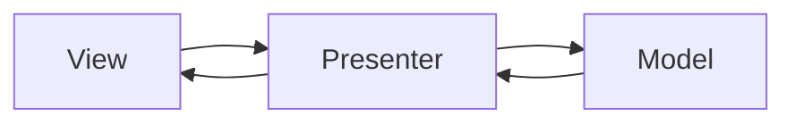

# MVP

## 概要

ModelとViewの間にPresenterを置き、表示ロジックや入力処理の調整をPresenterに集めるUIアーキテクチャです。

## 解決したい課題

- Viewに表示判断や入力処理が増えすぎる
- 画面ロジックを自動テストしにくい
- ModelとViewが直接結びつき変更影響が読みにくい

## 背景・登場した文脈

MVPは、Viewを薄く保ち、画面ロジックをPresenterへ寄せるために使われるUIパターンです。テストしにくいUIフレームワークで、表示判断をPresenterとして切り出す文脈でよく使われます。

## 基本構成

| 要素 | 責務 |
| --- | --- |
| Model | 状態、業務データ、ルールを表す |
| View | 表示とユーザー入力の受け口 |
| Presenter | Viewの状態更新とModel操作を仲介する |

## Mermaid図

この図は、MVPで中心になる責務と流れを簡略化したものです。実際の設計では、組織体制、運用能力、既存システムとの接続、非機能要件によって境界の切り方が変わります。

## 向いている場面

- Viewを受動的にし、Presenterをテストしたい
- GUIや従来型Webで表示制御が多い
- UIフレームワークから画面ロジックを切り離したい

## 向いていない場面

- 宣言的UIと局所状態だけで十分
- PresenterとViewのインターフェースが過剰に細かくなる
- Presenterが巨大な手続き処理になる

## メリット

- Viewを薄くしやすい
- 表示ロジックをPresenterでテストしやすい
- ModelとViewの直接依存を減らせる

## デメリット

- PresenterとViewの対応が増えやすい
- 画面数が多いとボイラープレートが増える
- 業務ロジックをPresenterへ置くと責務が崩れる

## よくある誤解

- PresenterはViewの代わりに何でも処理する場所ではない。表示ロジックとユースケース呼び出しの調整に絞る。
- MVPは古いGUIだけのパターンではない。テストしやすいUI境界を作りたい場面では今でも有効。
- Viewを完全に薄くするほど良いとは限らない。宣言的UIでは自然な表示責務をViewに残す方が読みやすい。

## 失敗しやすいポイント

- Presenterが画面遷移、API呼び出し、業務判断をすべて抱えて巨大化する
- Viewインターフェースが細かすぎて、実装とテストの保守コストが増える
- 非同期処理やライフサイクルのキャンセルを考えず、古い結果で画面を更新する

## 類似アーキテクチャとの違い

| 比較対象 | 違い |
|---|---|
| MVC | MVCはControllerが入力を処理し、ModelとViewの関係は実装により変わる。MVPはPresenterがViewとのやり取りを明示的に受け持つ |
| MVVM | MVVMはViewModelとデータバインディングでViewを更新する。MVPはPresenterがViewのインターフェースを呼び出すため、テストダブルを使った単体テストに向く |
| Flux | FluxはAction、Dispatcher、Storeの単方向データフローを重視する。MVPは画面単位の表示ロジック分離に焦点がある |

## 実務での判断ポイント

- Viewをどこまで受動的にするかを画面複雑度に合わせて決める
- Presenterの入力、出力、依存先をテスト可能な形にする
- 非同期処理、エラー、キャンセル、ローディング状態の扱いを設計する
- MVVMやFluxの方が自然なUIフレームワークでは無理にMVPへ寄せない

## 導入チェックリスト

- [ ] Presenterの責務が表示ロジックと調整に限定されている
- [ ] Viewインターフェースが過度に細分化されていない
- [ ] Presenter単体で主要な表示分岐をテストできる
- [ ] 非同期結果のキャンセルや二重送信対策がある

## 参考

- Martin Fowler, [GUI Architectures](https://martinfowler.com/eaaDev/uiArchs.html)
- Martin Fowler, [Supervising Controller](https://martinfowler.com/eaaDev/SupervisingPresenter.html)
