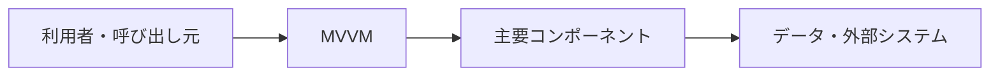

# MVVM

## 概要

ViewとModelの間にViewModelを置き、画面状態と操作をView向けに表現するUIアーキテクチャです。

## 解決したい課題

- UI、状態管理、画面構造が混ざると、変更の影響範囲が読みにくくなります。
- 変更影響、運用負荷、理解しやすさのバランスを取る
- 適用範囲と責務境界を明確にする

## 基本構成

| 要素 | 責務 |
| --- | --- |
| Model | 状態、業務データ、ルールを表す |
| View | 表示とユーザー入力の受け口 |
| ViewModel | Viewに必要な状態、コマンド、表示用変換を提供する |
| Binding | ViewとViewModelを同期する仕組み |

## Mermaid図

この図は全体像を簡略化したものです。実際には、非機能要件、組織体制、利用技術によって境界や責務が変わります。

## 向いている場面

- UIの変更頻度が高く、状態や部品の責務を整理したい場面に向きます。
- 変更や障害の影響範囲を意識して設計したい
- チーム内で構成要素の責務を共通認識にしたい

## 向いていない場面

- 課題が小さく、導入コストのほうが大きい
- 境界や責務を運用で守る体制がない
- 名前だけ導入して実装方針やレビュー観点が変わらない

## メリット

- 責務の分離により変更箇所を見つけやすい
- 設計判断の観点をチームで共有しやすい
- 適用条件が合えば、保守性や拡張性を高めやすい

## デメリット

- 抽象化や構成要素が増え、初期コストがかかる
- 境界設計を誤ると、かえって複雑になる
- 小さなシステムでは過剰設計になりやすい

## 類似アーキテクチャとの違い

| 比較対象 | 違い |
| --- | --- |
| MVP | MVPは関連する問題領域で使われる。MVVMは「ViewとModelの間にViewModelを置き、画面状態と操作をView向けに表現するUIアーキテクチャです。」点を主に扱うため、導入目的と責務境界を分けて判断する |
| MVC | MVCは関連する問題領域で使われる。MVVMは「ViewとModelの間にViewModelを置き、画面状態と操作をView向けに表現するUIアーキテクチャです。」点を主に扱うため、導入目的と責務境界を分けて判断する |
| Redux Architecture | Redux Architectureは関連する問題領域で使われる。MVVMは「ViewとModelの間にViewModelを置き、画面状態と操作をView向けに表現するUIアーキテクチャです。」点を主に扱うため、導入目的と責務境界を分けて判断する |

## 実務での判断ポイント

- 何を守りたいのか、何を変えやすくしたいのかを先に決める
- 導入後に責務境界をレビューできるルールを用意する
- 既存システムへは小さな範囲から適用し、効果を確認する

## 参考

- Microsoft, [The Model-View-ViewModel Pattern](https://learn.microsoft.com/en-us/archive/msdn-magazine/2009/february/patterns-wpf-apps-with-the-model-view-viewmodel-design-pattern)
