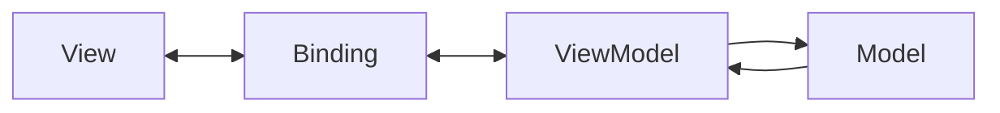

# MVVM

## 概要

ViewとModelの間にViewModelを置き、画面状態と操作をView向けに表現するUIアーキテクチャです。

## 解決したい課題

- Viewに表示用変換や状態管理が混ざる
- 画面状態をテストしにくい
- ModelをそのままViewへ出すとUI都合で歪む

## 背景・登場した文脈

MVVMは、View向けの状態と操作をViewModelとして切り出し、データバインディングやリアクティブな更新と組み合わせるUIパターンです。WPFなどで広まり、現代のフロントエンドでもViewModel的な考え方はよく使われます。

## 基本構成

| 要素 | 責務 |
| --- | --- |
| Model | 状態、業務データ、ルールを表す |
| View | 表示とユーザー入力の受け口 |
| ViewModel | Viewに必要な状態、コマンド、表示用変換を提供する |
| Binding | ViewとViewModelを同期する仕組み |

## Mermaid図

この図では、ViewがViewModelを通じて表示状態や操作を扱い、Modelとの直接結合を避ける関係を示しています。バインディングは便利ですが、状態変更の入口を追跡できるようにしておく必要があります。

## 向いている場面

- 画面状態や表示用変換が複雑
- データバインディングやリアクティブ更新を活用する
- Viewを差し替えても画面状態の考え方を保ちたい

## 向いていない場面

- 単純なフォームや一覧でViewModelが過剰
- Bindingの暗黙挙動を追跡できない
- ViewModelに業務ルールを集めてしまう

## メリット

- View向け状態を集約できる
- Viewを薄くしやすい
- 表示ロジックをテストしやすい

## デメリット

- Bindingのデバッグが難しいことがある
- ViewModelが肥大化しやすい
- Modelとの責務境界が曖昧になりやすい

## よくある誤解

- ViewModelはModelの単なるコピーではない。画面表示に必要な状態、変換、コマンドを持つ。
- 双方向バインディングは便利だが、更新経路が見えにくくなる場合がある。
- MVVMを使っても業務ロジックをViewModelへ集めすぎると保守しにくい。

## 失敗しやすいポイント

- ViewModelが画面都合と業務判断を抱え、再利用もテストも難しくなる
- バインディングの副作用で、どの操作が状態を変えたか追跡できない
- ライフサイクルや購読解除を忘れ、メモリリークや古い状態更新が起きる

## 類似アーキテクチャとの違い

| 比較対象 | 違い |
|---|---|
| MVP | MVPはPresenterがView操作を明示的に仲介する。MVVMはViewModelが表示状態とコマンドを公開し、バインディングでViewへ反映する |
| MVC | MVCはControllerが入力を受け、Model更新を調整する。MVVMはViewModelを通じてView用状態を表現し、ViewとModelの直接結合を避ける |
| Redux Architecture | Reduxは単一StoreとAction/Reducerでアプリケーション状態を管理する。MVVMは画面単位のViewModelを中心に状態と表示ロジックを整理する |

## 実務での判断ポイント

- ViewModelに置くのは表示状態、入力コマンド、表示用変換までと決める
- 業務ルールや永続化処理はUseCaseやServiceへ分ける
- 単方向更新と双方向バインディングの使い分けを決める
- 状態変更をテストしやすい粒度で公開する

## 導入チェックリスト

- [ ] ViewModelとDomain Modelの責務が分かれている
- [ ] 状態変更の入口が追跡できる
- [ ] 購読解除、キャンセル、ライフサイクル処理がある
- [ ] ViewModelの主要な状態遷移をテストできる

## 参考

- Microsoft, [The Model-View-ViewModel Pattern](https://learn.microsoft.com/en-us/archive/msdn-magazine/2009/february/patterns-wpf-apps-with-the-model-view-viewmodel-design-pattern)
- Martin Fowler, [Presentation Model](https://martinfowler.com/eaaDev/PresentationModel.html)
