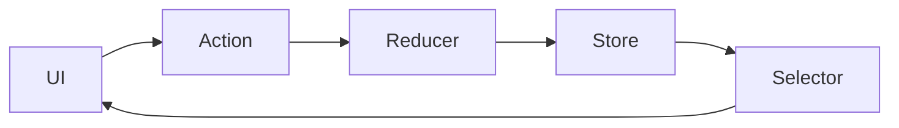

# Redux Architecture

## 概要

単一のStore、Action、Reducerによってアプリケーション状態を予測可能に管理する構成です。

## 解決したい課題

- 共有状態の変更原因が追えない
- 複数コンポーネントが同じ状態を別々に変更する
- 状態変更の履歴や再現性を確保したい

## 背景・登場した文脈

ReduxはFluxの考えを単一Store、Action、Reducerで整理した状態管理アーキテクチャです。状態遷移を明示的にし、予測可能性とデバッグ性を高めることを狙います。

## 基本構成

| 要素 | 責務 |
| --- | --- |
| Store | アプリケーション状態を保持する |
| Action | ユーザー操作や外部イベントを表す |
| Reducer | 現在状態とActionから次状態を作る関数 |
| Selector | Viewに必要な状態を取り出す関数 |

## Mermaid図

この図は、Redux Architectureで中心になる責務と流れを簡略化したものです。実際の設計では、組織体制、運用能力、既存システムとの接続、非機能要件によって境界の切り方が変わります。

## 向いている場面

- 大きなフロントエンドで共有状態が多い
- 状態遷移をログやDevToolsで追いたい
- チーム内で状態管理の規約を統一したい

## 向いていない場面

- 局所状態やサーバー状態だけで十分
- Storeへ何でも入れて巨大化している
- Reducerに副作用や業務処理を入れてしまう

## メリット

- 状態遷移が予測しやすい
- デバッグツールやエコシステムが強い
- チームで状態管理ルールを統一しやすい

## デメリット

- ボイラープレートが増えやすい
- Store設計を誤ると変更影響が広がる
- フレームワーク標準機能で足りる場合は過剰

## よくある誤解

- Reduxはすべての状態を入れる場所ではない。フォーム入力や開閉状態など局所状態はコンポーネント内で十分な場合がある。
- Reducerが純粋なら設計が良くなるわけではない。Action粒度、状態正規化、非同期境界が重要。
- Redux Toolkitを使っても、状態モデルの責任分担は自動では決まらない。

## 失敗しやすいポイント

- Storeを巨大なグローバル変数として使い、どの画面が何に依存するか分からなくなる
- Actionが細かすぎる、または曖昧すぎて履歴を見ても意味が分からない
- APIレスポンス形状をそのままStoreへ入れ、正規化やキャッシュ失効が難しくなる

## 類似アーキテクチャとの違い

| 比較対象 | 違い |
|---|---|
| Flux | ReduxはFluxの影響を受けつつ、単一Storeと純粋Reducerによる状態更新を強く定式化する。Fluxは複数StoreやDispatcherを含む、より広い考え方 |
| MVVM | MVVMはViewModelが画面状態と表示ロジックを持つ。Reduxはアプリケーション状態をStoreに集約し、ActionとReducerで更新履歴を追いやすくする |
| State Machine | State Machineは状態遷移を明示的な有限状態として表す。Reduxは状態コンテナであり、状態遷移の厳密なモデリングは設計次第 |

## 実務での判断ポイント

- 共有状態、履歴追跡、デバッグ容易性がRedux導入コストに見合うか判断する
- Slice単位、Action命名、Selectorの責務を決める
- Server StateはRTK Queryや別キャッシュに任せるか検討する
- 状態正規化、永続化、リセット条件を設計する

## 導入チェックリスト

- [ ] Reduxに置く状態とローカル状態の基準がある
- [ ] Slice、Action、Selectorの命名規則がある
- [ ] 非同期処理、キャッシュ、エラーの扱いが統一されている
- [ ] DevToolsで主要な状態遷移を追える

## 参考

- Redux, [Redux Fundamentals](https://redux.js.org/tutorials/fundamentals/part-1-overview)
- Redux, [Style Guide](https://redux.js.org/style-guide/)
