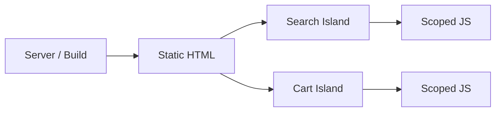

# Islands Architecture

## 概要

静的HTMLを基本にし、必要な部分だけを独立したインタラクティブな島としてハイドレーションする構成です。

## 解決したい課題

- ページ全体をハイドレーションし、不要なJavaScriptが増える
- コンテンツ中心サイトなのにSPAのコストを払っている
- 一部だけ動けばよいUIまで全体アプリ化している

## 背景・登場した文脈

Islands Architectureは、静的HTMLを基本にし、必要な部分だけをインタラクティブな島としてハイドレーションする構成です。コンテンツ中心サイトでJavaScript量を抑え、初期表示性能を高める文脈で使われます。

## 基本構成

| 要素 | 責務 |
| --- | --- |
| Static HTML | サーバーまたはビルド時に生成される基本HTML |
| Island | 独立してインタラクティブになるUI領域 |
| Partial Hydration | 必要な島だけJavaScriptを有効化する方式 |
| Server Rendering | 初期HTMLをサーバー側で生成する方式 |

## Mermaid図

この図は、Islands Architectureで中心になる責務と流れを簡略化したものです。実際の設計では、組織体制、運用能力、既存システムとの接続、非機能要件によって境界の切り方が変わります。

## 向いている場面

- コンテンツ中心で一部だけインタラクティブ
- 初期表示性能やCore Web Vitalsを重視する
- 島同士の状態共有が少ない

## 向いていない場面

- アプリ全体が密に相互作用するSPA
- グローバル状態共有が多い
- 島間通信が複雑で、結局アプリ全体が結合する

## メリット

- 送信JavaScriptを減らしやすい
- 静的HTMLの利点を活かせる
- インタラクション範囲を局所化できる

## デメリット

- 島間通信が必要になると複雑
- 適用できるUIタイプが限られる
- フレームワーク固有の設計理解が必要

## よくある誤解

- IslandsはSSRやSSGを否定しない。静的HTMLを基本にし、必要な部分だけをハイドレーションする考え方。
- JavaScriptをゼロにする方式ではない。どの島にどれだけJSを配るかを制御する。
- 管理画面のように全体が常時インタラクティブなUIでは、SPAの方が単純な場合がある。

## 失敗しやすいポイント

- 島の境界を細かくしすぎて、状態共有や通信が複雑になる
- 初期HTMLとクライアント状態の不一致でハイドレーションエラーが起きる
- SEOや初期表示だけを見て、操作開始までの遅延やJSサイズを測らない

## 類似アーキテクチャとの違い

| 比較対象 | 違い |
|---|---|
| SPA | SPAはページ全体をクライアント側アプリとして動かす。Islandsは静的HTMLを基本にし、必要な箇所だけをインタラクティブにする |
| SSR | SSRはサーバーでHTMLを生成する方式。IslandsはSSRやSSGで生成したHTMLの中で、ハイドレーション対象を部分的な島に限定する |
| Micro Frontends | Micro Frontendsはチームや機能単位でフロントエンドを分割する。Islandsはページ内のインタラクティブ領域を分割して配信・実行コストを抑える |

## 実務での判断ポイント

- ページの大部分が静的で、一部だけインタラクティブかを確認する
- 島同士で共有する状態をURL、サーバー、軽量ストアのどこに置くか決める
- TTFB、LCP、INP、JS転送量を測って効果を確認する
- Astroなどのフレームワーク制約と既存SPA資産の移行コストを比較する

## 導入チェックリスト

- [ ] インタラクティブにする島と静的に残す領域が定義されている
- [ ] 島間の状態共有方法が決まっている
- [ ] ハイドレーションエラーを検知できる
- [ ] Core Web VitalsとJSサイズを導入前後で比較できる

## 参考

- Astro, [Islands architecture](https://docs.astro.build/en/concepts/islands/)
- Jason Miller, [Islands Architecture](https://jasonformat.com/islands-architecture/)
