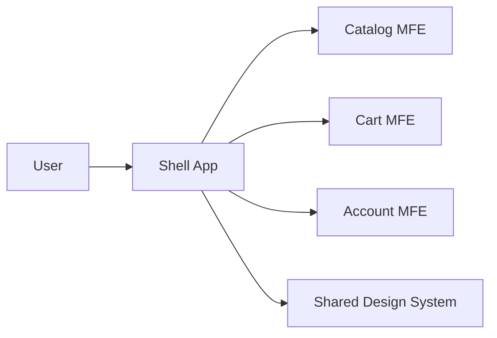

# Micro Frontends

## 概要

フロントエンドを複数の独立したアプリケーションや機能単位に分割する構成です。

## 解決したい課題

- 巨大なフロントエンドを複数チームで独立開発できない
- レガシーUIを一括刷新できない
- 機能ごとにリリースや技術選択を分けたい

## 背景・登場した文脈

Micro Frontendsは、フロントエンドを複数の独立したアプリケーションや機能単位に分割し、チームごとに開発・リリースできるようにする構成です。マイクロサービスと同様に、独立性を得る代わりに統合と運用の複雑さを引き受けます。

## 基本構成

| 要素 | 責務 |
| --- | --- |
| Micro Frontend | 独立して開発・配信されるUI単位 |
| Shell / Container | 全体レイアウトやルーティングを担う親アプリ |
| Integration | ビルド時または実行時にUIを統合する方式 |
| Shared Contract | 認証、デザイン、イベント、URLなどの共通契約 |

## Mermaid図

この図では、Shellが複数のMicro Frontendを統合し、各チームが独立してUIを提供する構成を示しています。統合方式、共通UI、認証、障害境界を揃えないと利用者体験がばらつきます。

## 向いている場面

- 複数チームが明確なUI領域を所有している
- 独立リリースの価値が統合コストを上回る
- 共通デザイン、認証、監視の契約を管理できる

## 向いていない場面

- 単一チームの小規模UI
- デザインや認証の共通契約を維持できない
- 性能や依存重複を測定していない

## メリット

- チーム自律性と独立リリースを得やすい
- 段階的なレガシー移行に向く
- 機能単位の所有権が明確になる

## デメリット

- 統合方式、バンドルサイズ、共有依存の管理が難しい
- UXやデザイン一貫性を保つ仕組みが必要
- 障害調査や監視対象が増える

## よくある誤解

- Micro FrontendsはUI部品の再利用方法ではなく、チームや業務領域の独立開発・配信を支える構成。
- 分割すれば開発が速くなるとは限らない。統合、共通UI、認証、監視のコストが増える。
- バックエンドがモノリスでも導入できるが、API境界が弱いとフロント側に複雑さが漏れる。

## 失敗しやすいポイント

- 各チームが異なるUI規約や依存バージョンを持ち、利用者体験がばらつく
- 統合シェル、認証、ルーティングの所有者が曖昧になる
- ランタイム統合で障害が一画面全体に波及するのに、監視がアプリ単位で分かれていない

## 類似アーキテクチャとの違い

| 比較対象 | 違い |
|---|---|
| マイクロサービス | マイクロサービスはバックエンドのサービス境界と運用独立性を扱う。Micro FrontendsはUIの所有、ビルド、デプロイ、統合方法を分ける |
| Component-Based UI | Component-Based UIは部品の再利用を目的にすることが多い。Micro Frontendsはアプリケーションや業務領域単位の独立開発・配信を重視する |
| Module Federation | Module FederationはMicro Frontendsを実装する技術の一つ。Micro Frontendsは組織、境界、運用、統合体験まで含む設計判断 |

## 実務での判断ポイント

- 分割したい理由がチーム独立性、リリース独立性、技術移行のどれかを明確にする
- ビルド時統合、ランタイム統合、iframeなど統合方式の制約を比較する
- Design System、認証、ログ、エラー境界を共通基盤として定義する
- SLOと障害責任をマイクロアプリ単位で持てるか確認する

## 導入チェックリスト

- [ ] マイクロアプリごとの所有チームとリリース責任がある
- [ ] 統合方式、ルーティング、認証、共通UIの方針が決まっている
- [ ] 障害時に対象マイクロアプリを特定できる監視がある
- [ ] 依存バージョンとDesign Systemの互換性ルールがある

## 参考

- Cam Jackson, [Micro Frontends](https://martinfowler.com/articles/micro-frontends.html)
- Luca Mezzalira, *Building Micro-Frontends*, O'Reilly, 2021
