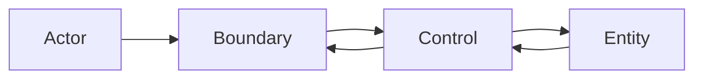

# BCE

## 概要

Boundary / Control / Entityでユースケースの入出力、制御、業務概念を分ける設計です。

## 解決したい課題

- ユースケース分析で出たアクター、操作、業務概念を実装責務へつなげたい
- UI、入力変換、処理手順、業務状態が1つのクラスや関数に混ざる
- 外部インターフェース変更が業務概念へ直接波及する

## 背景・登場した文脈

BCEは、Ivar Jacobsonらのユースケース駆動開発の文脈で知られる責務分離です。Boundaryが外部との境界、Controlがユースケースの進行、Entityが業務概念を担います。画面やAPIの形ではなく、ユースケースの責務から実装を整理する点が特徴です。

## 基本構成

| 要素 | 責務 |
| --- | --- |
| Boundary | 外部アクターやUIとの入出力境界を扱う |
| Control | ユースケースの進行や処理手順を調整する |
| Entity | 業務上の概念、状態、不変条件を表す |

## Mermaid図

この図は、BCEで中心になる責務と流れを簡略化したものです。実際の設計では、組織体制、運用能力、既存システムとの接続、非機能要件によって境界の切り方が変わります。

## 向いている場面

- ユースケース分析から設計へ自然につなげたい
- UIやAPIと業務概念を分離したい
- ユースケース単位で処理手順を読みやすくしたい

## 向いていない場面

- 単純なCRUDで、役割分割のコストが効果を上回る
- Controlにすべての業務判断を集める設計になっている
- DDDやClean Architectureとの用語対応をチームで合わせられない

## メリット

- 外部境界、処理手順、業務概念を説明しやすい
- ユースケース単位のレビューやテスト観点を作りやすい
- UI変更をEntityへ直接波及させにくい

## デメリット

- 役割名だけを付けるとControl肥大化やEntity貧血化を招く
- 小さな機能ではクラス数やファイル数が増えすぎる
- 他のアーキテクチャ用語と混在すると責務が曖昧になる

## よくある誤解

- BCEはクラス名の接尾辞を決めるための規則ではない。ユースケース内の入出力、制御、業務概念を分けるための見取り図。
- Controlは業務ルールを全部集める場所ではない。業務上の不変条件はEntity側に置く。
- BoundaryはUIだけではない。API、メッセージ、バッチ入口など外部との接点全般を含む。

## 失敗しやすいポイント

- Controlが巨大な手続きクラスになり、Entityがデータ入れ物になる
- Boundaryが外部形式をそのまま内部へ漏らし、変更影響が広がる
- ユースケース境界が曖昧で、同じ処理が複数Controlに重複する

## 類似アーキテクチャとの違い

| 比較対象 | 違い |
|---|---|
| MVC | MVCはUI入力、表示、モデルを分ける。BCEはユースケース単位で外部境界、制御、業務概念を分けるため、UI以外の入出力にも適用しやすい |
| クリーンアーキテクチャ | クリーンアーキテクチャは依存方向と層の内外を厳密に考える。BCEはBoundary、Control、Entityという役割名でユースケース実装を整理する軽量な見取り図として使いやすい |
| DDD | DDDはドメインモデル、境界づけられたコンテキスト、ユビキタス言語を重視する。BCEはユースケース内のオブジェクト責務を整理する粒度の考え方 |

## 実務での判断ポイント

- ユースケース単位でBoundary、Control、Entityを洗い出す
- 外部DTOと内部モデルの変換責務をBoundaryに置くかMapperに分けるか決める
- Entityに置く不変条件とControlに置く手順を区別する
- Clean ArchitectureやDDDと併用する場合の層名対応をチームで合わせる

## 導入チェックリスト

- [ ] Boundaryが外部形式と内部モデルの境界になっている
- [ ] Controlがユースケースの進行に集中している
- [ ] Entityに業務上の状態と不変条件がある
- [ ] 同じユースケース処理が複数箇所に重複していない

## 参考

- Ivar Jacobson et al., *Object-Oriented Software Engineering: A Use Case Driven Approach*, Addison-Wesley, 1992
