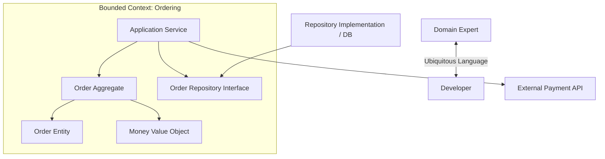

# DDDアーキテクチャ

## 概要

DDD、Domain-Driven Designは、複雑な業務領域をソフトウェアで扱うために、ドメイン知識を中心に設計する考え方です。単なるディレクトリ構成ではなく、ドメイン専門家と開発者が同じ言葉を使い、モデルを継続的に育てるための設計アプローチです。アーキテクチャとしては、Domain層を中心に置き、ApplicationやInfrastructureから業務ルールを守る構成と組み合わせて使われます。

## 解決したい課題

- 業務知識がコードに反映されず、仕様書や人の頭の中に分散する問題を避ける
- 同じ言葉が部署や機能ごとに違う意味で使われ、設計が混乱する問題を避ける
- 複雑な業務ルールをTransaction Scriptや巨大Serviceに押し込めない
- チームが業務の重要部分に集中できるよう、境界と優先度を明確にする

## 背景・登場した文脈

Eric Evansの書籍で体系化されたDDDは、複雑な業務ソフトウェアにおいて、モデルと実装を結びつけることを重視します。その後、Vaughn Vernonらによって、Bounded Context、Context Map、Aggregateなどの実践的な使い方が広く整理されました。DDDは特定のフレームワークではなく、業務理解、モデリング、設計、実装を結びつけるための考え方です。

## 基本構成

| 要素 | 責務 |
| --- | --- |
| Ubiquitous Language | ドメイン専門家と開発者が共有する言葉 |
| Bounded Context | モデルと言葉が一貫して通用する境界 |
| Entity | 同一性を持つ業務オブジェクト |
| Value Object | 値そのものに意味があり、同一性を持たないオブジェクト |
| Aggregate | 一貫性境界。Aggregate Rootを通じて内部を変更する |
| Repository | Aggregateの取得・保存を抽象化する |
| Domain Service | EntityやValue Objectに自然に置けない業務操作 |
| Application Service | ユースケースの進行、トランザクション、外部連携の調整 |

## 依存関係の考え方

DDDでは、Domain Modelを中心に置きます。Application ServiceはUse Caseを進行し、Domain Modelに業務判断を委ねます。InfrastructureはRepository実装や外部API接続を担います。DomainがDB、Web、外部APIの具体技術を知らないようにするため、クリーン、ヘキサゴナル、オニオンのような依存方向の設計と相性がよいです。

## Mermaid図



この図では、Orderingという境界の中で言葉とモデルを一貫させています。DB実装は外側に置き、モデルの意味をInfrastructureに引きずられないようにします。

## ディレクトリ構成例

```text
src/
├── ordering/
│   ├── application/
│   │   └── place-order.md
│   ├── domain/
│   │   ├── order.md
│   │   ├── order-line.md
│   │   ├── money.md
│   │   └── order-repository.md
│   └── infrastructure/
│       └── postgres-order-repository.md
└── payment/
    ├── application/
    ├── domain/
    └── infrastructure/
```

Bounded Contextごとにディレクトリを分け、その内部でApplication、Domain、Infrastructureを持つ構成です。レイヤーよりも業務境界を上位の分割単位にしています。

## 向いている場面

- 業務ルールが複雑で、専門家との継続的な会話が必要
- 同じ言葉が文脈によって違う意味を持つ
- 長期的にモデルを育てる必要がある
- 重要な業務領域を他の技術詳細から守りたい
- マイクロサービスやモジュラーモノリスで境界設計が重要

## 向いていない場面

- 単純なCRUDやマスタ管理が中心
- ドメイン専門家と会話する機会がほとんどない
- 業務ルールが薄く、データ変換や外部連携が主な価値である
- チームが用語整理やモデル改善に時間を使えない

## メリット

- 業務知識がコードに表れやすい
- 複雑なルールをモデルとして整理できる
- Bounded Contextにより、言葉とモデルの衝突を局所化できる
- 重要な業務領域に設計努力を集中できる

## デメリット

- 学習コストが高い
- 形だけ導入すると、EntityやRepositoryという名前だけが増える
- 専門家との対話なしでは効果が出にくい
- すべての領域にDDDを適用すると過剰設計になりやすい

## よくある誤解

- DDDはEntity、Value Object、Repositoryを作るだけの設計ではない。
- DDDはマイクロサービス専用ではない。モジュラーモノリスでも有効。
- Bounded Contextは単なるテーブル分割やパッケージ分割ではなく、モデルと言葉の境界である。
- Aggregateは関連オブジェクトを何でも集める箱ではなく、一貫性を守る境界である。
- Domain Serviceに何でも置くと、結局Transaction Scriptに戻る。

## 類似アーキテクチャとの違い

| 比較対象 | 違い |
| --- | --- |
| レイヤードアーキテクチャ | レイヤードは責務分離の構造。DDDは業務知識をモデル化する考え方 |
| クリーンアーキテクチャ | クリーンは依存方向を守る構造。DDDは中心に置く業務モデルの作り方を扱う |
| ヘキサゴナルアーキテクチャ | ヘキサゴナルは外部接続をPort/Adapterで分離する。DDDは内側のモデル設計を重視する |
| オニオンアーキテクチャ | オニオンはDomain Modelを中心に置く構造。DDDはそのDomain Modelをどう発見し育てるかを扱う |

## 実務での判断ポイント

- まず対象領域が本当に複雑かを見極める
- Core Domain、Supporting Subdomain、Generic Subdomainを分け、設計努力を集中する
- Ubiquitous Languageをドキュメント、会話、コード名に反映する
- Bounded Contextをまたぐときは、翻訳やAnti-Corruption Layerを検討する
- Aggregateはトランザクション境界と不変条件から設計する
- CRUDで十分な領域にDDDの戦術パターンを過剰適用しない

## 参考

- Eric Evans, *Domain-Driven Design: Tackling Complexity in the Heart of Software*, Addison-Wesley, 2004
- Eric Evans, [DDD Reference](https://www.domainlanguage.com/ddd/reference/)
- Vaughn Vernon, *Implementing Domain-Driven Design*, Addison-Wesley, 2013
- Vaughn Vernon, [Implementing Domain-Driven Design](https://www.pearson.com/en-us/subject-catalog/p/implementing-domain-driven-design/P200000009616/9780321834577), Pearson
- Vaughn Vernon, *Domain-Driven Design Distilled*, Addison-Wesley, 2016
