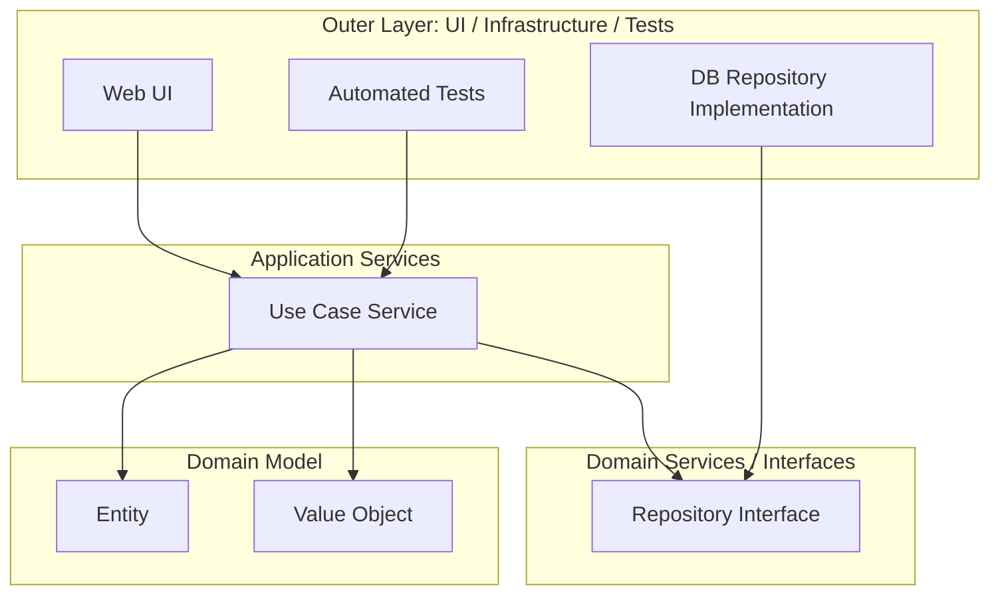

# オニオンアーキテクチャ

## 概要

オニオンアーキテクチャは、Domain Modelを中心に置き、依存関係を中心へ向ける設計です。外側にはApplication、Infrastructure、UI、テストなどを配置し、変わりやすいものを中心から遠ざけます。名前の通り、玉ねぎのような同心円の層で表現されます。

## 解決したい課題

- DB中心の設計になり、業務ルールが永続化技術に引きずられる問題を避ける
- UIやInfrastructureの変更からDomain Modelを守る
- 長寿命の業務アプリケーションで、保守コストを下げる
- Repository interfaceなどを使い、外部技術を外側へ追い出す

## 背景・登場した文脈

Jeffrey Palermoは、従来の上から下へ依存するレイヤード構成では、UIやBusiness LogicがData Accessへ推移的に依存してしまう点を問題視しました。そこで、Domain Modelを中心に置き、すべての依存を中心方向へ向けるアーキテクチャとしてOnion Architectureを提案しました。

## 基本構成

| 層 | 責務 |
| --- | --- |
| Domain Model | 組織にとって真実となる状態と振る舞い、業務ルール |
| Domain Services / Interfaces | Domainを支える振る舞い、Repository interfaceなど |
| Application Services | ユースケースの調整、トランザクション、入出力の流れ |
| Infrastructure / UI / Tests | DB、外部API、画面、テストなどの具体的な外側の詳細 |

## 依存関係の考え方

すべての依存は中心へ向かいます。Domain Modelは自分自身にしか依存しません。Repository interfaceのような契約は内側に置き、DBを使う具体実装は外側に置きます。実行時には外側の実装をDIなどで注入し、中心のコードが外側の具体技術を知らないようにします。

## Mermaid図



中心のDomain Modelは、UIやDB実装を知りません。外側が内側の契約に合わせて接続します。

## ディレクトリ構成例

```text
src/
├── domain/
│   ├── model/
│   │   ├── order.md
│   │   └── money.md
│   └── repositories/
│       └── order-repository.md
├── application/
│   └── place-order-service.md
└── infrastructure/
    ├── persistence/
    │   └── postgres-order-repository.md
    └── web/
        └── order-controller.md
```

## 向いている場面

- ドメインモデルを中心に長く育てたい業務アプリケーション
- DBスキーマやORMに業務ルールを支配されたくない場合
- RepositoryやDomain Serviceを使って、業務ルールと外部詳細を分離したい場合
- DDDと組み合わせて、モデル中心の設計を進めたい場合

## 向いていない場面

- ドメインロジックが薄く、DB操作がほぼすべてのアプリケーション
- 中心に置くべきDomain Modelがまだ見えていない段階
- 抽象化よりもフレームワークの速度を優先したい小規模開発

## メリット

- Domain Modelを中心に据えるため、業務ルールの所在が明確になる
- DBやUIを外側に置き、変更影響を閉じ込めやすい
- DDDの戦術パターンと相性がよい
- 長期保守で外部技術の入れ替えに対応しやすい

## デメリット

- Domain Modelが貧弱だと、構造だけが重くなる
- Repository interfaceの置き場所や粒度で迷いやすい
- 既存DB中心のシステムに後から適用するには移行コストがある
- クリーンアーキテクチャやヘキサゴナルとの差分が説明しづらいことがある

## よくある誤解

- Onion ArchitectureはDBを使わない設計ではない。DBを中心にしない設計である。
- 外側のInfrastructureが不要になるわけではない。変更されやすい詳細として隔離する。
- Domain Modelは単なるデータ入れ物ではなく、状態と振る舞いを持つ業務概念である。
- 層の数は固定ではない。中心に向かう依存方向が本質である。

## 類似アーキテクチャとの違い

| 比較対象 | 違い |
| --- | --- |
| レイヤードアーキテクチャ | 伝統的なレイヤードはData Accessに依存しやすい。オニオンはDomainを中心に置く |
| クリーンアーキテクチャ | クリーンはEntities、Use Cases、Interface Adaptersなどの役割を明示する。オニオンはDomain Model中心を強調する |
| ヘキサゴナルアーキテクチャ | ヘキサゴナルはPort/Adapterの接続点を強調する。オニオンは同心円の依存方向を強調する |
| DDD | DDDのDomain Modelを保護する構造として使われやすい |

## 実務での判断ポイント

- Domain Modelに本当に守るべき業務ルールがあるか確認する
- Repository interfaceをDomainに置くかApplicationに置くかは、モデルの意味に合わせて決める
- DBスキーマをそのままDomain Modelにしない
- Infrastructureは内側の契約を実装する側に置く
- 既存システムでは一度に全面適用せず、重要な業務領域から切り出す

## 参考

- Jeffrey Palermo, [The Onion Architecture : part 1](https://jeffreypalermo.com/2008/07/the-onion-architecture-part-1/), 2008
- Jeffrey Palermo, [The Onion Architecture : part 2](https://jeffreypalermo.com/2008/07/the-onion-architecture-part-2/), 2008
- Jeffrey Palermo, [The Onion Architecture : part 3](https://jeffreypalermo.com/2008/08/the-onion-architecture-part-3/), 2008
