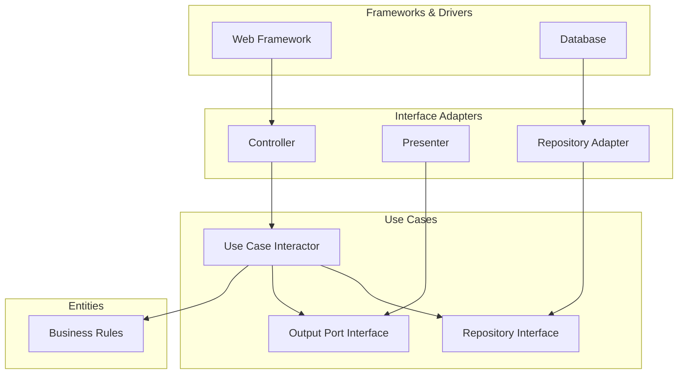

# クリーンアーキテクチャ

## 概要

クリーンアーキテクチャは、業務ルールを中心に置き、UI、DB、Webフレームワーク、外部サービスなどの詳細を外側へ追い出す設計方針です。中心に近いほど抽象度が高く、外側に行くほど具体的な技術詳細になります。最重要ルールは、ソースコード上の依存が内側にだけ向くことです。

## 解決したい課題

- ビジネスルールがフレームワーク、DB、UIに依存して変更しづらくなる問題を避ける
- 外部技術を差し替えても、中心のルールを守る
- ユースケース単位でテストしやすくする
- 複数の入出力手段を同じ業務ルールに接続できるようにする

## 背景・登場した文脈

Robert C. Martinは、Hexagonal Architecture、Onion Architecture、BCEなどの共通点を整理し、Clean Architectureとして説明しました。これらは細部こそ違いますが、関心の分離と依存方向の制御によって、業務ルールを外部詳細から独立させる点で共通しています。

## 基本構成

| 層 | 責務 |
| --- | --- |
| Entities | 企業またはアプリケーション全体で成り立つ重要な業務ルール |
| Use Cases | アプリケーション固有のユースケース、処理手順、入出力境界 |
| Interface Adapters | Controller、Presenter、Gatewayなど。内外のデータ形式を変換する |
| Frameworks & Drivers | Web、DB、UI、外部API、デバイスなどの詳細 |

## 依存関係の考え方

依存は常に内側へ向きます。Use CaseがPresenterやRepository実装を直接呼ぶ必要がある場合でも、内側にインターフェースを置き、外側がそれを実装します。実行時の制御の流れは外側へ向かうことがありますが、ソースコード上の依存は内側に保ちます。

## Mermaid図



矢印は依存または呼び出しの関係を簡略化したものです。重要なのは、Use CasesやEntitiesがWebやDBの具体名を知らないことです。

## ディレクトリ構成例

```text
src/
├── entities/
│   └── order.md
├── usecases/
│   ├── place-order.md
│   ├── order-repository-port.md
│   └── place-order-output-port.md
├── adapters/
│   ├── http-order-controller.md
│   ├── order-presenter.md
│   └── postgres-order-repository.md
└── frameworks/
    ├── web-framework.md
    └── database.md
```

## 向いている場面

- 業務ルールの寿命がUIやDBより長い
- 複数UI、API、バッチ、テストハーネスから同じユースケースを使いたい
- DBや外部サービスの変更に備えたい
- ユースケース単位のテストを重視したい

## 向いていない場面

- 単純なCRUDが中心で、業務ルールがほとんどない
- チームが依存方向やインターフェース分離に慣れていない
- フレームワークの規約に強く乗ることを優先したい小規模アプリ
- 抽象化のコストを回収できるほど変更可能性がない

## メリット

- 業務ルールを外部技術から守りやすい
- Use Caseを中心にテストしやすい
- UI、DB、外部APIの差し替えに強い
- 依存方向のルールが明確でレビューしやすい

## デメリット

- ファイル数やインターフェースが増えやすい
- DTOや境界モデルの変換が多くなる
- 小さな機能でも構造が重く見える
- 形だけ真似ると、実際には依存が逆流したままになる

## よくある誤解

- 円の数は固定ではない。重要なのは依存方向であり、4層を必ず作ることではない。
- Entityは必ずORM Entityではない。むしろORMやDB形式に引きずられない業務概念を置く。
- Use Caseは単なるServiceクラス名ではなく、アプリケーション固有の目的を表す単位である。
- 外側にあるものが重要でない、という意味ではない。変わりやすい詳細として隔離するという意味である。

## 類似アーキテクチャとの違い

| 比較対象 | 違い |
| --- | --- |
| レイヤードアーキテクチャ | レイヤードは上から下への依存になりやすい。クリーンは依存を内側に限定する |
| ヘキサゴナルアーキテクチャ | ヘキサゴナルはPort/Adapterで境界を表現する。クリーンは同様の考えを同心円の層で説明する |
| オニオンアーキテクチャ | オニオンはDomain Model中心を強調する。クリーンはUse CaseやInterface Adapterの役割も明確にする |
| DDD | DDDは業務知識のモデリング手法。クリーンは依存方向と境界の作り方に焦点を当てる |

## 実務での判断ポイント

- まず「守りたい業務ルール」と「変わりやすい技術詳細」を分けて考える
- すべてにインターフェースを作らず、外部詳細への依存を断ちたい境界に絞る
- DTO、Entity、DB Row、API Responseを混同しない
- Use Caseが肥大化したら、Domain側に業務ルールを戻す
- フレームワークの便利機能を中心層に持ち込まない

## 参考

- Robert C. Martin, [The Clean Architecture](https://blog.cleancoder.com/uncle-bob/2012/08/13/the-clean-architecture.html), 2012
- Robert C. Martin, *Clean Architecture: A Craftsman's Guide to Software Structure and Design*, Prentice Hall, 2017
- Robert C. Martin, [A Little Architecture](https://blog.cleancoder.com/uncle-bob/2016/01/04/ALittleArchitecture.html), 2016
