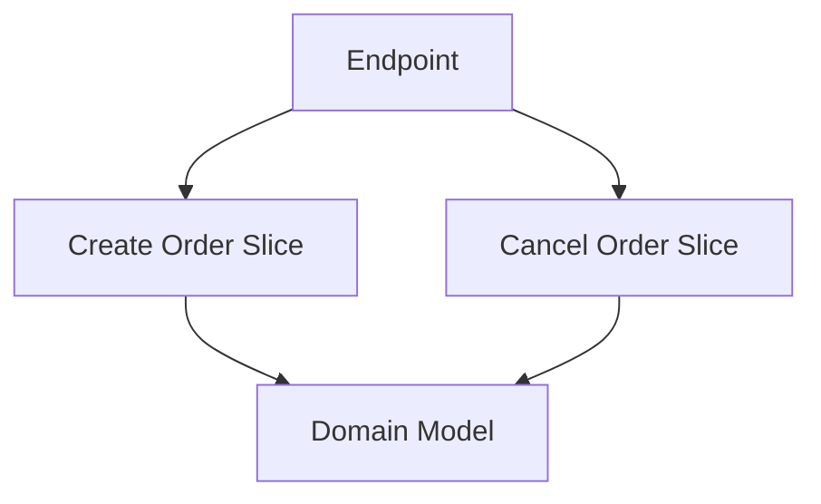

# Vertical Slice Architecture

## 概要

機能やユースケース単位でコードを縦にまとめる設計です。

## 解決したい課題

- 1つの機能変更でController、Service、Repositoryなど複数レイヤーを横断し、変更箇所を追いにくい
- 機能ごとの所有者やテスト範囲が曖昧になる
- レイヤー単位の共通化が進みすぎ、機能固有の変更が全体に波及する

## 背景・登場した文脈

Vertical Slice Architectureは、技術レイヤーではなくユースケースや機能単位でコードをまとめる考え方です。各スライスは入力、ユースケース、永続化、テストを自分の範囲に持ちます。レイヤードアーキテクチャを否定するものではなく、変更単位を機能に寄せるための配置方針です。

## 基本構成

| 要素 | 責務 |
| --- | --- |
| Slice | 機能やユースケースごとの変更単位 |
| Request / Command | 利用者操作や更新要求を表す入力 |
| Handler | 入力を受け取り検証、処理、保存を調整する |
| Local Model | その機能内で使うDTOや表示用モデル |

## Mermaid図

この図では、機能Aと機能Bがそれぞれ入力、処理、永続化、テストを持つ縦のまとまりとして分かれる関係を示しています。共通化しすぎず、機能単位で変更影響を追えることが狙いです。

## 向いている場面

- 機能単位で開発、レビュー、テスト、所有を行いたい
- レイヤー横断の変更が多く、影響範囲を局所化したい
- ユースケースごとに入力、処理、永続化の流れを読みたい

## 向いていない場面

- 共通処理を強く標準化する必要があり、機能差が小さい
- スライス間の重複や依存をレビューする体制がない
- DBスキーマやドメインモデルが全機能で密結合している

## メリット

- 機能変更の影響範囲を追いやすい
- スライス単位でテストや所有者を設定しやすい
- 新機能追加時に既存レイヤー全体へ触れる量を減らしやすい

## デメリット

- 同じような処理がスライス間で重複しやすい
- 横断的な認可、エラー処理、DB変更の標準化が必要
- 境界設計を誤るとスライス間依存が増える

## よくある誤解

- 縦に切ればレイヤーが不要になるわけではない。各スライス内部では入力、ユースケース、永続化の責務分離が必要。
- ファイルを機能別フォルダに置くだけではない。変更理由とテスト単位を機能に寄せることが目的。
- すべての共通処理を禁止するわけではない。共有すべき基盤とスライス内に閉じる処理を見分ける。

## 失敗しやすいポイント

- スライス間で同じ業務ルールが重複し、後から不整合になる
- 共通化を避けすぎて、認可、入力検証、エラー処理がばらつく
- DBモデルを共有しすぎて、結局すべてのスライスが同じ依存に引っ張られる

## 類似アーキテクチャとの違い

| 比較対象 | 違い |
|---|---|
| レイヤードアーキテクチャ | レイヤードは技術責務で横に分ける。バーティカルスライスはユースケースや機能で縦に分け、変更範囲を1つの機能内に寄せる |
| Clean Architecture | Clean Architectureは依存方向とユースケース中心の境界を重視する。バーティカルスライスは機能単位の配置と変更容易性を重視し、内部でClean Architectureを併用できる |
| Modular Architecture | Modular Architectureは公開インターフェースを持つモジュール境界を重視する。バーティカルスライスはユーザー価値やユースケース単位のまとまりをより強く意識する |

## 実務での判断ポイント

- 変更頻度が機能単位でまとまるプロダクトか確認する
- 共通化する基盤処理とスライス内に閉じる業務処理を定義する
- スライス単位でテスト、レビュー、所有者を設定する
- 横断的なDB変更や認可変更の扱いを決める

## 導入チェックリスト

- [ ] 機能ごとの入口、ユースケース、テストが同じ場所で追える
- [ ] スライス間の直接依存を制限している
- [ ] 共有基盤に置くものの基準がある
- [ ] スライス単位で変更影響を説明できる

## 参考

- Jimmy Bogard, [Vertical Slice Architecture](https://www.jimmybogard.com/vertical-slice-architecture/)
