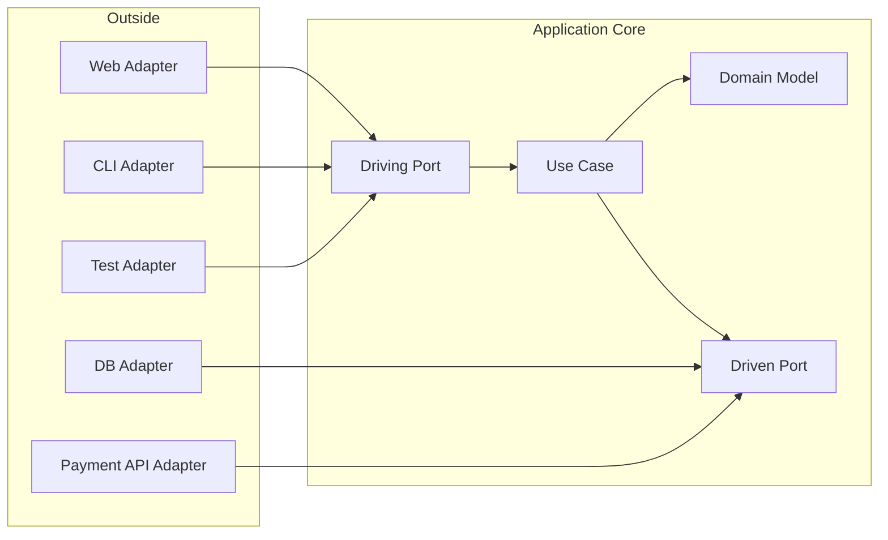

# ヘキサゴナルアーキテクチャ

## 概要

ヘキサゴナルアーキテクチャは、Ports & Adaptersとも呼ばれ、アプリケーションの内側を外部技術から分離する設計です。中心にアプリケーションやドメインを置き、外部との会話はPortで定義し、技術ごとの接続はAdapterで実装します。六角形そのものに意味があるのではなく、外部の接続口を複数持てることを表すための図です。

## 解決したい課題

- UIやDBが変わるたびにアプリケーションロジックが影響を受ける問題を避ける
- 同じユースケースをWeb、CLI、バッチ、テストから動かせるようにする
- DB、外部API、メッセージングなどを差し替えやすくする
- テスト時に外部システムをMockやIn-Memory Adapterに置き換える

## 背景・登場した文脈

Alistair Cockburnは、伝統的なレイヤー図ではアプリケーション内外の境界が曖昧になり、ロジックが境界を越えて漏れやすい問題を指摘しました。そこで、アプリケーションの内側と外側を分け、外部技術をすべてAdapterとして扱う考え方を提示しました。

## 基本構成

| 要素 | 責務 |
| --- | --- |
| Application Core | ユースケース、ドメインロジック、アプリケーションの目的 |
| Driving Port | 外部からアプリケーションを操作する入口 |
| Driving Adapter | Web Controller、CLI、Batch、テストなど、入口側の具体実装 |
| Driven Port | アプリケーションが外部へ依頼するための出口 |
| Driven Adapter | DB、外部API、メッセージングなど、出口側の具体実装 |

## 依存関係の考え方

内側は外側の技術を知りません。Driving AdapterはDriving Portを呼び出し、Application Coreを動かします。Application Coreが外部へ依頼する場合はDriven Portを呼び、外側のDriven AdapterがそのPortを実装します。これにより、実行時にはDBへ処理が流れても、ソースコード依存は内側へ向かいます。

## Mermaid図



この図では、Web、CLI、テストは同じ入口Portを使ってアプリケーションを操作できます。DBや外部APIは出口PortのAdapterとして差し替え可能です。

## ディレクトリ構成例

```text
src/
├── application/
│   ├── ports/
│   │   ├── in/
│   │   │   └── place-order-port.md
│   │   └── out/
│   │       └── order-repository-port.md
│   └── usecases/
│       └── place-order.md
├── domain/
│   └── order.md
└── adapters/
    ├── in/
    │   ├── http-order-controller.md
    │   └── cli-order-command.md
    └── out/
        ├── postgres-order-repository.md
        └── in-memory-order-repository.md
```

## 向いている場面

- 外部システムやUIの差し替え可能性が重要
- 自動テストで外部依存を置き換えたい
- 同じ業務処理を複数の入口から利用したい
- 外部技術よりアプリケーションの目的を中心に設計したい

## 向いていない場面

- 入出力が1つずつしかなく、差し替えの必要もない小さなCRUD
- PortとAdapterの粒度をチームで揃えられない場合
- フレームワーク主導で短期間に作り切ることを優先する場合

## メリット

- 外部技術をAdapterとして隔離できる
- テスト用Adapterを差し込みやすい
- 入口と出口を対称的に扱える
- DB中心ではなく、アプリケーションの目的を中心に設計しやすい

## デメリット

- Portの粒度設計が難しい
- 単純な処理では抽象化が過剰になりやすい
- AdapterとUse Caseの責務境界を誤ると、ロジックが外側へ漏れる
- 用語がプロジェクトごとに揺れやすい

## よくある誤解

- 六角形の6辺に固定の意味があるわけではない。Portを複数置けることを表す図である。
- Adapterは外部技術だけではなく、テストハーネスやCLIなどの入口にも使える。
- Portはすべてのクラスに必要ではない。外部との会話を安定させたい境界に置く。
- レイヤードアーキテクチャを否定するものではなく、内外の境界をより強調する考え方である。

## 類似アーキテクチャとの違い

| 比較対象 | 違い |
| --- | --- |
| レイヤードアーキテクチャ | レイヤードは上下方向、ヘキサゴナルは内外方向で境界を考える |
| クリーンアーキテクチャ | クリーンは同心円とDependency Ruleで説明する。ヘキサゴナルはPortとAdapterで外部接続を説明する |
| オニオンアーキテクチャ | オニオンはDomain Model中心を強調する。ヘキサゴナルはアプリケーションと外部の接続点を強調する |
| DDD | DDDのドメインモデルを中心に置く実装スタイルとして使われることが多い |

## 実務での判断ポイント

- Portは「技術」ではなく「目的のある会話」として名付ける
- 入力Adapterには業務判断を置かず、Use Caseへ渡す前の変換に留める
- 出力AdapterにはDBや外部APIの都合を閉じ込める
- テスト用Adapterを自然に差し込めるかで境界の良し悪しを確認する
- すべてを抽象化せず、変更可能性が高い外部依存から分離する

## 参考

- Alistair Cockburn, [Hexagonal Architecture](https://alistair.cockburn.us/hexagonal-architecture), 2005
- Steve Freeman, Nat Pryce, *Growing Object-Oriented Software, Guided by Tests*, Addison-Wesley, 2009
