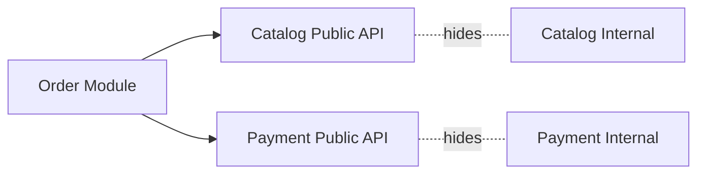

# Modular Architecture

## 概要

明確な公開インターフェースを持つモジュールへ分割する設計です。

## 解決したい課題

- コードベースが大きくなり、内部実装への直接依存や循環依存が増える
- 変更影響をモジュール内に閉じられず、修正のたびに広範囲を確認する
- チームや業務領域ごとの所有境界がコード上に表れていない

## 背景・登場した文脈

Modular Architectureは、明確な公開インターフェースを持つモジュールへシステムを分割する設計です。モノリスの中でも、ライブラリ群でも、分散システムでも適用できます。重要なのは、フォルダ分けではなく、依存方向、公開API、所有者、変更契約を保つことです。

## 基本構成

| 要素 | 責務 |
| --- | --- |
| Module | まとまった責務を持つ独立したコード単位 |
| Public Interface | 外部に公開するAPIや契約 |
| Internal Implementation | モジュール内に隠蔽する実装詳細 |
| Dependency Rule | 許可される依存方向や依存先の規則 |

## Mermaid図

この図は、Modular Architectureで中心になる責務と流れを簡略化したものです。実際の設計では、組織体制、運用能力、既存システムとの接続、非機能要件によって境界の切り方が変わります。

## 向いている場面

- 大きなコードベースで依存関係を整理したい
- 業務領域やチーム単位で責務を分けたい
- マイクロサービス化の前に境界を検証したい

## 向いていない場面

- 小さなアプリでモジュール境界の運用コストが重い
- 公開APIや依存ルールを守る仕組みがない
- 業務境界が分からないまま技術都合だけで分割しようとしている

## メリット

- 変更影響をモジュール内に閉じやすい
- 内部実装を隠し、公開契約で利用側と分離できる
- 将来の分割や再利用の判断材料を作りやすい

## デメリット

- 境界を誤ると不要な抽象化と調整コストが増える
- 共通モジュールや循環依存が放置されると効果が落ちる
- ビルド、テスト、バージョニングの設計が必要になる

## よくある誤解

- モジュール分割はフォルダ分割ではない。公開API、依存方向、所有者、変更契約を決めて初めて境界になる。
- 小さく分けるほど良いわけではない。境界が多すぎると調整とバージョニングが増える。
- マイクロサービス化の前段に使えるが、分散化を必須にするものではない。

## 失敗しやすいポイント

- 内部実装を直接参照し、公開APIが形だけになる
- 循環依存が増え、どのモジュールから変更すべきか分からなくなる
- 共通モジュールが肥大化し、すべての変更が全体影響になる

## 類似アーキテクチャとの違い

| 比較対象 | 違い |
|---|---|
| モジュラーモノリス | モジュラーモノリスは単一デプロイの中でモジュール境界を強く保つ構成。Modular Architectureはモノリス、ライブラリ、サービス分割などに広く適用できる設計原則 |
| マイクロサービス | マイクロサービスはモジュールをプロセス・デプロイ単位まで分離する。Modular Architectureはまずコードと依存関係の境界を整えるため、分散運用を必須にしない |
| DDD | DDDはドメイン理解とモデル化を中心に境界を見つける。Modular Architectureは見つけた境界をコード構造と公開APIで保つ実装上の考え方 |

## 実務での判断ポイント

- 業務境界、変更頻度、所有チームをもとにモジュールを切る
- 公開API、内部実装、依存禁止ルールを明文化する
- ビルド、テスト、リリースをモジュール単位でどこまで分けるか決める
- 境界違反をlint、依存解析、レビューで検知する

## 導入チェックリスト

- [ ] 各モジュールに公開APIと所有者がある
- [ ] 内部実装への直接依存を検知できる
- [ ] 循環依存がない、または解消計画がある
- [ ] 共通モジュールの追加基準が決まっている

## 参考

- David L. Parnas, On the Criteria To Be Used in Decomposing Systems into Modules, Communications of the ACM, 1972
